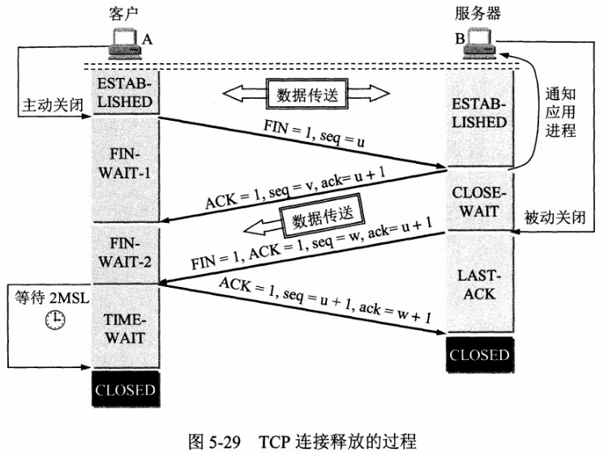
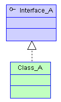
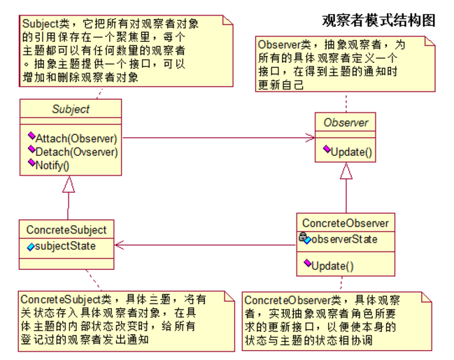
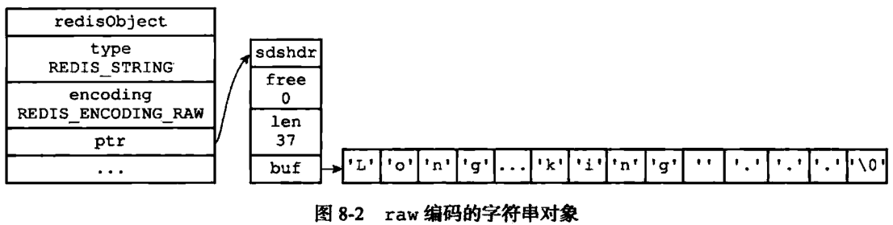

# 起步

### 刷题：

《剑指offer》，[LintCode](https://www.lintcode.com/) 答案见九章算法：[九章算法](https://www.jiuzhang.com/) 

### 书籍：

网络：《计算机网络》《图解HTTP》

数据结构，操作系统：教科书

Java并发：《Java高并发程序设计》

JVM相关：《深入理解Java虚拟机》-周志明   视频：[深入JVM内核原理](https://www.bilibili.com/video/av19249632?from=search&seid=5670540184211808620) 

Spring相关：《Spring揭秘》《精通Spring 4.x  企业应用开发实战》 

SSM框架：《Spring+MyBatis企业应用实战》

MySQL：《MySQL必知必会》 《高性能MySQL》

JavaWeb：《深入分析Java Web》

Redis：《Redis设计与实现》

设计模式：《大话设计模式》

框架：《大型网站技术架构 核心原理与案例分析》- 李智慧 

### 项目：

1. 一句话介绍：项目在做什么？
2. 我解决了什么问题？
3. 项目中遇到的难点、挑战：
4. 我得到了什么提升？

# 一、Java语言

---

## Java基础

* Java 常用的5个包：lang（提供基础类） Util（常用的工具类）io（提供全面的IO接口）net（提供网络应用的开发）sql（提供访问并处理存储在数据源中的数据API） awt、swing、text

* JDK，JRE，JVM：JDK（java开发工具箱），包含了JRE，compiler(编译)，debugger。JRE：java运行时环境。JVM：java虚拟机 

* Java与C++的区别：**1.** Java是解释型语言(源代码编译为字节码，然后由JVM解释执行)，C++是编译型语言(源代码经过编译和链接后生成可执行的二进制代码，可直接执行)。  **2.** Java为纯面向对象语言，C++兼具面向过程和面向对象。  **3.** Java中没有指针    **4.** Java不支持多继承，但是Java有接口 **5.**C++需要自己写析构函数，Java有垃圾回收。

* Arrays.asList()  这样转换的list只能读，不能改。

* JIT， 即时编译器，即时编译器（JIT compiler，just-in-time compiler）是一个把Java的字节码（包括需要被解释的指令的程序）转换成可以直接发送给处理器的指令的程序。当你写好一个Java程序后，源语言的语句将由Java编译器编译成字节码，而不是编译成与某个特定的处理器硬件平台对应的指令代码（比如，Intel的Pentium微处理器或IBM的System/390处理器）。字节码是可以发送给任何平台并且能在那个平台上运行的独立于平台的代码。

* abstract:  abstract 关键字用来修饰抽象类和抽象方法，抽象类还没有完全实现，不能实例化；抽象方法需要在子类中实现；如果一个类中有抽象方法，那么这个类也是抽象类，必须使用abstract修饰。如果子类只覆盖了部分抽象方法，那么子类还是一个抽象类。（abstract关键字不能与final、private、static关键字一起用）

* interface：JDK8中的接口中的方法不是只能有抽象方法，可以有静态方法和default方法。其中静态方法只能使用接口名来调用。对于default方法，需要通过实例对象来调用。

* Java有参的构造方法和无参的构造方法。1. 如果没有写构造方法，编译器会为我们自动加一个；2.如果你实现了一个有参的构造方法，编译器只认有参构造方法而不会默认添加无参的构造方法，所以，如果要使用无参的构造方法，需要自己手动添加。[参见](https://blog.csdn.net/lijia111111/article/details/63685907) 

* StringBuilder，StringBuffer 区别： StringBuilder线程不安全，StringBuffer 线程安全，它们都继承了AbstractStringBuilder抽象类，底层实现上，StringBuilder其实就是多了Synchronized关键字。

* clone(), 实现cloneable接口，此接口仅仅是一个标志，此标志仅仅针对clone()方法，可以调用super.clone()。此时为浅拷贝，成员对象中对其他对象的引用并没有变。如何实现深拷贝？1. 将那些引用对象的类全都实现cloneable()接口；2.使用序列化（将对象写进流中，再从流中取出来）。[参考](http://www.cnblogs.com/gw811/archive/2012/10/07/2712252.html) 

* Java.lang.reflect，java反射： **Class类**：反射的核心类，可以获取类的属性，方法等信息。  通过Class.forName("xxx"); 类名.class; 对象.getClass(); 获取。Field对象对应成员变量，Method对象对应成员方法，Constructor对象对应构造方法，方法的调用使用mehtod.invoke();

  反射简述：在程序运行的过程中，动态的创建对象。主要知道类名称，就可以使用它的字节码对象创建该类的一个对象。（对于这个类的任何一个变量或者方法，我们都可以访问或者使用它）。

* String设计成不可变类：安全和效率，final修饰，char数组， [参考](https://blog.csdn.net/one_Jachen/article/details/78148606) 

* 字符集和charset：存在底层的都是二进制文件，我们可以看到字符是因为二进制序列转换成字符的缘故。涉及两个概念：编码 Encode 、 解码 Decode。Java默认使用Unicode字符集，但是很多操作系统不适用Unicode字符集，所以从系统中读取数据到Java程序中时，便会出现乱码。

  Java提供了Charset来处理字节序列和字符序列之间的转换关系。该类包含了用于创建 解码器 和 编码器的方法，还提供了获取Charset所支持字符集的方法，Charset类是不可变的。

  常用的字符集：GBK（支持简体中文）、UTF-8（8位UCS转换格式）

  ```java
          Charset cn = Charset.forName("GBK"); //获取Charset对象
          CharsetDecoder cnDecoder = cn.newDecoder(); // 解码器
          CharsetEncoder cnEncoder = cn.newEncoder(); // 编码器
          CharBuffer cbuff = CharBuffer.allocate(8);
          cbuff.put("李");
          cbuff.flip();
          ByteBuffer byteBuffer = cnEncoder.encode(cbuff);
          for (int i = 0; i < byteBuffer.capacity(); i++) {
              System.out.println(byteBuffer.get(i));
          }
          System.out.println(cnDecoder.decode(byteBuffer));
  ```

* 重写equals()的同时要重写hashcode(): 两对象equals()相等，hashcode()肯定相等；如果equals()不相等，hashcode不一定不相等；只要equals()比较用到的信息没改，调用多次hashcode()，必须返回同一整数。

* 多态：一个接口，多种实现。父类的引用指向子类的对象。

* JDK1.5：泛型，for-each，自动装箱/拆箱，枚举。JDK1.6：DesTop类和SystemTray类，使用Complier API 动态编译。 JDK1.7：switch可以使用字符串，泛型实例化类型自动推断(new ArrayList<>();)。 JDK1.8：允许给接口添加default方法(非抽象的)，Lambda表达式，元空间代替永久带，G1垃圾收集器。

### Java序列化的底层实现

[序列化和反序列化的底层实现原理是什么？](https://blog.csdn.net/xlgen157387/article/details/79840134) 

[简述serializable和transient关键字作用](https://blog.csdn.net/java__project/article/details/54960525) 

[深入学习 Java 序列化](http://www.importnew.com/24490.html) 

* 序列化、反序列化：把对象存到字节流，根据字节流重建对象

* 为什么？ 1. 永久性保存对象，对象数据的持久化。2. 通过序列化在进程间传递对象。3.使得对象以字节流的形式在网络中传输。

* 实现：1.实现 Serializable

  ​	    2.java.io.ObjectOutputStream：表示对象输出流；它的writeObject(Object obj)方法可以对参数指定的obj对象进行序列化，把得到的字节序列写到一个目标输出流中；

  java.io.ObjectInputStream：表示对象输入流；它的readObject()方法源输入流中读取字节序列，再把它们反序列化成为一个对象，并将其返回；

* 步骤：

步骤一：创建一个对象输入流，它可以包装一个其它类型输入流，如文件输入流：

```
ObjectInputStream ois= new ObjectInputStream(new FileInputStream("object.out"));1
```

步骤二：通过对象输出流的readObject()方法读取对象：

```
User user = (User) ois.readObject();1
```

说明：为了正确读取数据，完成反序列化，必须保证向对象输出流写对象的顺序与从对象输入流中读对象的顺序一致。

* 注意点：
  1. 如果一个对象的成员变量是一个对象，那么这个对象的数据成员也会被保存！这是能用序列化解决深拷贝的重要原因
  2. 声明为static和transient类型的成员数据不能被序列化。因为static代表类的状态，transient代表对象的临时数据。
  3. 克隆(cloning)或者是序列化(serialization)的语义和含义是跟具体的实现相关的。因此，应该由集合类的具体实现来决定如何被克隆或者是序列化。


### Java中的注解

* [自己写的](https://blog.csdn.net/u012156116/article/details/80784905) 
* [参考的](https://blog.csdn.net/briblue/article/details/73824058) 

### Java中errors以及try-catch相关

* 异常类型最高的继承类是Throwable， Throwable下有两个子类：

（1）Error（错误）：指的是JVM错误，这个时候的程序并没有执行，无法处理；如OOM、虚拟机错误、栈溢出 ，通常由系统进行处理，程序本身无法捕获和处理。
（2）Exception（异常）：指的是程序之中出现的错误信息，可以进行异常处理。

* Exception分为RuntimeException和Checked Exception。Checked Exception必须要捕获或声明。而RuntimeException不强制,一般交由JVM处理。[详见此处](https://zhuanlan.zhihu.com/p/23371163) 

  **RuntimeException在程序中是完全可以避免的**，如数组下表越界及空指针异常都是可以避免的，判断下下标范围，而**CheckedException是无法避免的**，如IO异常，磁盘坏道了是程序员无法控制的。

  **（补充）**：**CheckedException**是Java编译器强制程序员必须捕获处理的。如果对**检查异常**不进行捕获或者抛出处理的话，编译都不会通过。而对于**运行时异常**，Java编译器不要求强制处理。

* finally的问题：假设利用 return 语句从 try 语句块中退出。在方法返回前，finally子句的内容将被执行。如果 finally 子句中也有一个 return 语句，这个返回值将会覆盖原始的返回值。

```java
public static void main(String[] args) {
        int k = f_test();
        System.out.println(k);
    }
     
    public static int f_test(){
        int a = 0;
        try{
            a = 1;
            return a;
        }
        finally{
            System.out.println("It is in final chunk.");
            a = 2;
            return a;
        }
    }
```

输出：

```java
It is in final chunk.
2
//如果将 return a; 注释掉，将输出
It is in final chunk.
1        
```

* 异常处理的流程

1. 如果程序中产生了异常，那么JVM会根据异常类型实例化一个指定异常类的对象。
2. 如果程序中没有异常处理操作，那么此对象将会交给JVM处理，JVM打印异常信息，然后中断程序。
3. 如果存在异常处理，由try捕获此异常类对象。
4. 然后与try后的catch进行匹配，匹配成功，由catch处理，如匹配不成功，交由JVM处理。
5. finally子句的内容将被执行。

* 只有try-finally可以吗？可以，如果捕获到异常，需要对异常进行处理才要catch，如果自己不知道怎么处理，就可以在finally中将异常向上throw。同时，finally中可以执行一些清理或者释放操作，如lock.unlock()。


* throw和throws

使用throws关键字**声明的方法表示此方法不处理异常，而交给方法调用处进行处理**。

throw关键字是抛出一个异常，抛出的时候是抛出的是一个异常类的实例化对象。

```java
package methoud;
class Math{
    public int div(int i,int j) throws Exception{    // 定义除法操作，如果有异常，则交给被调用处处理
        System.out.println("***** 计算开始 *****") ;
        int temp = 0 ;    // 定义局部变量
        try{
            temp = i / j ;    // 计算，但是此处有可能出现异常
        }catch(Exception e){
            throw e ;　　　　//抛出异常。
        }finally{    // 不管是否有异常，都要执行统一出口
            System.out.println("***** 计算结束 *****") ;
        }
        return temp ;
    }
};
public class ThisDemo06{
    public static void main(String args[]){
        Math m = new Math() ;
        try{
            System.out.println("除法操作：" + m.div(10,0)) ;
        }catch(Exception e){
            System.out.println("异常产生：" + e) ;
        }
    }
};
```

* Java异常处理原则之一：延迟捕获

  意思是，当异常发生时，不应立即捕获，而是应该考虑当前作用域是否有有能力处理这一异常的能力，如果没有，则应将该异常继续向上抛出，交由更上层的作用域来处理。[参考此处](https://www.zhihu.com/question/25530011)

# 二、多线程并发篇

### volatile

[参考](https://mp.weixin.qq.com/s?__biz=MzAxNjM2MTk0Ng==&mid=2247484676&idx=1&sn=1f91c1a13d85afb931e14d126da3d65c&chksm=9bf4b5b1ac833ca7d70b0fb55964bc744e0dd74b5a205c5794517a1253aad193ad495df62c4c&mpshare=1&scene=23&srcid=0718R61f7hKvpDJv8fHO2whl#rd) 

#### 缓存一致性协议

 

缓存一致性协议保证了每个缓存中使用的共享变量的副本是一致的。它的核心思想是：CPU写数据时，发现变量是共享变量，即在其他CPU中也存在该变量的副本，就会发信号通知其他CPU置该变量缓存行为无效。当其他CPU读的时候发现该缓存行是无效的，那么会从内存重新读取。

#### 三个概念

原子性：一个或多个操作要么都执行，要么都不执行。

可见性：多个线程访问同一个变量时，一个线程修改了这个变量的值，其他线程能够立即看得到修改的值。

有序性：程序执行的顺序按照代码的先后顺序执行。（指令重排序需保证线程的串行语义）。

#### Java内存模型

​	JVM规范中定义了JMM试图来屏蔽各个硬件平台和操作系统的内存访问差异，以实现让Java程序在各个平台上都能达到一致的访问效果。

​	JMM中规定所有变量都存在主存（相当于物理内存）中，每个线程都有自己的工作内存（类似于高速缓存）。线程对变量的所有操作都必须在工作内存中进行，而不能直接对主存进行操作。并且每个线程不能访问其他线程的工作内存。

对以上来个解读： `i = 10` 执行线程必须先在自己的工作内存中赋值，然后再写进主存中。

#### Java如何保证三大特性：

**原子性：使用synchronized和Lock。**  注： volatile不保证原子性（例：自增操作不是原子性操作，Atomic包提供原子操作。）

**可见性：使用volatile** 

**有序性：使用synchronized和Lock。**volatile变量规则：对一个变量的写操作先行发生于后面对这个变量的读操作

#### volatile详解

两层语义：

* 保证了不同线程对这个变量进行操作时的可见性，即一个线程修改了某个变量的值，这新值对其他线程来说是立即可见的。
* 禁止进行指令重排序。

深入原理：

观察加入volatile指令的汇编代码时，会发现多出一个lock前缀指令。

lock指令其实相当于一个内存屏障，而内存屏障有三个功能：

1. 它确保指令重排序时不会把其后面的指令排到内存屏障之前的位置，也不会把前面的指令排到内存屏障的后面；即在执行到内存屏障这句指令时，在它前面的操作已经全部完成；
2. 会强制对缓存的修改立即写入主存
3. 如果是写操作，它会导致其他CPU中对应的缓存行无效（缓存一致性协议）。

使用场景：

​	需保证使用的场景是原子性的，才能保证volatile在并发时能够正确使用。

#### happens-before原则:

先行发生原则，发生在前的操作的影响能被后面的操作观察到。Java内存模型有一些天然的先行发生关系：

1.程序次序原则：在一个线程内，书写在前面的操作一定先行发生于书写在后面的操作

2.管程锁定原则：一个unlock操作线程先行发生于后面对同一个锁的lock操作

3.volatile变量规则：对一个volatile变量的写操作先行发生于后面对这个变量的读操作

4.线程启动原则：Thread的start()方法先行发生于此线程的每一个操作

5.线程终止原则：线程的所有方法先行发生于对此线程的终止检测

6.线程中断原则：对线程interrupt()方法调用先行发生于被中断线程的代码检测到中断事件的发生。

7.对象终结原则：一个对象的初始化完成（构造函数执行结束）先行发生于它的finalize()方法的开始。

8.传递性原则：如果操作A先行发生于操作B，操作B先行发生于操作C，那么可以得出操作A先行发生于C的结论。

先行发生原则跟时间上的先后并没有太大的关系，所以我们衡量并发安全问题的时候不要受到时间顺序的干扰，一切必须以先行发生原则为准。

### BlockingQueue

* BlockingQueue接口主要实现：


* 主要有**ArrayBlockingQueue（基于数组，有界队列）**、**LinkedBlockingQueue（无界队列）**。
* 关键是在Blocking上，它会让服务线程在队列为空时，进行等待，当有新的消息进入队列后，自动将线程唤醒。

#### BlockingQueue的实现与使用

* ArrayBlockingQueue的内部元素都放在一个对象数组中，`final Object[] items; ` 
* 压入元素：offer()-如果队列满了，返回false； put()-如果队列满了，它会一致等待，直到有空闲的位置。
* 弹出元素：poll()-如果队列为空直接返回null，take()-会等到队列中有可用元素。
* 使用 put() , take()
* 底层实现： 通过以下字段实现put(), take() 

```java
    // 1.字段
    /** Main lock guarding all access */
    final ReentrantLock lock;

    /** Condition for waiting takes */
    private final Condition notEmpty;

    /** Condition for waiting puts */
    private final Condition notFull;
```

* [更多底层，生产者、消费者实现](https://blog.csdn.net/u012156116/article/details/80489564)

### ThreadLocal

* **ThreadLocal的作用是提供线程内的局部变量，这种变量在线程的生命周期内起作用，减少同一个线程内多个函数或者组件之间一些公共变量的传递的复杂度。**
* 设计初衷：提供线程内部的局部变量，在本线程内随时随地可取，隔离其他线程。
* 最合适的应用场合是线程多实例（每个线程一个实例的）的对象的访问，并且这个对象很多地方都要用到。每个线程都有一份拷贝

#### ThreadLocal基本操作： 

1. **initialValue函数** : initialValue函数用来设置ThreadLocal的初始值,该函数在调用get函数的时候会第一次调用，但是如果一开始就调用了set函数，则该函数不会被调用。
2. **get函数**：该函数用来获取与当前线程关联的ThreadLocal的值，如果当前线程没有该ThreadLocal的值，则调用initialValue函数获取初始值返回。
3. **set函数**：  set函数用来设置当前线程的该ThreadLocal的值。
4. **remove函数**：remove函数用来将当前线程的ThreadLocal绑定的值删除。

```java
public class thread_local2 {

    private static final ThreadLocal<Integer> value = new ThreadLocal<Integer>(){
        @Override
        protected Integer initialValue() {
            return 0;
        }
    };
    static class MyThread extends Thread{

        private int index;

        public MyThread(int index){
            this.index = index;
        }

        public void run(){
            System.out.println("线程"+index+":的初始value="+value.get());
            for (int i = 0; i < 10; i++) {
                value.set(value.get()+i);
                if(i == 5){
                    value.remove();
                }
            }
            System.out.println("线程"+index+":的累加始value="+value.get());
        }
    }
    public static void main(String[] args) {
        for (int i = 0; i < 5; i++) {
            new Thread(new MyThread(i)).start();
        }
    }
}
```

输出：

```java
线程3:的初始value=0
线程3:的累加始value=30
线程0:的初始value=0
线程4:的初始value=0
线程2:的初始value=0
线程0:的累加始value=30
线程1:的初始value=0
线程1:的累加始value=30
线程4:的累加始value=30
线程2:的累加始value=30
```

#### ThreadLocal底层原理：

1. JDK8的ThreadLocal的get方法的源码:

```java
public T get() {
        Thread t = Thread.currentThread();
        ThreadLocalMap map = getMap(t);
        if (map != null) {
            ThreadLocalMap.Entry e = map.getEntry(this);
            if (e != null) {
                @SuppressWarnings("unchecked")
                T result = (T)e.value;
                return result;
            }
        }
        return setInitialValue();
    }
```

 其中getMap()的源码:

```java
ThreadLocalMap getMap(Thread t) {
      return t.threadLocals;
 }
```

简单解析一下，get方法的流程是这样的：

1. 首先获取当前线程
2. 根据当前线程获取一个Map
3. 如果获取的Map不为空，则在Map中以ThreadLocal的引用作为key来在Map中获取对应的value e，否则转到5
4. 如果e不为null，则返回e.value，否则转到5
5. Map为空或者e为空，则通过initialValue函数获取初始值value，然后用ThreadLocal的引用和value作为firstKey和firstValue创建一个新的Map

**设计思路**：**每个Thread维护一个ThreadLocalMap映射表，这个映射表的key是ThreadLocal实例本身，value是真正需要存储的Object。** 


#### ThreadLocal底层深入：

* **ThreadLocalMap是使用ThreadLocal的弱引用作为Key的**。 

  

  >ThreadLocal会引发内存泄露，他们的理由是这样的：
  >
  >*如上图，ThreadLocalMap使用ThreadLocal的弱引用作为key，如果一个ThreadLocal没有外部强引用引用他，那么系统gc的时候，这个ThreadLocal势必会被回收，这样一来，ThreadLocalMap中就会出现key为null的Entry，就没有办法访问这些key为null的Entry的value，如果当前线程再迟迟不结束的话，这些key为null的Entry的value就会一直存在一条强引用链：*
  >
  >**ThreadLocal Ref -> Thread -> ThreaLocalMap -> Entry -> value**
  >
  >*永远无法回收，造成内存泄露。*

* JDK设计中的防范： 如ThreadLocalMap的getEntry函数的流程：（如果e为null或者key不一致则向下一个位置查询，如果下一个位置的key和当前需要查询的key相等，则返回对应的Entry，否则，如果key值为null，则擦除该位置的Entry，否则继续向下一个位置查询）set操作也有类似的思想，将key为null的这些Entry都删除，防止内存泄露。 

* 以上有一个前提，**要调用ThreadLocalMap的**genEntry**函数或者**set**函数。** 1. 所以很多情况下需要使用者手动调用ThreadLocal的remove函数，手动删除不再需要的ThreadLocal，防止内存泄露。2. JDK建议将ThreadLocal变量定义成private static的，这样的话ThreadLocal的生命周期就更长，由于一直存在ThreadLocal的强引用，所以ThreadLocal也就不会被回收，也就能保证任何时候都能根据ThreadLocal的弱引用访问到Entry的value值，然后remove它，防止内存泄露。


### Future模式：


1. 首先实现Callable接口，call()方法将作为线程执行体，并有返回值。

```java
public class realTask implements Callable {
    private String para;

    public realTask(String para){
        this.para = para;
    }
    @Override
    public Object call() throws Exception {
        StringBuilder sb = new StringBuilder();
        for (int i = 0; i < 10; i++) {
            sb.append(para);
            try{
                Thread.sleep(100);
            }catch (Exception e){
                e.printStackTrace();
            }
        }
        return sb.toString();
    }
}
```

2. 创建Callable的实现类，通过FutureTask类来包装Callable对象。
3. 使用FutureTask对象作为Thread对象的target创建并启动新线程。
4. 调用FutureTask对象的get()方法来获得子线程执行结束后的返回值。

```java
    public static void main(String[] args) throws ExecutionException, InterruptedException {
        FutureTask<String> futureTask = new FutureTask<String>(new realTask("abc"));
        ExecutorService executor = Executors.newFixedThreadPool(1);
        executor.submit(futureTask);
        try{
            Thread.sleep(2000);
        }catch (Exception e){
            e.printStackTrace();
        }
        System.out.println(futureTask.get());
    }
```

5. Callable 与 Runnable 的区别：

>(1) Callable规定（重写）的方法是call()，Runnable规定（重写）的方法是run()。
>
>(2) Callable的任务执行后可返回值，而Runnable的任务是不能返回值的。
>
>(3) call方法可以抛出异常，run方法不可以。
>
>(4) 运行Callable任务可以拿到一个Future对象，表示异步计算的结果。它提供了检查计算是否完成的方法，以等待计算的完成，并检索计算的结果。通过Future对象可以了解任务执行情况，可取消任务的执行，还可获取执行结果。

### 信号量（Semaphore）['seməfɔː]

无论是synchronized，reentranLock，一次都只允许一个线程访问一个资源，而Semaphore却可以指定多个线程，同时访问某一个资源。通过acquire()获取一个许可，如果没有就等待，通过release()释放一个信号。如果设置信号量的个数为1，则可以当作互斥锁使用

### ReadWriteLock 读写锁


### CountDownLatch

与Semaphore不同的是，CountDownLatch 的release操作（countDown）使得计数值减少，当计数值减少到0的时候，await操作才能获取许可。相当于有多把锁，这些锁都被打开（countDown），才能将门打开（await）。latch.await()的对象都存储在队列中。

```java
final CountDownLatch latch = new CountDownLatch(2);
// 1,
latch.countDown();
// 2,
latch.countDown();
// 3，主程序部分
latch.await();
```

### CyclicBarrier 循环栅栏

与CountDownLatch相似，也可以实现线程间的技术等待。前面的Cycli意为循环，也就是说这个计数器可以反复使用。比如，我们将计数器设置为10，那么凑齐第一批10个线程后，计数器就会归零，然后截至凑齐下一批10个线程，这就是循环栅栏的内在含义。

```java
public CyclicBarrier(int parties, Runnable barrierAction) {
}
public CyclicBarrier(int parties) {
}
```

参数parties指让多少个线程或者任务等待至barrier状态；参数barrierAction为当这些线程都达到barrier状态时会执行的内容，这是比countDownLatch强的地方。

CyclicBarrier中最重要的方法就是await方法，它有2个重载版本：

```java
public int await() throws InterruptedException, BrokenBarrierException { };
public int await(long timeout, TimeUnit unit)throws InterruptedException,BrokenBarrierException,TimeoutException { };
```

第一个版本比较常用，用来挂起当前线程，直至所有线程都到达barrier状态再同时执行后续任务；

第二个版本是让这些线程等待至一定的时间，如果还有线程没有到达barrier状态就直接让到达barrier的线程执行后续任务。

CountdownLatch与CyclicBarrier的区别：

一个是只有当所有线程countDown()，直到计数器的值减到0的时候，等待在await()上的线程才被唤醒。

而CyclicBarrier是每个线程执行await()方法，用于挂起每个线程，直到所有线程都到达了，继续执行线程剩余的操作。不同的是1. 可以不止使用一次，2. 等所有线程到达状态时可以执行另外一个任务，3.可以设定等待时间。

### 线程阻塞工具： LockSupport

1. 与wait()相比，它不需要先获得某个对象的锁，也不会抛出InterruptedException异常。
2. 原理： 因为LockSupport类使用类似信号量的机制。它为每一个线程准别了一个许可，如果许可可用，那么park（）函数会立即返回，并且消费这个许可，如果许可不可用，就会阻塞。而unpark（）使得一个许可可用，所以unpark（）发生在park（）之前，线程依然可以返回。
3. LockSuport.park()跟Thread.sleep(), Object.wait(), Thread.join()一样，是可以相应Interrupted中断的， 但是它不会抛出InterruptedException异常。

### 交换者：Exchanger

[如下：](https://blog.csdn.net/u012156116/article/details/79876017)  Exchanger用于进行线程间的数据交换。它提供一个同步点，在这个同步点两个线程可以交换彼此的数据。用法：`**public **V exchange(V x) **throws **InterruptedException{}`。

### CAS和原子类

[如下：](https://blog.csdn.net/u012156116/article/details/80627909)

### 线程池相关

[自己整理的](https://blog.csdn.net/u012156116/article/details/79439764)

#### 为什么要使用线程池

1.如果为每一个小任务都去创建一个线程，很有可能出现创建和销毁线程所占用的时间大于该线程真实工作所消耗的时间。2.大量线程的创建会占用内存空间，而且会给GC带来压力，延长GC的停顿时间。3.使用线程池后，创建线程就变成了从线程池中获取线程，关闭线程就变成了向池子归还线程。

#### 自己去设计一个线程池，会怎么考虑

> 1 **线程管理器(ThreadPoolManager)**：用于创建并管理线程池，包括创建线程、销毁线程池、添加新任务(提供对任务队列的处理)。
>
> 2 **工作线程(PoolWorker)**：线程池中线程，在没有任务时处于等待状态，可以循环的执行任务。
>
> 3 **任务接口(Task)** ：每个任务必须实现的接口，以供工作线程调度任务的执行，它主要规定了任务的入口、任务执行 完后的收尾工作、任务的执行状态等。
>
> 4 **任务队列(TaskQueue)**：用于存放没有处理的任务，提供一种缓冲机制。

#### 常见线程池

>Executors.newFixedThreadPool(n);  
>
>```java
>return new ThreadPoolExecutor(nThreads, nThreads,
>                                      0L, TimeUnit.MILLISECONDS,
>                                      new LinkedBlockingQueue<Runnable>());
>```
>
>Executors.newSingleThreadExecutor();
>
>Executors.newCachedThreadPool();	
>
>```java
>return new ThreadPoolExecutor(0, Integer.MAX_VALUE,
>                                      60L, TimeUnit.SECONDS,
>                                      new SynchronousQueue<Runnable>());
>```
>
>Executors.newScheduledThreadPool(n);

#### ThreadFactory

ThreadFactory，线程池中的那些线程都是由ThreadFactory而来。ThreadFactory是一个接口，只有一个方法，用来创建线程:

```java
public interface ThreadFactory {
    Thread newThread(Runnable r);
}
```

当线程池需要新建线程时，就会调用这个方法。

我们可以通过自定义ThreadFactory来干很多事情，比如自定义线程的名称，组以及优先级等信息，甚至将所有的线程设置为守护线程。

#### 扩展线程 

ThreadPoolExecutor也是一个可以扩展的线程池，它提供了beforeExecute()、afterExecute()和terminated()三个接口对线程池进行控制。

```java
protected void beforeExecute(Thread t, Runnable r){}
```

### Fork/Join 框架

* 一个把大任务分割成若干个小任务，最终汇总每个小任务结果后得到大任务结果的框架。

### AQS详解

#### 同步框架

1. 两个关键
   * volatile int state 代表共享资源
   * FIFO线程等待队列 多线程竞争资源被阻塞时会进入此队列
2. 共享方式
   * Exclusive（独占，只有一个线程能执行，如ReentrantLock）
   * Share（共享，多个线程可同时执行，如Semaphore/CountDownLatch）
3. 自定义同步器：**在实现时只需要实现共享资源state的获取与释放方式即可** ，至于具体线程等待队列的维护（如获取资源失败入队/唤醒出队等），主要实现以下几种方法：
   - isHeldExclusively()：该线程是否正在独占资源。只有用到condition才需要去实现它。
   - tryAcquire(int)：独占方式。尝试获取资源，成功则返回true，失败则返回false。
   - tryRelease(int)：独占方式。尝试释放资源，成功则返回true，失败则返回false。
   - tryAcquireShared(int)：共享方式。尝试获取资源。负数表示失败；0表示成功，但没有剩余可用资源；正数表示成功，且有剩余资源。
   - tryReleaseShared(int)：共享方式。尝试释放资源，如果释放后允许唤醒后续等待结点返回true，否则返回false
4. 两个例子：
   * ReentrantLock：state初始化为0，表示未锁定。A线程lock()时，会调用tryAcquire()独占该锁并将state+1。此后，其他线程tryAcquire()就会失败。
   * CountDownLatch：任务分为N个子线程去执行，state初始化为N，每个子线程countdown（）一次，state会CAS减1，等到所有子线程都执行完后，state=0，主线程会从await（）返回，继续执行。
5. 在ReentrantLock中，若一个线程A获得了锁，其他线程会使用LockSupport.park()进行阻塞，并且会生成节点进行排序，A线程执行结束释放锁资源时，会唤醒队列上的线程。

# 三、JVM篇

### 栈和方法区中存放的具体

#### 栈

* 每一个方法调用的时候都会创建一个栈帧，每一个方法从调用到完成的过程，就是一个栈帧在虚拟机栈中入栈到出栈的过程。
* 栈帧的内容：局部变量表，操作数栈，常量池指针，方法出口
* 局部变量表：存放了编译期可知的基本数据类型，对象引用（指针），returnAddress类型（指向下一条字节码指令的地址）。
* 局部变量表所需的内存空间在编译期间完全确定。
* StackOverflowError异常（请求的栈过深），内存不够（OutOfMemoryError）

#### 方法区

HotSpot使用永久代来实现方法区貌似不是一个很好的主意，逐渐使用直接内存来实现，目前已经将字符串常量池移出。

* 保存装载的类信息、常量、静态变量、方法字节码

* 这部分的回收主要是常量池以及类型的卸载

* 运行时常量池：1 . class文件中有一项信息为常量池，存放编译器生成的字面量和符号引用，此部分类加载后放入方法区的运行时常量池。2. 动态性：运行时也可以加入常量，如String.intern()方法。

* String.intern() ：先看常量池中有没有这个引用，如果没有的话，在常量池生成副本，返回该引用。在JDK1.7后，添加到常量池的是对堆中字符串地址的引用，而不是副本。 [参考](https://blog.csdn.net/soonfly/article/details/70147205) 

* 直接内存：NIO中DirectByteBuffer可以分配直接内存。

  ​

###JVM基础

* 一些特殊的方法：类的初始化方法：< clinit>

  ​				实例的初始化方法：< init>

* 指令重排的基本原则：


### Java内存模型

1. Java虚拟机规范试图定义一种Java内存模型（JMM）来屏蔽掉各种硬件和操作系统的内存访问差异，以实现让Java程序在各种平台下都能达到一致的内存访问效果。
2. **主内存与工作内存** : Java内存模型的主要目标是定义程序中各个变量的访问规则，即在虚拟机中将变量存储到内存和从内存中取出变量这样的底层细节。（此处变量不包括局部变量和方法参数，因为它们是线程私有的）。
3. JMM规定**所有变量都存储在主内存中，每条线程还有自己的工作内存** ，线程的工作内存中保存了被该线程使用到的**变量的主内存副本拷贝** 。
4. 内存之间交互操作：JMM定义了8中操作来完成， 虚拟机实现的时候必须保证这些操作都是**原子的、不可再分的** ，先行先发生原则。
5. volatile 型变量的特殊规则（重要，待整理）
6. **先行先发生规则** ：如果说操作A先行发生操作B，其实就是说在发生操作B之前，操作A产生的影响能被操作B观察到，“影响”包括修改了内存中共享变量的值、发送了消息、调用了方法等。（P375）
7. Java 的线程实现 、 Java线程调度：协同式线程调度（一个线程完成后通知另一个）， 抢占式线程调度（Java使用）不会导致整理进程阻塞。


### G1垃圾收集器

[G1垃圾收集器](https://www.cnblogs.com/aspirant/p/8663872.html) 


* 堆空间被分割成一些相同大小的堆区域，每一个都是连续范围的虚拟内存。特定的区域集合像旧的收集器一样被指派为相同的角色（伊甸：eden、幸存：survivor、年老：old），但是它们没有一个固定大小。这在内存使用上提供了更强大的灵活性。

  1. **年轻代的收集**

  **活跃对象会被疏散（复制、移动）到一个或多个survivor区域。如果达到晋升总阈值，对象会晋升到年老代区域。**

  关于G1的年轻代回收做以下总结：

  - 堆空间是一块单独的内存空间被分割成多个区域。
  - 年轻代内存是由一组非连续的区域组成。这使得需要重调大小变得容易。
  - 年轻代垃圾回收是stop the world事件，所有应用线程都会因此操作暂停。
  - 年轻代垃圾收集使用多线程并行回收。
  - 活跃对象被复制到新的Survivor区或者年老代区域。

- 2.**G1年老代垃圾回收**

  >1.初始标记：在年轻代收集的时候，对活跃对象进行初始标记，
  >
  >2.并发标记：如果发现空区域，在重新标记阶段它们会被马上清楚，
  >
  >3.重新标记：清除回收空区域，计算所有区域的活性，
  >
  >4.复制/清理阶段：G1选择活性最低的区域，这些区域能够以最快的速度回收，然后这些区域在年轻代的回收过程中被回收。 这些区域会被回收压缩。
  >
  >优点：可以设置最大GC暂停时间。

  G1收集器为年老代对象被设计成一个低暂停收集器。G1垃圾收集器在堆上的年老代执行以下阶段。注意一些阶段是年轻代回收的一部分。

#### 年老代垃圾回收总结

总结下，我们可以列出一些关于G1收集器在年老代的上关键点。 
**并发标记阶段**

> - 当应用运行时，并发的计算活性信
> - 在疏散暂停期间，活性信息鉴定哪些区被最好的回收
> - 没有像CMS一样的清除操作

**重新标记阶段**

> - 使用比在CMS中使用的算法更快的Snapshot-at-the-Beginning(SATB)算法
> - 完全空的区域会被回收掉

**复制/清理阶段**

> - 年轻代和年老代被同时回收
> - 年老代区域基于它们的活性被选择

***

# 四、Spring

### Spring演进：

1. Spring框架所倡导的基于POJO（Plain Old Java Object，简单Java对象）的轻量级开发理念，就是从实际出发，立足于最基础的POJO（就好像我们的地球）。为了能够让这些基础的POJO构建出健壮而强大的应用，Spring框架就好像那包裹地球的大气层一样，为构筑应用的POJO提供了各种服务，进而创造了一套适宜用POJO进行轻量级开发的环境。
2. 整个Spring框架构建在Core核心模块之上，它是整个框架的基础。AOP模块提供了一个轻便但功能强大的
   AOP框架，让我们可以以AOP的形式增强各POJO的能力，进而补足OOP/OOSD之缺憾。
3. Spring框架在Core核心模块和AOP模块的基础上，为我们提供了完备的数据访问和事务管理的抽象和集成服务。Spring框架中的事务管理抽象层是Spring AOP的最佳实践，它直接构建在Spring AOP的基础之上，为我们提供了编程式事务管理和声明式事务管理的完备支持。
4. 为了简化各种Java EE服务（像JNDI、JMS以及JavaMail等）的使用，Spring框架为我们提供了针
   对这些Java EE服务的集成服务。
5. 最后要提到的就是Web模块。在该模块中，Spring框架提供了一套自己的Web MVC框架，职责分
   明的角色划分让这套框架看起来十分地“醒目”。

​       **不要只将Spring看作是一个IoC容器，也不要只将Spring与AOP挂钩Spring提供的远比这些东西要多得多。**

​	**Spring不仅仅是一个简化Java EE开发的轻量级框架，它更应该是一个简化任何Java应用的开发框架。**

### Spring中bena的生命周期：


### AOP

#### 几个概念：

通知（Advice）：想要织入的功能

连接点（JointPoint）：Spring允许你通知的地方。 （每个方法的前后，异常点

切入点（PointCut）：真正织入通知的连接点

切面（Aspect）：通知+切入点

织入（weaving）：把切面应用到目标对象生成新的代理对象的过程

#### 实际使用：

```java
@Aspect
@Component
public class LogAspect {
    private static final Logger logger = LoggerFactory.getLogger(LogAspect.class);

    @Before("execution(* com.nowcoder.controller.*Controller.*(..))")
    public void beforeMethod(JoinPoint joinPoint) {
        StringBuilder sb = new StringBuilder();
        for (Object arg : joinPoint.getArgs()) {
            if (arg != null) {
                sb.append("arg:" + arg.toString() + "|");
            }
        }
        logger.info("before method:" + sb.toString());
    }

    @After("execution(* com.nowcoder.controller.IndexController.*(..))")
    public void afterMethod() {
        logger.info("after method" + new Date());
    }
}
```

1. 切面类首先是一个Java Bean ： `@Component` 
2. 定义一个切面 ：`@Aspect` 
3. 使用`@Before()` ,  `@After()`   ，`@AfterReturning()` ，`@AfterThrowing()`，`@Around()` 进行对原有方法的增强 。
4. 切入点表达式：`"execution(* com.nowcoder.controller.*Controller.*(..))"` , 第一个*代表任意返回值，.. 代表任意数量的参数。
5. JoinPoint 类型的参数可以访问连接细节，如需增强方法的方法名，参数等信息。
6. 使用 `@Order` 注解来指定切面的优先级。

#### AspectJ支持的5种类型的通知：

* **@Before**: 前置通知, 在方法执行之前执行
* **@After**: 后置通知, 在方法执行之后执行
* **@AfterReturning**: 返回通知, 在方法返回结果之后执行
* **@AfterThrowing**: 异常通知,在方法抛出异常之后
* **@Around**: 环绕通知,围绕着方法执行


```java
@Override
public Object invoke(Object proxy, Method method, Object[] args) throws Throwable {
   Object result;
   try {
       //@Before
       result = method.invoke(target, args);
       //@After
       return result;
   } catch (InvocationTargetException e) {
       Throwable targetException = e.getTargetException();
       //@AfterThrowing
       throw targetException;
   } finally {
       //@AfterReturning
   }
}
```


### 事务

声明式事务： `@Transactional` 等

底层：使用的时数据库的事务，AOP

[深入理解事务--Spring事务的传播机制](https://blog.csdn.net/yuanlaishini2010/article/details/45792069) 

### scope（single 和 prototype的作用范围）


***

## SpringMVC

[自己实现的一个SpringMVC](https://blog.csdn.net/u012156116/article/details/80795424) 

### 基本组件

1. DispatcherServlet （**统一请求处理**）

   DispatcherServlet是一个Servlet，因此使用时需要把它配置在Web应用的部署描述符web.xml文件中。DispatcherServlet充当前端控制器，它的核心功能时分发请求。

2. 基于Controller接口的控制器

   请求会被分发给对应的Java类，Spring MVC中称为Handle。Handle必须实现一个Controller接口。

### 运行流程：

1.用户向服务端发送请求，被Spring的前端控制器DispatcherServlet (调度员Servlet)截获，2.然后交由HandlerMapping处理，根据URL获得Handler对象及其对应的拦截器，以HandlerExecutionChain返回给DispatcherServlet，3.DispatcherServlet根据返回的Handler选择合适的HandlerAdapter处理，该适配器调用对应Handler的实际处理请求的方法（例如login）。4.接下来执行相应的Handler（Controller）方法，5.并返回一个ModelAndView对象，这个对象中包含视图名称和数据对象，6.选择一个合适的ViewResolver对象返回给DispatcherServlet，7.ViewResolver结合Model和View来渲染View，并将View渲染的结果返回给客户端。

 


### SpringMVC基本注解解析：

见博客。

---

## Springboot

### 特点： 

* 使用 Spring 项目引导页面可以在几秒构建一个项目
* 方便对外输出各种形式的服务，如 REST API、WebSocket、Web、Streaming、Tasks
* 非常简洁的安全策略集成
* 支持关系数据库和非关系数据库
* 支持运行期内嵌容器，如 Tomcat、Jetty
* 强大的开发包，支持热启动
* 自动管理依赖
* 自带应用监控
* 支持各种 IED，如 IntelliJ IDEA 、NetBeans


[了解Springboot](https://zhuanlan.zhihu.com/p/38018138) 


# 五、Java Web

>Java Web 定义：Java Web应用由一组Servlet、HTML页、类、以及其它可以被绑定的资源构成。它可以在各种供应商提供的实现Servlet规范的 Servlet容器 中运行。

### Tomcat容器

[tomcat处理一个请求的过程](https://blog.csdn.net/joenqc/article/details/75212749) 

[分析http请求从浏览器到tomcat全过程](https://blog.csdn.net/sky_100/article/details/77541968) 

Tomcat的两大组件就是网络框架Coyote(tomcat的Connector框架的名字[参考](https://blog.csdn.net/meiyang1990/article/details/78275106) ) 和 Servlet容器Catalina，前者封装了底层的网络通信(Socket请求及响应)，后者负责处理具体的业务。

**具体过程如下**：

假设来自客户端的请求为：<http://localhost:8080/wsota/wsota_index.jsp> 

1. 请求被发送到本机端口8080，被在那儿侦听的Connector获得，创建request，response对象。
2. Connector把它交给所在的Service的Engine来处理，并等待来自Engine的回应。
3. Engine根据 请求URL 匹配 名为 localhost 的host，
4. 此host匹配 路径名 为 wsota 的Context，
5. 此Context 获得请求 wsota_index.jsp ，在它的 mapping_table中寻找对应的servlet，
6. 构造 HttpServletRequest对象和HttpServletResponse对象，作为参数调用doGet或者doPost方法，
7. Context把执行完的 HttpServletResponse 返回给 host， host把 ** 返回给 Engine ，Engine把 ** 返回给 Connector，
8. Connector把结果返回给客户端。

### Servlet

#### 1.Servlet简介

是用于 java 编写的服务器端程序，其使用 java servlet API，当客户机发送请求到服务器时，服务器可以将请求信息发送给 servlet，并让 servlet 建立起服务器返回给客户机的响应。当启动 web 服务器 or 客户机第一次请求服务时，可以自动装入 servlet，装入后，servlet 继续运行直到其他客户机发出请求。

#### 2.Servlet容器的响应请求的过程

①Servlet引擎检查**是否已经装载并创建**了该Servlet的实例对象。如果是，则直接执行第④步，否则，执行第②步。

②**装载并创建**该Servlet的一个实例对象：调用该Servlet的构造器

③**调用**Servlet实例对象的**init()**方法。

④创建一个用于封装请求的ServletRequest对象和一个代表响应消息的ServletResponse对象，然后**调用**Servlet的**service()方法**并将请求和响应对象作为参数传递进去。

⑤WEB应用程序被停止或重新启动之前，Servlet引擎将卸载Servlet，并在卸载之前调用Servlet的destroy()方法。

#### 3.Servlet的注册与运行

* Servlet程序必须在WEB应用程序的web.xml文件中进行注册和映射其访问路径，才可以被Servlet引擎加载和被外界访问。
* 一个`<servlet>` 元素用于注册一个Servlet，它包含有两个主要的子元素：`<servlet-name>`和`<servlet-class>`，分别用于设置Servlet的注册名称和Servlet的完整类名。
* 一个`<servlet-mapping>`元素用于映射一个已注册的Servlet的一个对外访问路径，它包含有两个子元素：`<servlet-name>`和`<url-pattern>`，分别用于指定Servlet的注册名称和Servlet的对外访问路径。
* 同一个Servlet可以被映射到多个URL上，即多个`<servlet-mapping>`元素的`<servlet-name>`子元素的设置值可以是同一个Servlet的注册名。


#### 4.ServletConfig接口、ServletContext接口

​	Servlet引擎将代表**Servlet容器的对象(ServletContext)**和**Servlet的配置参数信息**一并封装到一个称为**ServletConfig的对象**中，并在初始化Servlet实例对象时传递给该Servlet。

​	Servlet引擎为每个**WEB应用程序**都创建一个对应的ServletContext对象，ServletContext对象被包含在**ServletConfig对象**中，调用**ServletConfig.getServletContext方法**可以返回ServletContext对象的引用。

#### 5.Servlet的生命周期

​					**a. 加载并实例化  b. 初始化 c. 服务 d. 销毁**

* init(): 仅执行一次init()方法。它是在服务器装入Servlet时执行的，负责初始化Servlet对象。可以配置，以在启动服务器或客户机首次访问Servlet时装入Servlet。无论有多少客户机访问Servlet，都不会重复执行init（）。
* service(): 处理请求
* destroy(): 仅执行一次，在服务器停止或者卸载servlet时执行，负责释放占用的资源。

#### 6.HttpServletRequest, HttpServletResponse 

* 都是接口，实例对象代表请求和响应，
* HttpServletRequest：HTTP请求头中的所有信息都封装在这个对象中。
* HttpServletResponse：是对服务器的响应对象。这个对象中封装了向客户端发送数据、发送响应头，发送响应状态码的方法。

#### 7.Servlet的本质

* Servlet是Java的一个接口，定义了一套处理网络请求的规范，所有实现servlet的类，都需要实现那5个方法，其中主要是生命周期方法：init(), destory(), 还有一个处理请求的service()。（这3个类表明初始化，销毁时，接收到请求时做什么）
* servlet容器是与客户端直接打交道的，它监听了端口，请求过来时，根据url等信息，确定将请求交给哪个servlet去处理，然后调用service()方法，service方法返回一个response对象，servlet容器将此对象返回给客户端。（doget(), dopost() 时httpservlet中的方法。）

---

### 过滤器（filter）和拦截器（Interceptor）

#### Filter 过滤器

* 基本功能： 对 servlet 容器调用 servlet 的过程进行拦截，从而在servlet 进行相应处理的前后实现一些特殊功能。

* 实现方式：实现Filter接口，并由servlet容器进行调用和执行。

* 具体方法：**1 . init()方法** 类似于 servlet 的 init 方法，创建 filter 对象后，立即被调用，且只被调用一次。

     2. **doFilter()方法**，逻辑代码写在这里面，每次拦截器都会调用的方法。有三个参数：servletrequest，servletresponse，filterchain，具体如下：

  ```java
  public class CharsetEncodingFilter implements Filter {
  	private String endcoding;
  	@Override
  	public void destroy() {
        //释放当前 filter 所占用的资源，filter 销毁之前被调用，且只被调用一次。
  	}
  	@Override
  	public void doFilter(ServletRequest request, ServletResponse response,
  	FilterChain chain) throws IOException, ServletException {
  		request.setCharacterEncoding(endcoding);
  		//继续执行
  		chain.doFilter(request, response);
  	}
  	@Override
  	public void init(FilterConfig filterConfig) throws ServletException {
  		this.endcoding = filterConfig.getInitParameter("encoding");
  	}
  }
  ```

  **filterchain** 只有一个方法 **doFilter(request，response)**,把请求传给 filter 链的下一个 filter，若当
  前 filter 是 filter 链的最后一个 filter，将把请求传给目标 servlet（or jsp）。--采用责任链模式

  以上例子的web.xml配置可见：[spring 过滤器和拦截器](https://zhuanlan.zhihu.com/p/27301390)

* 应用：1）禁用浏览器的缓存。2）字符编码过滤器。3）检测用户是否登录的 filter

* 实现原理： 基于回调函数，可见 [Java回调机制解析](https://blog.csdn.net/bjyfb/article/details/10462555)

#### Interceptor拦截器

* 基本功能：基于Java反射，是AOP的一种运用，在SpringMVC中，可以对controller请求进行拦截。
* 实现方式：实现HandlerInterceptor接口，并实现接口中的三个方法。

```java
package org.springframework.web.servlet;  
public interface HandlerInterceptor {  
    boolean preHandle(  
            HttpServletRequest request, HttpServletResponse response,   
            Object handler)   
            throws Exception;  

    void postHandle(  
            HttpServletRequest request, HttpServletResponse response,   
            Object handler, ModelAndView modelAndView)   
            throws Exception;  

    void afterCompletion(  
            HttpServletRequest request, HttpServletResponse response,   
            Object handler, Exception ex)  
            throws Exception;  
}   
```

* 具体方法：

1. preHandle: 预处理回调方法，实现处理器的预处理（如登录检查），第三个参数为响应的处理器（如具体的Controller实现； 返回值：true表示继续流程（如调用下一个拦截器或处理器；false表示流程中断（如登录检查失败，不会继续调用其他的拦截器或处理器，此时我们需要通过response来产生响应；
2. postHandle:后处理回调方法，实现处理器的后处理（但在渲染视图之前），此时我们可以通过modelAndView（模型和视图对象）对模型数据进行处理或对视图进行处理，modelAndView也可能为null。
3. afterCompletion: 整个请求处理完毕回调方法，即在视图渲染完毕时回调，如性能监控中我们可以在此记录结束时间并输出消耗时间，还可以进行一些资源清理，类似于try-catch-finally中的finally，但仅调用处理器执行链中preHandle返回true的拦截器的afterCompletion。

* 应用：1. 权限检查 ：登录检测  2. 通用行为：读取cookie得到用户信息并将用户对象放入请求，从而方便后续流程使用 3. 日志记录
* 实现原理： 反射，AOP

#### 过滤器、拦截器区别

1. 拦截器是基于java的反射机制的，而过滤器是基于函数回调。
2. 拦截器不依赖与servlet容器，过滤器依赖于servlet容器。

---

# 六、数据结构及算法

### ConcurrentHashmap （整理不全）

#### JDK1.7

1. 整个 ConcurrentHashMap 由一个个 Segment 组成，Segment 代表”部分“或”一段“的意思，ConcurrentHashMap 是一个 Segment 数组，Segment 通过继承 ReentrantLock 来进行加锁，所以每次需要加锁的操作锁住的是一个 segment，这样只要保证每个 Segment 是线程安全的，也就实现了全局的线程安全。


Segment数组的大小默认为16，也就是说ConcurrentHashMap 有16个槽，理论上最多支持16个线程并发写。16在初始化时可以设其他值，但是一旦设过了，就不可以改了。

2. 每个Segment内部很像一个单独的HashMap。
   * Segment[i] 的默认大小为 2，负载因子是 0.75，得出初始阈值为 1.5，也就是以后插入第一个元素不会触发扩容，插入第二个会进行第一次扩容
   * put()中是加锁的，get()方法并没有加锁。

#### JDK1.8

结构上和 Java8 的 HashMap 基本上一样，不过它要保证线程安全性，所以在源码上确实要复杂一些。


>当sizeCtl=-1，代表正在初始化。
>
>当sizeCtl=-N，代表有N-1个线程在扩容。
>
>当sizeCtl=0，代表需要初始化。
>
>以上三个值，都可以算是状态位。
>
>当sizeCtl>0，即扩容的阈值，也即总容量*0.75。

锁粒度：对每个数组元素加锁（Node）

put() 里面 synchronized

transfer() 里面 使用的 CAS 。

### 红黑树

[教你初步了解红黑树](https://blog.csdn.net/v_july_v/article/details/6105630)

[红黑树](https://subetter.com/articles/2018/06/rb-tree.html)

红黑树本质上是一个二叉查找树，不过它是一种平衡的二叉查找树。 它的操作有着良好的最坏情况运行时间(O(lgn))。

红黑树有四个性质：

1. 每个节点要么是红的，要么黑的。
2. 根节点是黑的。
3. 如果一个节点是红色的，则它的两个孩子节点都是黑色的。
4. 对于任意一个节点，其到叶子节点的每条路径上都包含相同数目的黑色节点。


在插入、删除节点时，通过“重新着色”和“旋转”两种方式使之重新符合特性。

> 红黑树追求的时局部平衡，已达到较好的性能，插入操作最多三次调整。

**左旋：**


**右旋：**


**插入操作：**

按照二叉查找树，将节点插入，如果不满足红黑树的定义了，就需要同通过“旋转”和“重新着色”来让它重新成为红黑树。

**首先**，我们把新插入的结点着色为红色。（将插入的结点着色为红色，不会违背 "性质 4"。）

**其次**，会有三种情况：

1. 如果是根节点，涂黑。
2. 如果插入节点的父节点是黑色的，什么都不要做，仍然满足条件。
3. 如果父节点是红色的，违背了“性质3”.

**最后**，我们来分析父节点是红色的情况，此时，插入节点一定有祖父节点。这时还可以进一步分为3中情况。

* **case 1 ：当前结点的父亲是红色，叔叔存在且也是红色**


处理策略：1. 将“父亲节点”，“叔叔节点”涂黑，2.将“祖父节点”改为红色，3.将“祖父节点”设为“当前节点”，继续操作。

* **case 2 : 当前结点的父亲是红色，叔叔不存在或是黑色，且当前结点是其父亲的右孩子**


处理策略：1. 将 "父亲结点" 设为 "当前结点"，2. 以“新的当前节点”为支点进行左旋。处理完后，还不满足，继续case3。

* **Case 3：当前结点的父亲是红色，叔叔不存在或是黑色，且当前结点是其父亲的左孩子**


处理策略：1. 将"父亲结点" 改为黑色；2. 将 "祖父结点" 改为红色；3. 以 "祖父结点" 为支点进行右旋。

**删除操作：**

按照二叉查找树，删除节点会有三种情况：

1. "被删结点" 没有孩子，那么直接删除即可；
2. "被删结点" 只有一个孩子，那么直接删除该结点，并用该结点的唯一孩子替换它；
3. "被删结点" 有两个孩子，那么先找出它的 "后继结点"，然后删除 "被删结点"，再用 "后继结点" 去替换 "被删结点"。

为方便叙述，我们把 "被删结点" 称为 "原先结点"，用来替换 "被删结点" 的结点称为 "当前结点"。

**首先**，我们来看看删除一个结点会遇到哪几种情况，分析发现，一共有四种：

1. "原先结点" 为黑色，"当前结点" 为红色，那么我们把 "原先结点" 删掉后，拿 "当前结点" 去替换它并修改颜色为黑色即可；
2. "原先结点" 为黑色，"当前结点" 为黑色，这种情况比较复杂，待会再说；
3. "原先结点" 为红色，"当前结点" 为红色，那么我们把 "原先结点" 删掉后，直接拿 "当前结点" 去替换它即可；
4. "原先结点" 为红色，"当前结点" 为黑色，那么我们把 "原先结点" 删掉后，再拿 "当前结点" 去替换它并修改颜色为红色。我们发现，此时 "原先结点" 位置是满足红黑树性质的，但是由于 "当前结点" 被拿走，"当前结点" 位置可能就会违背红黑树性质。分析发现，此时的 "当前结点" 不就是上面 "情况 1" 和 "情况 2" 中所讲的 "原先结点"！那么当前的这种情况直接就变成了 "情况 1" 或 "情况 2"。


### Big DATA

#### Map-Reduce

1. Map阶段: 通过hash函数把大任务分为子任务，同样hash值得任务会被分到一个节点上处理。一个节点可能是一个机器或者计算节点。
2. Reduce阶段：子任务并发处理，然后合并结果。
3. 难点：工程上的处理：
4. 

#### 处理海量数据题目解题关键

1. 分而治之。通过hash函数将大任务分流到机器，或者分流成小文件。最后将结果合并起来。
2. 常见的hashmap或bitmap。
3. 难点：通讯，时间和空间的估算。


# 七、网络

知识总结： [计算机网络面试总结](https://blog.csdn.net/chenchaofuck1/article/details/51980794)

## OSI 7层， TCP/IP 4层， 5层协议

### OSI 7层

***物理层、数据链路层、网络层、传输层、会话层、表示层、应用层。***

每一层的协议如下：
物理层：RJ45、CLOCK、IEEE802.3 （中继器，集线器）
数据链路：PPP、FR、HDLC、VLAN、MAC （网桥，交换机）
网络层：IP、ICMP、ARP、RARP、OSPF、IPX、RIP、IGRP、 （路由器）
传输层：TCP、UDP、SPX
会话层：NFS、SQL、NETBIOS、RPC
表示层：JPEG、MPEG、ASII
应用层：FTP、DNS、Telnet、SMTP、HTTP、WWW、NFS

每一层的作用如下：
物理层：通过媒介传输比特,确定机械及电气规范（比特Bit）
数据链路层：将比特组装成帧和点到点的传递（帧Frame）
网络层：负责数据包从源到宿的传递和网际互连（包PackeT）
传输层：提供端到端的可靠报文传递和错误恢复（段Segment）
会话层：建立、管理和终止会话（会话协议数据单元SPDU）
表示层：对数据进行翻译、加密和压缩（表示协议数据单元PPDU）
应用层：允许访问OSI环境的手段（应用协议数据单元APDU）

### TCP/IP 4层

***网络接口层、 网际层、运输层、 应用层。***

### 5层协议

***物理层（传输Bit,光纤）、数据链路层（传输帧，交换机）、网络层（传输包，路由器）、运输层（传输报文）、 应用层。***


## 3.1运输层

​	网络层只把分组发送到目的主机，但是真正通信的并不是主机而是主机中的进程。运输层提供了进程间的逻辑通信，运输层向高层用户屏蔽了下面网络层的核心细节，使应用程序看见的好像在两个运输层实体之间有一条端到端的逻辑通信信道。

### 3.1.1 UDP 和 TCP 的特点

- 用户数据报协议 UDP（User Datagram Protocol）是无连接的，尽最大可能交付，没有拥塞控制，面向报文（对于应用程序传下来的报文不合并也不拆分，只是添加 UDP 首部），支持一对一、一对多、多对一和多对多的交互通信。
- 传输控制协议 TCP（Transmission Control Protocol）是面向连接的，提供可靠交付，有流量控制，拥塞控制，提供全双工通信，面向字节流（把应用层传下来的报文看成字节流，把字节流组织成大小不等的数据块），每一条 TCP 连接只能是点对点的（一对一）。

### 3.1.2 TCP 首部格式

- **序号** ：用于对字节流进行编号，例如序号为 301，表示第一个字节的编号为 301，如果携带的数据长度为 100 字节，那么下一个报文段的序号应为 401。
- **确认号** ：期望收到的下一个报文段的序号。例如 B 正确收到 A 发送来的一个报文段，序号为 501，携带的数据长度为 200 字节，因此 B 期望下一个报文段的序号为 701，B 发送给 A 的确认报文段中确认号就为 701。
- **数据偏移** ：指的是数据部分距离报文段起始处的偏移量，实际上指的是首部的长度。
- **确认 ACK** ：当 ACK=1 时确认号字段有效，否则无效。TCP 规定，在连接建立后所有传送的报文段都必须把 ACK 置 1。
- **同步 SYN** ：在连接建立时用来同步序号。当 SYN=1，ACK=0 时表示这是一个连接请求报文段。若对方同意建立连接，则响应报文中 SYN=1，ACK=1。
- **终止 FIN** ：用来释放一个连接，当 FIN=1 时，表示此报文段的发送方的数据已发送完毕，并要求释放连接。
- **窗口** ：发送本报文段一方的接收端口。窗口值作为接收方让发送方设置其发送窗口的依据。之所以要有这个限制，是因为接收方的数据缓存空间是有限的。


### 3.1.3 TCP的三次握手


假设 A 为客户端，B 为服务器端。

- 首先 B 处于 LISTEN（监听）状态，等待客户的连接请求。
- A 向 B 发送连接请求报文段，SYN=1，ACK=0，选择一个初始的序号 x。
- B 收到连接请求报文段，如果同意建立连接，则向 A 发送连接确认报文段，SYN=1，ACK=1，确认号为 x+1，同时也选择一个初始的序号 y。
- A 收到 B 的连接确认报文段后，还要向 B 发出确认，确认号为 y+1，序号为 x+1。
- B 收到 A 的确认后，连接建立。

>采用三次握手是防止失效的连接请求报文段突然传送到服务端，因而产生错误。（失效的连接：client发送的一个连接请求并没有丢失，在网络中滞留了，以致延误到达server端。本来此连接早已失效，但是server端误以为是一个新的请求，就同意建立连接。如果不采用三次握手，只要server发出确认，连接建立了，但是client并没有请求发出，server端却一直在等待，浪费了很多资源。）

>关于为什么不采用二次握手，如果客户端在二次握手后建立连接后不想连接了，服务端一直在等待，是不是又浪费很多资源呢。

### 3.1.4 TCP的四次挥手



以下描述不讨论序号和确认号，因为序号和确认号的规则比较简单。并且不讨论 ACK，因为 ACK 在连接建立之后都为 1。

- A 发送连接释放报文段，FIN=1。
- B 收到之后发出确认，此时 TCP 属于半关闭状态，B 能向 A 发送数据但是 A 不能向 B 发送数据。
- 当 B 不再需要连接时，发送连接释放请求报文段，FIN=1。
- A 收到后发出确认，进入 TIME-WAIT 状态，等待 2 MSL 时间后释放连接。
- B 收到 A 的确认后释放连接

**四次挥手的原因：**

​	客户端发送了 FIN 连接释放报文之后，服务器收到了这个报文，就进入了 CLOSE-WAIT 状态。这个状态是为了让服务器端发送还未传送完毕的数据，传送完毕之后，服务器会发送 FIN 连接释放报文。

**TIME_WAIT：**

​	客户端接收到服务器端的 FIN 报文后进入此状态，此时并不是直接进入 CLOSED 状态，还需要等待一个时间计时器设置的时间 2MSL。这么做有两个理由：

- 确保最后一个确认报文段能够到达。如果 B 没收到 A 发送来的确认报文段，那么就会重新发送连接释放请求报文段，A 等待一段时间就是为了处理这种情况的发生。
- 等待一段时间是为了让本连接持续时间内所产生的所有报文段都从网络中消失，使得下一个新的连接不会出现旧的连接请求报文段。

#### 2MSL：

MSL是Maximum Segment Lifetime英文的缩写，中文可以译为**“报文最大生存时间”**，他是任何报文在网络上存在的最长时间，超过这个时间报文将被丢弃。（RFC 793中规定MSL为2分钟，实际应用中常用的是30秒，1分钟和2分钟等。）

### 3.1.5 TCP如何保证传输的可靠性

​	tcp 是面向连接，可靠的字节流服务。

​	面向连接意味着两个使用 tcp 的应用（通常是一个客户端和一个服务器）在彼此交换数
据之前必须先建立一个 tcp 连接。在一个 tcp 连接中，仅有两方进行彼此通信，广播和多播
不能用于 tcp。
**Tcp 通过下列方式提供可靠性：** 

（TCP如何保证数据的可靠传输的（这个问题可以引申出很多子问题，拥塞控制慢开始、拥塞避免、快重传、滑动窗口协议、停止等待协议、超时重传机制，最好都能掌握））

1）将应用数据分割为 tcp 认为最合适发送的数据块；
2）**超时重传：**当 tcp 发出一个段后，他启动一个定时器，等待目的端确认收到这个报
文段。若不能及时收到一个确认，将重发这个报文段。
3）**当 tcp 收到发自 tcp 链接另一端的数据时，它将发送一个确认**（对于收到的请求，给
出确认响应）。这个确认不是立即发送，通常将推迟几分之一秒（之所以推迟，可能是要对
包做完校验）；
4）若 tcp 收到包，校验出包有错，丢弃报文段，不给出响应，tcp 发送端会超时重传；
5）对于失序数据进行重新排序，然后交给应用层（tcp 报文段作为 ip 数据报进行传输，
而 ip 数据报的到达会失序，因此 tcp 报文段的到达也可能失序。若必要，tcp 将对收到的数
据进行重新排列，以正确的顺序交给应用层）。
6）对于重复数据，直接丢弃。
7）tcp 可以进行流量控制，防止较快主机致使较慢主机的缓冲区溢出。

**Tcp的可靠传输有以下机制：**

1，校验和（校验数据是否损坏）；
2，定时器（分组丢失则重传）；
3，序号（用于检测丢失的分组和冗余的分组）；
4，确认（接收方告知发送方正确接收分组以及期望的下一个分组）；
5，否定确认（接收方通知发送方未被正确接收的分组）；
6，窗口和流水线（用于增加信道的吞吐量）。

### 3.1.6 流量控制和拥塞控制

拥塞控制的四种算法：1. 慢开始 2.拥塞避免 3. 快重传 4. 快恢复

* 慢开始：发送方维持一个拥塞窗口cwnd（congestion window），拥塞窗口的大小取决于网络的拥塞程度，并且动态变化。**发送方让自己的发送窗口等于拥塞窗口。**

  一开始cwnd = 1，发送第一个报文段M1，发送方收到接收方的确认后，将cwnd=2；然后发出M2,M3，接收到M2，M3后，将cwnd=4.........  每经过一个传输轮次，拥塞窗口 cwnd 加倍。

* 拥塞避免：设置一个开始阈值ssthresh， 当 cwnd< ssthresh时，使用慢开始；cwnd > ssthresh时，使用拥塞避免。 即 每一个轮次，cwnd + 1.

​       在慢开始，拥塞避免阶段，如果发送方判断没有按时收到确认（即网络阻塞），将 ssthresh = cwnd/2, cwnd=1，执行慢开始。

* 快重传：前提，每收到一个失序的报文段就立即发出重复确认，如果连续收到三个重复确认，立即重传未被确认的报文段，而不必等待 重传计时器到期。
* 快恢复：与快重传配套使用，cwnd = ssthresh/2，然后使用 拥塞避免 线性增大。

详见：[计算机网络整理](https://github.com/CyC2018/Interview-Notebook/blob/master/notes/%E8%AE%A1%E7%AE%97%E6%9C%BA%E7%BD%91%E7%BB%9C.md) 

## 3.2 常用端口

| 应用       | 应用层协议  | 端口号     | 运输层协议   | 备注                 |
| -------- | ------ | ------- | ------- | ------------------ |
| 域名解析     | DNS    | 53      | UDP/TCP | 长度超过 512 字节时使用 TCP |
| 动态主机配置协议 | DHCP   | 67/68   | UDP     |                    |
| 简单网络管理协议 | SNMP   | 161/162 | UDP     |                    |
| 文件传送协议   | FTP    | 20/21   | TCP     | 控制连接 21，数据连接 20    |
| 远程终端协议   | TELNET | 23      | TCP     |                    |
| 超文本传送协议  | HTTP   | 80      | TCP     |                    |
| 简单邮件传送协议 | SMTP   | 25      | TCP     |                    |
| 邮件读取协议   | POP3   | 110     | TCP     |                    |
| 网际报文存取协议 | IMAP   | 143     | TCP     |                    |

## 3.3 Web 页面请求过程（不全，应加入DNS解析具体过程）

1.浏览器分析连接指向页面的URL

2.浏览器向DNS服务器请求解析 www.tsinghua.edu.cn的IP地址  （ 重点 ！！！， 下面解析）

3.域名系统DNS解析出清华大学服务器的IP地址为166.111.4.100

4.浏览器与目标服务器在80端口上建立TCP连接。（在服务器端的IP地址为166.111.4.100，端口是80）

5.浏览器发出取文件命令： GET/chn/yxsz/index.html（请求页面的html）

6.服务器 www.tsinghua.edu.cn给出响应，把文件index.html发送给浏览器

7.浏览器在窗口内渲染html。（显示“清华大学院系设置”文件index.html中的所有文本）

8.窗口关闭时， 浏览器释放TCP连接

## 3.4 HTTP相关

[HTTP整理](https://github.com/CyC2018/Interview-Notebook/blob/master/notes/HTTP.md) 

[HTTP](https://www.cnblogs.com/ranyonsue/p/5984001.html) 

HTTP：超文本传输协议，一个属于应用层的协议，基于TCP/IP来传递数据。特点是简单快捷，无状态（指的是对于事务处理没有记忆能力，意味着如果后续处理需要前面的信息，则它必须重传）。

### 3.4.1 基础概念

1. 请求报文


2. 响应报文


请求行/响应行   不一样，可以用来区分是请求报文还是响应报文

请求/响应首部

空行

请求体/响应体

3. 请求行

   * Get

   >获取资源

   * Post

   >传输实体主体

   POST 主要用来传输数据，而 GET 主要用来获取资源。

   * put

   >> 上传文件
   >
   >由于自身不带验证机制，任何人都可以上传文件，因此存在安全性问题，一般不使用该方法。

### 3.4.2 http 状态码

服务器返回的 **响应报文** 中第一行为状态行，包含了状态码以及原因短语，用来告知客户端请求的结果。

| 状态码  | 类别                     | 原因短语          |
| ---- | ---------------------- | ------------- |
| 1XX  | Informational（信息性状态码）  | 接收的请求正在处理     |
| 2XX  | Success（成功状态码）         | 请求正常处理完毕      |
| 3XX  | Redirection（重定向状态码）    | 需要进行附加操作以完成请求 |
| 4XX  | Client Error（客户端错误状态码） | 服务器无法处理请求     |
| 5XX  | Server Error（服务器错误状态码） | 服务器处理请求出错     |

#### 1XX 信息

- **100 Continue** ：表明到目前为止都很正常，客户端可以继续发送请求或者忽略这个响应。

#### 2XX 成功

- **200 OK**
- **204 No Content** ：请求已经成功处理，但是返回的响应报文不包含实体的主体部分。一般在只需要从客户端往服务器发送信息，而不需要返回数据时使用。
- **206 Partial Content** ：表示客户端进行了范围请求。响应报文包含由 Content-Range 指定范围的实体内容。

#### 3XX 重定向

- **301 Moved Permanently** ：永久性重定向，客户端可以将请求的地址服务端返回的地址。
- **302 Found** ：临时性重定向
- **303 See Other** ：和 302 有着相同的功能，但是 303 明确要求客户端应该采用 GET 方法获取资源。
- 注：虽然 HTTP 协议规定 301、302 状态下重定向时不允许把 POST 方法改成 GET 方法，但是大多数浏览器都会在 301、302 和 303 状态下的重定向把 POST 方法改成 GET 方法。
- **304 Not Modified** ：如果请求报文首部包含一些条件，例如：If-Match，If-Modified-Since，If-None-Match，If-Range，If-Unmodified-Since，如果不满足条件，则服务器会返回 304 状态码。
- **307 Temporary Redirect** ：临时重定向，与 302 的含义类似，但是 307 要求浏览器不会把重定向请求的 POST 方法改成 GET 方法。

#### 4XX 客户端错误

- **400 Bad Request** ：请求报文中存在语法错误。
- **401 Unauthorized** ：该状态码表示发送的请求需要有认证信息（BASIC 认证、DIGEST 认证）。如果之前已进行过一次请求，则表示用户认证失败。
- **403 Forbidden** ：请求被拒绝，服务器端没有必要给出拒绝的详细理由。
- **404 Not Found** ： 请求失败，请求的资源在服务器上未发现。

#### 5XX 服务器错误

- **500 Internal Server Error** ：服务器正在执行请求时发生错误。
- **503 Service Unavilable** ：服务器暂时处于超负载或正在进行停机维护，现在无法处理请求。

### 3.4.3 具体应用

* **Cookie**

  1. HTTP/1.1 引入 Cookie 来保存状态信息。Cookie 是服务器发送到用户浏览器并保存在本地的一个小小的文本文件（Set-cookie:12345678），它会在浏览器下次向同一服务器再发起请求时被携带并发送到服务器上(首部行中 Cookie:12345678)。它用于告知服务端两个请求是否来自同一浏览器，并保持用户的登录状态。
  2. **会话期 Cookie**：浏览器关闭之后它会被自动删除，也就是说它仅在会话期内有效。**持久性 Cookie**：指定一个特定的过期时间（Expires）或有效期（max-age）之后就成为了持久性的 Cookie。

* ##### **Session**

  1. 除了可以将用户信息通过 Cookie 存储在用户浏览器中，也可以利用 Session 存储在服务器端，存储在服务器端的信息更加安全。Session 可以存储在服务器上的文件、数据库或者内存中，现在最常见的是将 Session 存储在内存型数据库中，比如 Redis。
  2. 使用 Session 维护用户登录的过程如下：
     * 用户进行登录时，用户提交包含用户名和密码的表单，放入 HTTP 请求报文中；
     * 服务器验证该用户名和密码；
     * 如果正确则把用户信息存储到 Redis 中，它在 Redis 中的 ID 称为 Session ID；
     * 服务器返回的响应报文的 Set-Cookie 首部字段包含了这个 Session ID，客户端收到响应报文之后将该 Cookie 值存入浏览器中；
     * 客户端之后对同一个服务器进行请求时会包含该 Cookie 值，服务器收到之后提取出 Session ID，从 Redis 中取出用户信息，继续之后的业务操作。
  3. 应该注意 Session ID 的安全性问题，不能让它被恶意攻击者轻易获取，那么就不能产生一个容易被猜到的 Session ID 值。此外，还需要经常重新生成 Session ID。在对安全性要求极高的场景下，例如转账等操作，除了使用 Session 管理用户状态之外，还需要对用户进行重新验证，比如重新输入密码，或者使用短信验证码等方式

#### Cookie 与 Session 选择

- Cookie 只能存储 ASCII 码字符串，而 Session 则可以存取任何类型的数据，因此在考虑数据复杂性时首选 Session；
- Cookie 存储在浏览器中，容易被恶意查看。如果非要将一些隐私数据存在 Cookie 中，可以将 Cookie 值进行加密，然后在服务器进行解密；
- 对于大型网站，如果用户所有的信息都存储在 Session 中，那么开销是非常大的，因此不建议将所有的用户信息都存储到 Session 中。

#### 短连接与长连接

当浏览器访问一个包含多张图片的 HTML 页面时，除了请求访问 HTML 页面资源，还会请求图片资源，如果每进行一次 HTTP 通信就要断开一次 TCP 连接，连接建立和断开的开销会很大。长连接只需要建立一次 TCP 连接就能进行多次 HTTP 通信。

从 HTTP/1.1 开始默认是长连接的，如果要断开连接，需要由客户端或者服务器端提出断开，使用 Connection : close；而在 HTTP/1.1 之前默认是短连接的，如果需要长连接，则使用 Connection : Keep-Alive。

#### 流水线

默认情况下，HTTP 请求是按顺序发出的，下一个请求只有在当前请求收到应答过后才会被发出。由于会受到网络延迟和带宽的限制，在下一个请求被发送到服务器之前，可能需要等待很长时间。

流水线是在同一条长连接上发出连续的请求，而不用等待响应返回，这样可以避免连接延迟。

### 3.4.4 HTTPs

HTTP 有以下安全性问题：

- 使用明文进行通信，内容可能会被窃听；
- 不验证通信方的身份，通信方的身份有可能遭遇伪装；
- 无法证明报文的完整性，报文有可能遭篡改。

#### 预备知识：

* 公钥、私钥的简要介绍：[易懂版](https://www.cnblogs.com/mujian/p/7665952.html) 
* 对称加密：加密和解密使用同一个密钥，常见的算法：DES，AES，3DES等
* 非对称加密：加密和解密使用不同的秘钥，一把作为公开的公钥，另一把作为私钥。公钥加密的信息，只有私钥才能解密。私钥加密的信息，只有公钥才能解密。 常见的算法：RSA，ECC
* 客户端/服务端/证书机构的关系


#### HTTps的工作流程： 

####  [https详解](https://www.cnblogs.com/xinzhao/p/4949344.html) 


工作流程可分为三个阶段：

0. 浏览器A向服务器B发送浏览器的SSL版本号和一些可选的加密算法，B从中选择自己所支持的算法，并告知A

1. **认证服务器**：浏览器内置一个受信任的CA机构列表，并保存了这些CA机构的证书。第一个阶段中服务器会提供CA机构认证颁发的证书，如果认证该服务器证书的CA机构，存在于浏览器的受信任CA机构列表中，并且服务器证书中信息与当前正在访问的网站一致，那么浏览器认为当前服务端是可信的，并从服务器证书中取得服务器公钥。
2. **协商会话密钥**：客户端通过取得的公钥与服务器进行加密通信，协商出两个会话密钥，分别是用于加密客户端往服务端发送数据的客户端会话密钥，用于加密服务端往客户端发送数据的服务端会话密钥。在已有服务器公钥，可以加密通讯的前提下，还要协商两个对称密钥的原因，是因为非对称加密相对复杂度更高，在数据传输过程中，使用对称加密，可以节省计算资源。
3. **加密通讯**：此时客户端服务器双方都有了本次通讯的会话密钥，之后传输的所有Http数据，都通过会话密钥加密。

**HTTPs相关面试题：**

* 在客户端抓包抓到的是加密的还是没加密的？ 答：没有加密的。https 若在浏览器端抓包，是可以看到数据的，并没有加密，抓到的是加密之前的。

HTTPs 并不是新协议，而是让 HTTP 先和 SSL（Secure Sockets Layer）通信，再由 SSL 和 TCP 通信。也就是说 HTTPs 使用了隧道进行通信。

通过使用 SSL，HTTPs 具有了加密（防窃听）、认证（防伪装）和完整性保护（防篡改）。


#### 完整性保护

#### HTTPs 的缺点

- 因为需要进行加密解密等过程，因此速度会更慢；
- 需要支付证书授权的高费用。

#### 配置 HTTPs

[Nginx 配置 HTTPS 服务器](https://aotu.io/notes/2016/08/16/nginx-https/index.html)

### GET和POST的区别

1. 作用：GET 用于获取资源，而 POST 用于传输实体主体。
2. 参数：GET 和 POST 的请求都能使用额外的参数，但是 GET 的参数是以查询字符串出现在 URL 中，而 POST 的参数存储在实体主体中。

```html
GET /test/demo_form.asp?name1=value1&name2=value2 HTTP/1.1

POST /test/demo_form.asp HTTP/1.1
Host: w3schools.com
name1=value1&name2=value2
```

​	不能因为 POST 参数存储在实体主体中就认为它的安全性更高，因为照样可以通过一些抓包工具（Fiddler）查看。

​	因为 URL 只支持 ASCII 码，因此 GET 的参数中如果存在中文等字符就需要先进行编码，例如中文会转换为%E4%B8%AD%E6%96%87，而空格会转换为%20。POST 支持标准字符集。

3. 安全：

   **安全的http方法不会改变服务器的状态，也就是说它只是可读的。**GET 方法是安全的，而 POST 却不是，因为 POST 的目的是传送实体主体内容，这个内容可能是用户上传的表单数据，上传成功之后，服务器可能把这个数据存储到数据库中，因此状态也就发生了改变。

   安全的方法除了 GET 之外还有：HEAD、OPTIONS。

   不安全的方法除了 POST 之外还有 PUT、DELETE。

4. 幂等性

   **幂等的 HTTP 方法，同样的请求被执行一次与连续执行多次的效果是一样的，服务器的状态也是一样的。**

GET，HEAD，PUT 和 DELETE 等方法都是幂等的，而 POST 方法不是。所有的安全方法也都是幂等的。

5. 可缓存

如果要对响应进行缓存，需要满足以下条件：

- 请求报文的 HTTP 方法本身是可缓存的，包括 GET 和 HEAD，但是 PUT 和 DELETE 不可缓存，POST 在多数情况下不可缓存的。
- 响应报文的状态码是可缓存的，包括：200, 203, 204, 206, 300, 301, 404, 405, 410, 414, and 501。
- 响应报文的 Cache-Control 首部字段没有指定不进行缓存。


### forward和redirect的区别

* 转发（forward）：**1. 是服务器内部的重定向，服务器直接访问目标地址的 url网址，把里面的东西读取出来，但是客户端并不知道，因此用forward的话，客户端浏览器的网址是不会发生变化的。2.关于request: 由于在整个定向的过程中用的是同一个request，因此forward会将request的信息带到被重定向的jsp或者servlet中使用。** 

* 重定向（redirect）：**1.是客户端的重定向，是完全的跳转。即服务器返回的一个url给客户端浏览器，然后客户端浏览器会重新发送一次请求，到新的url里面，因此浏览器中显示的url网址会发生变化。** 
  **2.因为这种方式比forward多了一次网络请求，因此效率会低于forward。** 

  一般用于用户的非正常访问，如未登录的用户将该请求重定向到登录页面。在Servlet中，使用response对象的SendRedirect()方法，告诉浏览器重定向的URL。

  ```java
  //Servlet中处理get请求的方法
  public void doGet(HttpServletRequest request,HttpServletResponse response){
  	//请求重定向到另外的资源
      response.sendRedirect("资源的URL");
  }
  ```


# 八、操作系统

[操作系统面试重难点总结](https://www.jianshu.com/p/d254b138de03) 

## 用户态-内核态-系统调用

整理在此，什么时候转过来。[用户态-内核态-系统调用](https://blog.csdn.net/u012156116/article/details/79752568)  

Intel的CPU将特权等级分为4个级别：Ring0~Ring3


当程序运行在3级特权层上时，称之运行在用户态。

当程序运行在0级特权层时，称之运行在核心态。

虽然用户态下和内核态下工作的程序有很多差别，**但最重要的差别就在于特权级的不同，即权力的不同。**运行在用户态下的程序不能直接访问操作系统内核数据结构和程序。

当我们在系统中执行一个程序时，大部分时间是运行在用户态下的，在其需要操作系统帮助完成某些它没有权力和能力完成的工作时就会切换到内核态。

**用户态切换到内核态的3种方式**

* 系统调用
* 中断
* 异常

## 同步与异步的区别？

##### 同步（Sync）：

所谓同步，就是发出一个功能调用时，在没有得到结果之前，该调用就不返回或继续执行后续操作。

##### 异步（Async）：

当一个异步过程调用发出后，调用者在没有得到结果之前，就可以继续执行后续操作。当这个调用完成后，可以通过回调来通知调用者。对应异步调用，调用的返回并不受调用者控制。

**回调：** 当被调用者执行完成后，会调用调用者提供的回调函数。**异步中的回调是使用的内核级线程。**

同步和异步的区别：请求发出后，是否需要等待结果，才能继续执行其他操作。

## LInux操作：

[Linux日常](https://blog.csdn.net/hiudawn/article/details/80560437) 

[Linux日常维护操作手册（一）](https://blog.csdn.net/cocis/article/details/4068367) 

# 九、数据库

## 9.1.读锁、写锁、表锁、行级锁

### 读写锁

在处理并发读或者写时， 可以通过实现一个由两种锁组成的锁系统来解决问题。这两种类型的锁通常被称为共享锁（shared lock）和排他锁（exclusive lock），也叫读锁（read lock）和写锁（write lock）。

- 读锁是共享的，相互不阻塞的。写锁是排他的，一个写锁会阻塞其他的写锁和读锁。

### 锁粒度

锁定的数据量越少，系统的并发程度越高。只要相互之间不发生冲突就行。加锁也需要消耗资源，所以需要在锁的开销和锁粒度之间寻求平衡，这就是所谓的锁策略。

### 表锁（table lock）

锁定整张表，写操作比读操作有更高的优先级。

### 行级锁（row lock）

可以最大程度的支持并发处理，同时也带来了最大的锁开销。InnoDB实现了。

## 9.2.ACID事务

事务sql样本如下：

```MYSQL
START TRANSACTION;
SELECT balance FROM checking WHERE customer_id = 20122323;
UPDATE checking SET balance = balance -200 WHERE customer_id = 20122323;
UPDATE savings SET balance = balance + 200 WHERE customer_id = 20122323;
COMMIT;
```

**一个良好的事务处理系统，必须处理这些标准特征：** 

### ACID事务

- A（Atomicity 原子性）：一个事务要么执行，要么不执行。
- C（Consistency 一致性）：事务的运行不改变数据的一致性，例如，完整性约束了a+b=10，事务改变了a，b也随之改变。
- I（Isolation隔离性/独立性）：事务之间不会交替执行，通常来说，一个事务所做的修改再最终提交之前，对其他事务是不可见的。
- D（Durability持久性）：改变的数据持久的留在数据库中。

一个实现了ACID的数据库，往往需要更强的计算机资源，用户可以根据业务是否需要事务来处理，来选择合适的存储引擎。

### 数据库事务的四种隔离级别

- 未提交读（Read Uncommitted）：在事务没有提交时就允许读取数据。允许其他事务读取没有提交的数据。**脏读**：一个事务读取到了另外一个事务没有提交的数据。重点在于事务过程中**读取**。
- 提交读（Read Committed）：只能读取已经提交的数据。解决了脏读问题。Oracle等多数数据库默认都是该级别 。但有一个问题：**不可重复读** 。在一个事务里，有多次读取操作，但是在两次读取之间有其他的事务改变了数据，此时导致两次读取的数据不同，**读取数据的时候其他的事务不能对数据进行修改** 。重点在于事务过程中**修改** 。
- 可重复读（Repeatable Read）：可重复读，在同一事务内，查询的数据始终与事务开始时是一致的。InnoDB的默认级别，消除了不可重复读，但是存在**幻读**现象。**幻读**是指一个事务对表进行操作，改动涉及了表中的所有数据。同时第二个事务向表中插入一行新的数据，此时操作第一个数据的用户就会发现数据表中还有没有修改的数据，好像产生了幻觉一样。重点在于事务过程中**增加或删除** 。
- 可串行化（Serializable）：完全串行化的读，每次读都要获得表级别的锁或者行级锁，读写都会相互阻塞。

### 事务实现原理

[mvcc原理](http://www.cnblogs.com/chenpingzhao/p/5065316.html) 

[mvcc深入](https://www.cnblogs.com/chinesern/p/7592537.html) 

**MVCC的实现 ， 是通过保存数据在某个时间点的快照来实现的。也就是说，不管需要执行多长时间，每个事务看到的数据都是一致的。根据事务开始的时间不同，每个事务对同一张表，同一时刻看到的数据可能是不一样的。**MVCC的实现有乐观的、悲观的。

InnoDB的 MVCC主要是为Repeatable-Read(可重复读)事务隔离级别所做的。在InnoDB的MVCC中，在每一行后面隐藏着两个列，一个保存了行的创建时间（版本号），一个保存行的过期时间（或删除时间）。这里的时间并不是指的实际的时间，而是系统的版本号。每开始一个新的事务，系统的版本号都会自动递增。在Repeatable read隔离级别下，MVCC具体的操作实现如下：

- `SELECT`： 会根据下面的两个条件查询每行记录：
  - InnoDB只查找创建时间小于等于当前版事务本号的的数据行，可以确保当前的事务读取的行是事务开始之前就存在或者由该事物创建。
  - InnoDB只会查询删除版本不存在或者版本号大于当前事务版本号的数据，可以确保查询的数据在当前事务开始之前没有被删除。
- `INSERT`： InnoDB为新插入的每一行作为当前的版本号作为行版本号。
- `DELETE`： InnoDB为删除的每一行保存当前的系统版本号作为行删除标志版本号。
- `UPDATE`： InnoDB将为更新的行保存当前的版本号作为创建版本号，复制出该行进行修改；同时将更新之前的行的删除版本号设置为当前版本号；复制的行修改后的版本号等于之前的版本号才进行事务的提交，否则进行回滚。

脏读，可重复读，幻读的概念可见：[何为脏读、不可重复读、幻读](http://ifeve.com/db_problem/)

### 乐观锁、悲观锁

- 悲观锁：悲观的认为业务操作是可能失败的，要先获取锁，再进行业务操作。“一锁二查三更新”即指使用悲观锁。通常来说，数据库通常使用`select ... for update` 来实现悲观锁，使用该语句时，会获取该语句查询到的行的行锁，其他并发执行的select for update将会等待其释放锁。**需要注意的是，mysql行级锁都是基于索引的，如果一条sql语句查询的条件不是索引，mysql会锁整张表，造成效率问题** 。适用于事务操作频繁易于产生数据冲突的情况。
- 乐观锁：在提交数据更新之前检查是否发生了冲突，发生了则进行事务的回滚。使用版本号进行实现。适用于不易产生数据冲突的情况。

---

## 9.3.Mysql索引

### 索引的优缺点：

优点：

* 通过建立唯一性索引，可以保证数据库表中每一行数据的唯一性。
* 加快检索速度
* 使用分组，排序 进行数据检索时，可以减少查询中分组、排序的时间

缺点：

* 创建和维护索引需要浪费时间
* 需要占用物理空间
* 对表中数据增删时，索引也要动态的维护，降低维护速度

### 索引的实现方式：

#### 1. B，B+树 （见笔记）

#### 2. hash index 哈希索引（只有Memory引擎支持hash索引）

使用场景：存储大量URL，并根据URL查找。具体，删除原有索引，并新建url_crc列，使用fnv64（）作为hash函数，可以将url变短。

### 索引的种类：

* 普通索引：

是最基本的索引，它没有任何限制。

1. 创建

```sql
CREATE INDEX index_name ON table(column(length))
```

2. 修改

```sql
ALTER TABLE table_name ADD INDEX index_name ON (column(length))
```

3. 创建表的时候同时创建索引

```sql
CREATE TABLE `table` (
    `id` int(11) NOT NULL AUTO_INCREMENT ,
    `content` text CHARACTER NULL ,
    PRIMARY KEY (`id`),
    INDEX index_name (title(length))
)
```

4. 删除

```sql
DROP INDEX index_name ON table
```

* 唯一索引：

与前面的普通类似，不同的就是，索引列的值必须唯一，但允许有空值。如果是组合索引，则列值的组合必须唯一。（如果能确定某个数据列只包含彼此各不相同的值，在为这个数据列创建索引的时候就应该用 关键字UNIQUE 定义为一个唯一索引。）

1. 创建

```sql
CREATE UNIQUE INDEX indexName ON table(column(length))
```

2. 修改

```sql
ALTER TABLE table_name ADD UNIQUE index_name ON (column(length))
```

3. 创建表的时候同时创建唯一索引

CREATE TABLE `table` (

```sql
`id` int(11) NOT NULL AUTO_INCREMENT ,
`content` text CHARACTER NULL ,
PRIMARY KEY (`id`),
UNIQUE index_name (title(length))
```
* 主键索引：

是一种特殊的唯一索引，一个表只能有一个主键，不允许有空值。一般在建表的时候创建主键索引了。

```sql
CREATE TABLE `table` (
    `id` int(11) NOT NULL AUTO_INCREMENT ,
    `title` char(255) NOT NULL ,
    PRIMARY KEY (`id`)
);
```

* 组合索引：

指的是在多个字段上创建的索引，只有在查询条件中使用了创建索引时的第一个字段，索引才会被使用。使用组合索引时遵循最左前缀集合。

参考：[MySQL数据库几种常用的索引类型使用介绍](https://www.2cto.com/database/201803/726894.html)

还未整理具体的sql优化场景，可从上面链接上整理。

### 何时使用索引：

* 经常需要所有的列上
* 主键
* 用在连接上
* 经常需要排序的列

   （**注：当修改性能远远大于检索性能时，不应该创建索引**）

索引相关参考： [数据库索引的作用优点和缺点](https://blog.csdn.net/u013310119/article/details/52527632)

## 9.4.InnoDB和MyISAM

### InnoDB

支持了ACID事务，提供了数据库的四种完整性约束，提供了行级锁和完整性约束，MySQL在运行InnoDB的引擎时，会在内存中建立缓冲池，用于缓冲数据和索引，其设计目标是处理较大数量的数据。当要使用数据库事务时，该引擎时首选，因为支持更小粒度的锁，写操作不会锁整张表，适合并发较高时提升效率。但是该引擎没有保存行数，`select count(*)from table` 需要扫面整张表。

其索引结构为B+树，索引文件本身就是数据文件，即B+树数据域存储的本身就是data数据，索引的key就是数据表的主键，因此InnoDB数据表本身就是**主索引** 。一个主索引的例子如图所示：


对于**辅助索引** 来说，B+树数据域存储的是主键的值，如下图所示


这种基于主键的聚集索引使得按主键查询效率较高，但是对于辅助索引来说，需要查询两次，首先需要查询到主键，然后通过主键查询数据。这种在索引中直接存储数据的索引方式成为**聚簇索引** 。

### MyISAM

没有提供对数据库事务的支持，也不支持行级锁和外键。每次对表进行事务操作时需要锁整张表，效率较低。但存储了数据记录的行数。如果数据库的读操作远远多于写操作且不需要数据库事务的支持，那么MyISAM也是一种好的选择。


其索引结构同样是B+树，但不同于InnoDB的是，B+树中存储的是实际数据的地址，地址指向了实际数据。这种索引的形式叫做**非聚簇索引** 以下两张图分别给出了**主索引** 和 **辅助索引** 的例子。


### 比较和讨论

大尺寸的数据趋向于选择InnoDB，因为其支持事务处理和故障恢复。数据库的大小决定了恢复的长短，InnoDB可以利用事务日志进行数据恢复，这会比较快。主键查询在InnoDB也会相当快。大批的INSERT语句(在每个INSERT语句中写入多行，批量插入)在MyISAM下会快一些，但是UPDATE语句在InnoDB下则会更快一些，尤其是在并发量大的时候。

了解数据库底层原理对我们正确使用和优化数据库都有好处，比如：

- 由于InnoDB直接存储主键数据作为索引，所以不宜用过长的主键来作为主键，因为这会增加索引的数据大小，过长的主索引大小会令辅助索引变得过大。
- 使用非单调的字段作为主键不是一个好主意，这可能会使索引为了维持B+树的特性而不停的分裂调整，十分低效。推荐使用递增的数据列作为主键。

## 9.5.Mysql优化

### 9.5.1查询调优

#### 慢查询：

分析MySQL语句查询性能的方法除了使用 EXPLAIN 输出执行计划，还可以让MySQL记录下查询超过指定时间的语句，我们将超过指定时间的[SQL语句](https://baike.baidu.com/item/SQL%E8%AF%AD%E5%8F%A5/5714895)查询称为“慢查询”。

* 如何开启慢查询以及设置慢查询时间：[慢查询](https://baike.baidu.com/item/%E6%85%A2%E6%9F%A5%E8%AF%A2/9200910?fr=aladdin) 

* 慢查询的工具：

  mysqldumpslow工具，自带的。

  `perlmysqldumpslow –s c –t 10 slow-query.log` : -s 表示按何种方式排序，c、t、l、r分别是按照记录次数、时间、查询时间、返回的记录数来排序，ac、at、al、ar，表示相应的倒叙；

* 分析慢查询日志：

  

  Count:414            语句出现了414次；

  Time=3.51s（1454）  执行最长时间为3.51s，累计总耗费时间1454s；

  Lock=0.0s（0）           等待锁最长时间为0s，累计等待锁耗费时间为0s；

  Rows=2194.9（9097604） 发送给客户端最多的行数为2194.9，累计发送给客户端的函数为90976404

#### 慢查询基础（分析出问题的sql）：

1. 确认应用程序是否在检索大量超过需要的数据，
2. 确认MySQL服务器层是否在分析大量超过需要的数据行。

#### explain：

概念：用来描述MySQL如何执行查询操作，以及MySQL成功返回结果需要的行数。可以帮助选择更好的索引和写出更优化的查询语句

操作： `EXPLAIN SELECT * FROM res_user ORDER BYmodifiedtime LIMIT 0,1000`  

结果：

- id：select 查询的序列号
- select_type：select查询的类型，一般包含SIMPLE、联合查询、子查询等
- table：输出结果所引用的表
- type：联合查询所使用的类型
- possible key：指出MySQL使用哪个索引在该表中找到行。如果是空，代表没有相应的索引
- key：mysql决定使用的索引
- ....

#### 二次整理explain：


- 用于解释SELECT操作，但是并不能显示MySQL在执行查询时的优化操作

- explain出来的信息有10列：id、select_type、table、type、possible_keys、key、key_len、ref、rows、Extra

- **id**：SQL执行顺序的标识，越大优先级越高，越先被执行。

- **select_type**：表示每个查询子句的类型：SIMPLE：简单查询，不使用UNION或子查询。

- **table**：具体的表 

- **type**：ALL：遍历全表 index：只遍历索引树  range：只检索给定范围的行  

  ​	     ref：表示上述表的连接匹配条件，即哪些列或常量被用于查找索引列上的值

  ​	     eq_ref：唯一索引

  ​	     const，system：当MySQL对查询某部分进行优化，并转化为一个常量时，使用这些类型访问。

  ​	     NULL：执行时优化分解，甚至不用访问表或者索引

- **possible_keys**：指出MySQL能使用哪个索引在表中找到记录，查询涉及到的字段上若存在索引，则该索引被列出，但不一定使用到。

- **Key**：列出MySQL实际决定使用的索引。

- **key_len**：索引段的最大可能长度。

- **ref**：表示上述表的连接匹配条件，即哪些列或常量被用于查找索引列上的值

- **rows**：估算找到所需记录所需读取的行数

- **Extra**：该列包含MySQL解决查询的详细信息

[参考](https://www.cnblogs.com/xuanzhi201111/p/4175635.html) 

#### profile（轮廓）：

概念：SQL语句都将记录其资源开销，诸如IO，上下文切换，CPU，Memory等等。根据这些开销进一步分析当前SQL瓶颈从而进行优化与调整。

**慢查询，explain，profile总结：** 慢查询是用来记录那些执行很慢的操作，explain是用来查看这些操作的具体步骤的，profile是用来看查询中资源消耗的具体情况的。


### 9.5.2Mysql常见sql操作

#### delete，truncate与drop的区别

​	delete删除可以rollback，安全，truncate可以快速删除表中所有数据，drop删除表

​	删除部分记录，delete；删除表中所有数据，truncate；删除表，drop


### 9.5.3 Mysql分库分表

* 主从复制，解决了数据库的读写分离，并很好地提升了读的性能。

* 垂直切分，如果业务切分的足够独立，那把不同业务的数据放到不同的数据库服务器将是一个不错的方案，而且万一其中一个业务崩溃了也不会影响其他业务的正常进行，并且也起到了负载分流的作用，大大提升了数据库的吞吐能力。经过垂直分区后的数据库架构图如下：

  

  然而，尽管业务之间已经足够独立了，但是有些业务之间或多或少总会有点联系，这时就用到了水平切分了。

* 水平切分（sharding），将用户按一定规则（按id哈希）分组，并把该组用户的数据存储到一个数据库分片中，即一个sharding。

[参考1](https://www.cnblogs.com/sunny3096/p/8595058.html) 

[参考2](https://www.cnblogs.com/mfmdaoyou/p/7246711.html) 

---

## MyBatis

### 0.之前整理

#### 简介

主要是把sql语句和代码分开，以增强项目的可维护性。一般将sql写在xml文件中，被叫做mapper文件，一个BEAN对应一个mapper文件，其中有对该BEAN的增删改查。涉及了两个比较重要的类，SqlSessionFactory和SqlSession。其中增删改查的方法均源于SqlSession。也可以使用Mapper接口的**动态代理**对象来访问数据库，invoke方法中只根据package+Mapper+method全限定名确定执行的方法，即一个mapper文件对应一个Mapper接口，接口的一个方法对应了一个sql语句。方法实际上底层仍然调用的是SqlSession的方法。

#### 动态代理

##### 简介

为了增强target，代理类需要继承一个InvocationHandler接口，实现invoke方法。以`Proxy.newProxyInstance(ClassLoader, Class(Interface), InovationHandler)`获取代理对象。只能为接口对象获取代理。MyBatis的Mapper接口因为没有实现类，因此**直接运行代理方法而没有对所谓的target增强。** 

##### 动态代理的原理 ：[JDK动态代理和CGLIB代理的具体实现](https://blog.csdn.net/u012156116/article/details/80754096)

### 1.自己整理

#### 使用步骤：

* 1.开发持久化类PO（Java Bean）和编写持久化操作的Mapper.xml，在其中定义要执行的sql语句
* 2.获取SqlSessionFactory（通过mybatis-config.xml，Mybatis配置文件）
* 3.获取SqlSession,` SqlSession session = sqlSessionFactory.openSession();` 
* 4.用面向对象的方式操作数据库
* 5.关闭数据库，关闭SqlSession

对PO的操作必须在SqlSession的管理下才能同步到数据库。SqlSession由SqlSessionFactory工厂生产，SqlSessionFactory是数据库编译后的内存镜像，通常一个应用对应一个SqlSessionFactory对象。SqlSessionFactory对象通过加载`mybatis-config.xml` 配置文件生成。

#### Mybatis配置文件:

Mybatis配置文件包含了影响Mybatis行为的信息。

* **properties属性**，主要是**数据库驱动**，具体数据库的**url**，**用户名**，**密码**。

* **settings属性**，可以改变Mybatis的运行时行为。

  `lazyLoadingEnabled`： 延迟加载的全局开关，开启时，所有关联对象都会延迟加载

  `cacheEnabled` : 影响了所有映射器中配置的缓存的全局开关

* typeAliases：设置别名，减少完全限定名的冗余

* typeHandlers类型处理器：无论是Mybatis在预处理语句(PreparedStatement)中设置一个参数时，还是从结果集中取出一个值时，都会用类型处理器将获取的值以合适的方式转换成Java类型。

* objectFactory对象工厂： Mybatis每次创建结果对象的新实例时，它都会使用一个对象工厂实例来完成。

* **environments配置环境**：Mybatis环境配置实际就是数据源的配置。当可能存在多种数据库环境时可以配置，比如开发和最终使用时。

  `default="development"` : 默认的环境

  `transactionManager` : 事务管理器配置，可以选择JDBC，MANAGED。（但Spring会默认覆盖此选项

  `dataSource type="POOLED"` : UNPOOLED：每次打开，关闭链接；POOLED：使用连接池，可以配置其他一些参数如连接池最大的个数等等；JNDI：见书

* **mapper映射器**： 

  ```xml
  <mappers>
  	<package name = "org.fkit.mapper"/>
  </mappers>
  ```

  告诉Mybatis取哪儿找映射文件。

#### Mybatis映射文件（mapper.xml）:

* `#{}` ， 在预处理的时候，会将参数用一个占位符`？` 代替，真正的替换在DBMS中，能够防止参数输入。

  `SELECT * FROM TB_USER WHERE ID=#{id}` : 实际流程为：

  ```java
  String selectUser = "SELECT * FROM TB_USER WHERE ID=?"
  PreparedStatement ps = conn.prepareStatement(selectUser);
  ps.setInt(1,id);
  ```

  `${}`， 直接将参数解析替换，一些确定的参数可以用这个，如表名。

* **select , insert, update, delete 等操作，重要**

* namespace：用于绑定DAO接口，好处是使用了namespace之后就可以不用写接口实现类，业务逻辑会直接通过这个绑定寻找到相对应的SQL语句进行对应的数据处理。

#### 关联映射：                       

如Person类， Card类，Person类中的其中一个属性是card，那么设置card_id为外键，每次在select person的时候，配置< resultMap>属性，其中使用< association.../>属性，根据card_id转换为card对象。

* 一对一：

  1. 首先，数据库层，需要设置好唯一主外键关联；
  2. 然后，在写mapper.xml文件的时候，需要配置< resultMap>属性
  3. 最后，在< resultMap>属性中，配置< association.../>元素映射一对一的关联关系

* 一对多：

  1. 首先，数据库层，设置好主外键关联，外键设在多方，如班级-->学生，外键设在学生那边

  2. 然后，mapper.xml中需要配置< resultMap>属性

  3. 最后，< collection.../>元素映射一对多的关联关系，其中有`fetchType` 属性取值eager(立即加载)和lazy(懒加载)，lazy指的是并不会立即发送sql语句去查询班级的所有学生，而是等调用

     class.getStudents()方法时才去执行sql。

* 多对多：见书。

#### 动态SQL：    

**常见的动态SQL元素包括：if, choose(when,otherwise), where, set, foreach, bind** 

* if : 常用于where中
* choose： 有点像switch语句，按需调用 相应的 查询语句
* where: 防止 where < 空> 或者 where  and id=${id} 这些出错的情况
* set: 与update同用，动态包含需要更新的列
* foreach：相当于where xx  IN < 集合> 这种操作，对一个集合进行操作
* bind：创建一个变量并绑定到上下文

#### 缓存机制：

* sqlSession和mapper:Mybatis官方建议使用mapper接口的代理对象去访问mybatis，该对象关联了SqlSession对象，开发者可以通过该对象直接调用方法操作数据库。

  ```xml
  <mapper namespace="org.fkit.mapper.PersonMapper">
  	<select id = "selectPersonById" parameterType="int".../>
  </mapper>
  ```

  PerSonMapper.java

  ```java
  public interface PersonMapper{
    	// 方法名和参数必须和XML文件中的 属性一样
    	Person selectPersonById(Intefer id);
  }
  ```

  使用时：

  ```java
  SqlSession session = sqlSessionFactory.openSession();
  //Person p = session.select("org.fkit.mapper.PersonMapper.selectPersonById",1);
  PersonMapper pm = session.getMapper(PersonMapper.class);
  Person p = pm.selectPersonById(1)
  ```

  不同点：mapper可以多个SqlSession公用。

* 一级缓存（SqlSession级别）：构造SqlSession的时候使用HashMap用于存储缓存数据，不同的SqlSession存储的缓存数据之间是不影响的。同一个SqlSession对象执行两次相同的查询操作，第二次可以直接从内存中拿数据而不需要再次查表。如果SqlSession执行了DML(insert,update,delete)操作并提交到了数据库，MyBatis将会清空当前的缓存，避免脏读。MySql默认开启。

* 二级缓存（Mapper级别）：多个SqlSession使用同一个Mapper的查询操作，得到的数据会缓存在二级缓存区域，同样使用HashMap进行数据存储。但是缓存是多个SqlSession共享的，作用域是mapper的同一个namespace。不同的SqlSession执行两次相同的namespace下的sql语句，第二次执行的可以直接额从内存中拿数据。默认没有开启，需要在setting参数中配置开启二级缓存。使用如下配置：

  ```xml
  <settings>
    <setting name="cacheEnable" value="true"/>
  </settings>
  ```

  在mapper.xml中可以配置二级缓存的属性。eviction收回策略LRU、FIFO、SOFT、WEAK；size：缓存大小；flushInterval刷新间隔，默认没有；readOnly：读写属性，默认false。

#### 常用标签

- 首先是config文件中的标签：根标签为`<configuration>`，其中较为重要的标签为`<settings>`：设置mybatis的行为，制指定日志实现、缓存、懒加载等等。`<environments>`配置mybatis的环境变量，即为数据源配置。需要配置dataSource和事务管理器等。`<typeAliases>`指定类型的别名，为其设置一个方便的名字。`<mappers>`标签指定了每张数据表所属于的mapper映射器。
- Mapper XML文件中的标签：增(add)，删(delete), 改(update), 查(select)。`<resultMap>`是mybatis中比较强大的标签，可以将数据库中选择的column(column属性)指定成需要的对象属性(property)，在关联映射中这个属性用的尤其多。关联其他表的一行记录时，在`resultMap` 中使用`<association>` 标签，用`column` 指定对应的外键，`select`指定定义好的查询，`javaType` 指定返回的类型。关联其他表的多行记录时，用`<collection>` 标签，除上面的属性可以指定外，还可以使用`fetchType="lazy"` 指定查询模式为懒加载。

# 十、设计模式

参考：[Java经典设计模式](https://blog.csdn.net/u013142781/article/details/50816245) 

## 几种关系

[几种关系](http://blog.csdn.net/kevin_darkelf/article/details/1137)

### 继承


### 实现



### 依赖


类A使用到了类B，但这种关系具有偶然性、临时性，非必然。具体表现为A中的某个方法使用到了B。

### 关联


是指两个类或者类与接口之间比较强的依赖关系，关系不是偶然的，是长期，稳定的，双方的关系也是平等的。表现在代码里，就是被关联的B以属性的方式出现在A中。

### 聚合


是关联关系的一种特例，其表现的是一种整体与部分的关系、用有的关系，此时整体和部分是可以分离的，他们有各自的生命周期。比如公司与员工，电脑与CPU的关系。表现在代码层面，与关联关系是一样的，只能通过语义来判断。

### 组合


组合也是关联关系的一种特例，这种关系比聚合强，也称为强聚合关系；也体现的是整体与部分的关系，此时整体与部分是不可分的，比如人和大脑的关系。代码层面上，表现与关联关系也是一致的，只能通过语义判断。

关系的强弱关系一般来说组合>聚合>关联>依赖。

## 设计模式六大原则：

1.开闭原则：对扩展开放，对修改关闭。（当增加新功能时，尽量不要去修改原有的代码

2.里氏代换原则：1.子类的能力必须大于等于父类；2.子类的返回值能力小于父类；(如父类:List，子类返回ArrayList可以，但是父类:ArrayList，子类返回List就不可以)；3.子类的异常只能声明父类声明异常的子类。

3.依赖倒转原则：开闭的基础

4.接口隔离原则：此原则意思为使用多个接口，比使用一个接口好。目的还是降低类之间的耦合度。

5.迪米特法则（最少知道原则）：一个实体应当尽量少的与其他实体之间发生相互作用，使得系统功能模块相对独立。

6.合成复用原则：尽量使用合成/聚合的方式，而不是使用继承。（1.继承复用破坏包装，把父类的实现细节暴露给子类；2.类与类之间的高耦合，即父类发生了改变，那么子类也要发生相应的改变。

## 创建型模式（5种）

### 工厂方法模式

[自己总结在这边](https://blog.csdn.net/u012156116/article/details/80857255) 

1. 概念：工厂方法模式**定义一个用于创建对象的接口，让子类决定实例化哪一个类。**工厂方法使一个类的实例化延迟到其子类。

### 抽象工厂模式

1. 概念：抽象工厂是可以生产多个产品的，例如 MysqlFactory 里可以生产 MysqlUser 以及 MysqlLogin 两个产品，而这两个产品又是属于一个系列的，因为它们都是属于MySQL数据库的表。而工厂方法模式则只能生产一个产品，例如之前的 MysqlFactory 里就只可以生产一个 MysqlUser 产品。

### 简单工厂方法、工厂方法、抽象工厂方法模式的区别

[参考：](https://blog.csdn.net/foreveyking/article/details/79560191) 

* 简单工厂方法：不管是什么产品，都把它塞到工厂方法里，这样工厂便可以根据用户的要求来生产产品。

  缺点：当需要增加新产品时，需要扩展工厂类，显然不符合“开闭”原则。

* 工厂模式：解决了工厂方法的缺陷，工厂模式就是一个工厂只生产一样产品，当需要新产品时，我们只用设计新产品和建设新工厂就行了。这样原来的产品线就不会受到新的产品的影响而实现了解耦。

* 抽象工厂模式：抽象工厂是基于工厂模式的，工厂模式只能生产单一的抽象产品。但是如果一个工厂可以产生多个产品，而且每个产品可以被多个工厂生产时，此时工厂模式就不适用了，此时就需要抽象工厂了。（比如格力工厂可以生产洗衣机，电视，冰箱；美的工厂可以生产洗衣机，电视，冰箱。。。）

### 原型模式

1. 概念：**通过一个已经存在的对象，复制出更多的具有与此对象具有相同类型的新的对象。**
2. 特点： a.由原型对象自身创建目标对象。也就是说，对象创建这一动作发自原型对象本身。b.目标对象是原型对象的一个克隆。也就是说，通过原型模式创建的对象，不仅仅与原型对象具有相同的结构，还与原型对象具有相同的值。c. 根据对象克隆深度层次的不同，有浅度克隆与深度克隆。
3. 浅克隆：克隆是复制出一份一模一样的对象，两个对象内存地址不同。但是引用类型的变量只是复制了那个变量的内存地址， **换句话说，引用类型的属性所指向的对象并没有复制。**
4. 深克隆： 深拷贝会拷贝所有的属性,并拷贝属性指向的动态分配的内存。a.递归对整个对象的属性遍历 b.使用序列化

## 结构型模式（7种）

[比较](https://blog.csdn.net/hp910315/article/details/51111744) 

### 适配器模式（实现目标，关联功能）

1. 概念：**将一个类的接口转换成客户希望的另外一个接口。Adapter模式使得原本由于接口不兼容而不能一起工作的那些类可以一起工作。**（如InputStreamReader（源是InputStream，目标接口是Reader）继承Reader）
2. 特点：主要应用于希望复用一些现存的类，但是接口又与复用环境要求不一致的情况。
3. 分类：类适配器模式、对象的适配器模式、接口的适配器模式（差别较大）


4. 实现思想：Target：用户期待的，最后需要的输出

   ​		    Adaptee：需要适配的类

5. （和装饰者模式初学时可能会弄混，这里要搞清，装饰者是对src的装饰，使用者毫无察觉到src已经被装饰了（使用者用法不变）。 这里对象适配以后，使用者的用法还是变的。 
   **即，装饰者用法： setSrc->setSrc，对象适配器用法：setSrc->setAdapter.**)

### 装饰器模式


1. 概念：为已有的功能动态地添加更多功能的一种方式,就添加功能来说，比生成子类更灵活。

2. 思想:   component:    抽象构件角色：真实对象和装饰对象有相同的接口。

   ​	    concreteComponent: 需要装饰的对象（真实对象）

   ​	    Decorator：装饰角色，内含抽象组件的的引用、装饰者共有的方法

   ​	    ConcreteDecorator：具体装饰角色，负责给构建增加新的责任


3. 开发中的使用场景：IO流的设计，BufferedInputStream

4. 优缺点: 

   ​	优点：扩展对象功能，比继承灵活，不会导致类个数急剧增加

   ​	缺点：产生很多小对象。大量小对象占据内存，一定程度上影响性能； 多层装饰比较复杂。

5. 区别：**适配器模式主要是通过改变接口来达到重复使用的目的，而装饰者模式恰恰是要保持原有的接口，但是增强原有对象的功能。 装饰者将一个对象包装起来以增强新的行为和责任**

### 代理模式

代理模式和装饰模式很像，不同点就是代理模式中代理类对于被代理类有控制权，决定其执行或者不执行，而装饰模式中，装饰类只是对原对象增加一层装饰，以加强被装饰对象的功能。

### 桥接模式

1. 概念：将抽象部分与它的实现部分分离，使它们都可以独立地变化。

   通俗地讲，就是实现系统可能有很多个角度分类，每一种分类都有可能变化，那么就把这种多角度分离出来让它们独立变化，减少它们之间的耦合。

2. 桥接模式将继承关系转化成关联关系，它降低了类与类之间的耦合度，减少了系统中类的数量，也减少了代码量。

3. 具体见：[桥接模式具体见](http://www.cnblogs.com/chenssy/p/3317866.html) 

### 外观模式(Facade模式)

1. 概念：为子系统中的一组接口提供一个高层接口，使得这一子系统更加容易使用。是一种“简化行为。


2. 总结：隐藏了系统的复杂性，在客户和子系统之间设置了一个Facade，客户不需要知道子系统的内部构成，只需要跟Facade类交互即可。而门面根据客户的需要预置了几组功能的组合以供客户使用。


## 行为型模式（11种）

### 迭代器模式

1. 概念：**提供一种方法顺序的访问一个聚合对象中各个元素，而又不暴露该对象的内部表示。**

2. 迭代器是一种设计模式，它是一个对象，它可以遍历并选择序列中的对象，而开发人员不需要了解该序列的底层结构。迭代器通常被称为“轻量级”对象，因为创建它的代价小。

     Java中的Iterator功能比较简单，并且只能单向移动：

   　　(1) 使用方法iterator()要求容器返回一个Iterator。第一次调用Iterator的next()方法时，它返回序列的第一个元素。注意：iterator()方法是java.lang.Iterable接口,被Collection继承。

   　　(2) 使用next()获得序列中的下一个元素。

   　　(3) 使用hasNext()检查序列中是否还有元素。

   　　(4) 使用remove()将迭代器新返回的元素删除。

   　　Iterator是Java迭代器最简单的实现，为List设计的ListIterator具有更多的功能，它可以从两个方向遍历List，也可以从List中插入和删除元素。

3. for,foreach,Iterator

   for需要知道集合或者数组的大小；for，foreach都需要知道集合的类型；Iterator可以在遍历的时候使用remove（）。


### 观察者模式

1. 概念：观察者模式又叫发布-订阅模式，定义了**一种一对多的依赖关系**，让多个观察者对象同时监听某一个主题对象。这个主题对象在状态发生变化时，会**通知所有观察者对象**，使他们能够自动更新自己。
2. UML类图：



3. 当一个对象的改变需要同时改变其他对象时，我们可以使用观察者模式。尤其是这个对象不知道有多少对象有待改变的时候。
4. 使用事件（EventHandler）委托机制，但是委托对象所搭载的所哟方法必须具有相同的原形和形式，也就是拥有相同的参数列表和返回值类型。


# 十一、优化技术

## 7.1 CDN

1. 全称：Content Ddistribute Network， 内容分发式网络

2. **基本思路**： CDN网络就是在用户和服务器中间增加缓存层（Cache），基本原理是通过接管DNS将用户的请求引导到Cache上，CDN系统能够实时地根据**网络流量和各节点的连接、负载状况以及到用户的距离和响应时间**等综合信息将用户的请求重新导向离用户最近的服务节点上。

3. 目的：

      解决因分布、带宽、服务器性能带来的访问延迟问题，适用于站点加速、点播、直播等场景。使用户可就近取得所需内容，解决 Internet网络拥挤的状况，提高用户访问网站的响应速度和成功率。

4. CDN的优点： 缓存 、 调度  、 协议优化

5. 流程：

      **1.**用户向浏览器输入www.web.com这个域名，浏览器第一次发现本地没有dns缓存，则向网站的DNS服务器请求；

      2.网站的DNS域名解析器设置了CNAME，指向了www.web.51cdn.com,请求指向了CDN网络中的智能DNS负载均衡系统；

      3.智能DNS负载均衡系统解析域名，把对用户响应速度最快的IP节点返回给用户；

      4.用户向该IP节点（CDN服务器）发出请求；

      5.由于是第一次访问，CDN服务器会向原web站点请求，并缓存内容；

      6.请求结果发给用户。

      

## 7.2 负载均衡

### 几个概念：

- CDN（内容分发式网络）的本质仍然是一个网络，而且将数据缓存在离用户最近的地方，使用户以最快的速度获取数据。  p65
- 反向代理：反向代理服务器位于网站机房的一侧，代理网站Web服务器接收HTTP请求。
  1. 功能1： 保护网站安全，访问必须先通过代理服务器。
  2. 功能2： 通过配置缓存加速Web请求，缓存一些静态内容。
  3. 功能3：实现负载均衡。

### 负载均衡的分类：

* 四层负载均衡工作在OSI模型的传输层，**主要工作是转发**，它在接收到客户端的流量以后通过修改数据包的地址信息将流量转发到应用服务器。 （LVS工作在四层）
* 七层负载均衡工作在OSI模型的应用层，因为它需要解析应用层流量，所以七层负载均衡在接到客户端的流量以后，还需要一个完整的TCP/IP协议栈。七层负载均衡会与客户端建立一条完整的连接并将应用层的请求流量解析出来，再按照调度算法选择一个应用服务器，并与应用服务器建立另外一条连接将请求发送过去，因此七层负载均衡的主要**工作就是代理**。（nginx工作在七层）

### 几种负载均衡算法：

* 随机
* 轮询/加权轮询
  1. 轮询(Round Robbin)当服务器群中各服务器的处理能力相同时，且每笔业务处理量差异不大时，最适合使用这种算法。 轮循，按公约后的权重设置轮循比率。
  2. 加权轮询(Weighted Round Robbin)为轮询中的每台服务器附加一定权重的算法。比如服务器1权重1，服务器2权重2，服务器3权重3，则顺序为1-2-2-3-3-3-1-2-2-3-3-3- ......
* 最小连接及加权最小连接
* 哈希算法
  1. 普通hash
  2. 一致性hash: 相同参数的请求总是发到同一提供者。当某一台提供者挂时，原本发往该提供者的请求，基于虚拟节点，平摊到其它提供者，不会引起剧烈变动。

### 几种负载均衡的实现：

#### HTTP重定向负载均衡

HTTP重定向服务器只是一台普通的应用服务器，唯一的功能就是根据用户的http请求计算一台真实的Web服务器地址，并将该Web服务器地址写入HTTP重定向中（响应码302）返回给用户浏览器。最后浏览器重新请求。

优点：简单	缺点：需要两次访问；重定向服务器可能成为瓶颈；可能被判SEO作弊

#### DNS域名解析负载均衡

利用DNS处理域名解析请求的同时进行负载均衡处理的方案。 在DNS服务器中配置多个A记录。每次域名请求都会根据负载均衡算法计算一个不同的IP地址返回，这样A记录中配置的多个服务器就构成了一个集群。大型网站总是部分使用DNS域名解析，作为第一级负载均衡手段，然后再在内部做第二级负载均衡。

#### 反向代理负载均衡（nginx）

反向代理服务器则位于网站机房一侧，代理网站web服务器接收http请求。将请求根据负载均衡算法转发到不同的Web服务器上。Web服务器处理完成后的响应也需要通过反向代理服务器返回给用户。由于转发请求在HTTP协议层面，因此也叫应用层负载均衡。优点是部署简单，缺点是可能成为系统的瓶颈。

#### 数据链路层负载均衡（LVS）

​	指的是在数据链路层修改mac地址进行负载均衡。

​	这种数据传输方式又称作三角传输模式，负载均衡数据分发过程中不修改IP地址，**只修改目的的mac地址**，通过配置真实物理服务集群的虚拟IP和负载均衡服务器IP地址一样，从而达到负载均衡，这种方式又称作直接路由方式（DR）。


如上图，用户请求到达负载均衡服务器后，负载均衡服务器将请求数据的目的mac地址修改为真实WEB服务器的mac地址，并不修改数据包目标IP地址，因此数据可以正常到达目标WEB服务器，该服务器在处理完数据后可以经过网关服务器而不是负载均衡服务器直接到达用户浏览器。

​	使用三角传输模式的链路层负载均衡是目前大型网站所使用的最广的一种负载均衡手段。在linux平台上最好的链路层负载均衡开源产品是LVS(linux virtual server)。

#### IP负载均衡(SNAT)

​	即**在网络层通过修改请求目标地址**进行负载均衡。

​	具体过程：用户请求到达负载均衡服务器后，负载均衡服务器在操作系统内核进行获取网络数据包，根据负载均衡算法计算得到一台真实的web服务器地址，然后修改数据包的ip地址。web服务器处理完成后，响应数据回到负载均衡服务器，负载均衡服务器再将数据包源地址修改为自身的IP地址发送给用户。

​	关键在于 web服务器如何将数据包返回给负载均衡服务器，一种时负载均衡服务器在修改目的IP地址的同时修改源地址为自己的IP地址，即源地址转换（SNAT），另一种方案是将负载均衡服务器同时作为真实物理服务器的网关服务器，这样所有的数据都会到达负载均衡服务器。

​	IP负载均衡在内核进程完成数据分发，较反向代理均衡有更好的处理性能。但由于所有请求响应的数据包都需要经过负载均衡服务器，**因此负载均衡的网卡带宽成为系统的瓶颈**。

参考： [负载均衡基础知识](https://www.cnblogs.com/danbing/p/7459224.html) 

​	     [MGW——美团点评高性能四层负载均衡](https://tech.meituan.com/MGW.html) 

# 十二、分布式和大数据

## 8.1 Redis

### 8.1.1 SDS

* 没有使用C语言传统的字符串表示，而是自己构建了一种名为**简单动态字符串（simple dynamic string，SDS）** 的抽象类型，并将SDS用作Redis的默认字符串表示。在Redis里，包含字符串值得键值对在底层都是由DS来实现的。
* SDS还被用作缓冲区（buffer）：AOF模块中的AOF缓冲区，以及客户端状态中的输入缓冲区，都是由SDS实现的。

#### SDS定义：

```c
struct sdshdr{
  // 记录buf数组已使用字节数量
  int len;
  // 记录buf数组中未使用字节的数量
  int free;
  // 字节数组，用于保存字符串
  char buf[];
}
```


#### SDS相比较于c字符串的好处

1. 取字符长度，SDS直接读取**len属性**。
2. 杜绝缓冲区溢出。C字符串拼接时时假定已经为拼接的字符串预留了足够多的内存，如果这个假定不成立，那么就会产生缓冲区溢出。**而SDS是这样做的：SDS的API会会先检查SDS的空间是否满足所需的要求，如果不满足，API自动将空间扩展至所需大小。**
3. 减少修改字符串长度时所需的内存重分配次数。
4. 二进制安全。
5. 兼容部分C字符串函数。


#### SDS空间分配策略：

* 通过未使用空间，SDS实现了**空间预分配**和**惰性空间释放**两种优化策略。
* **空间预分配：** 用于优化SDS的字符增长操作：程序不仅会为SDS分配修改所必须要的空间，还会为SDS分配额外的未使用空间。（**具体：**1. len(SDS)< 1mB时，分配len（free）=len，2.如果len(SDS) >1mb,分配len（free）=1mb）
* **惰性空间释放：** 用于优化SDS字符缩短操作：当缩短字符串时，程序并不立即使用内存重分配来回收缩短后多出来的字节，而是使用free属性将这些字节的数量记录起来，并等待将来使用。 

### 8.1.2 对象系统

* Redis基于以上数据结构创建了一个对象系统，每种对象都用到了至少一种之前介绍的数据结构。
* 每次当我们在Redis中**新创建一个键值对**时，我们**至少会创建两个对象**，一个对象用作键值对的**键**（键对象），另一个对象用作键值对的**值**（值对象）。

使用对象系统的好处：

（1）在执行命令时，根据对象类型判断一个对象是否可以执行给定的命令

（2）针对不同的使用场景，为对象设置多种不同的数据结构，从而优化对象在不同场景下的使用效率；

（3）基于对象引用计数技术实现内存的回收；

（4）通过引用计数技术实现对象的共享；

在Redis中每个对象都由一个redisObject结构表示，包含了type，encoding，ptr属性：

```c
/* 
 * Redis 对象 
 */  
typedef struct redisObject {  
    // 类型  
    unsigned type:4;  
    // 编码  
    unsigned encoding:4;  
    // 对象最后一次被访问的时间  
    unsigned lru:REDIS_LRU_BITS; /* lru time (relative to server.lruclock) */  
    // 引用计数  
    int refcount;  
    // 指向实际值的指针  
    void *ptr;  
} robj;  
```

#### 类型：


其中， 键总是一个字符串对象，而值可以是其上任意一种。

**Type命令的实现方式：** Type(键名) ： 返回的结果为数据库键对应的值对象的类型。


#### 编码和底层实现：

ptr：指向对象的底层实现数据结构，而这些数据结构由对象的encoding属性决定。

encoding：记录了对象所使用的编码，也就是说这个对象使用了什么数据结构作为对象的底层实现，有如下：


每种类型的对象至少使用了两种不同的编码，如下表所示对应关系：


使用**OBJECT ENCODING**命令可以查看一个数据库键的值对象的编码。

* 使用encoding属性来设定对象所使用的编码，极大的提升了Redis的灵活性和效率。

### 8.1.3 各对象对应的编码

* 字符串对象（编码可以是int, raw, embstr）



```sql
redis> SET story "Long,long ago there lived a king..."
OK
redis> STRLEN story
(inter)37
redis> OBJECT ENCODING story
"raw"
```

创建了raw编码的字符串对象作为story键的值。

* 列表对象（编码为 ziplist压缩列表， linkedlist双端链表）
* 哈希对象（编码为 ziplist， hashtable）
* 集合对象 （编码为 intset ， hashtable）
* 有序集合对象 （编码为 ziplist， skiplist）

### 8.1.4 类型检查与命令多态

### 8.1.5 RDB持久化

1. 服务器状态


* 以上包含三个非空数据库的Redis服务器，这三个数据库以及数据库中的键值对就是该**服务器的数据库状态**。
* Redis是内存数据库，它将数据库状态存在内存里，所以如果不将内存中的数据存在磁盘中的话，一旦服务进程退出的话，服务器中的数据库状态也会消失不见。

2. Redis提供RDB持久化功能，这个功能可以将Redis在内存中的数据库状态保存到磁盘，保存为RDB文件，一个经过压缩的二进制文件。
3. **具体方式 SAVE， BGSAVE**

**创建RDB文件：**

```c
redis> SAVE    // 阻塞进程，直至持久化完成
OK
redis> BGSAVE   // 派生子进程， 并由子进程创建RDB文件
Backgroud saving started
```

**载入RDB文件：**  在服务器启动时自动载入， 载入期间，服务器处于阻塞状态。

4. 在执行 SAVE时，再执行BGSAVE会被拒绝；在执行 BGSAVE时，再执行SAVE也会被拒绝；在执行 BGSAVE时，执行BGREWRITEAOF会被延后到BGSAVE执行完成后执行。
5. 自动间隔保存：

```java
save 900 1  //在900秒内，对数据库至少进行了1次修改
save 300 10
save 60 10000 
```

满足以上三个中的一个， BGSAVE命令就会执行。

6. RDB文件的格式

### 8.1.6 AOF持久化 （append only File）

1.  AOF持久化是通过保存Redis服务器所执行的写命令来记录数据库状态的。


2. AOF持久化的实现： 命令追加（append）、文件写入、文件同步（sync）

* 命令追加（append）：在执行一个命令之后，协议内容就会被追加到aof_buf缓冲区的末尾
* **选项：** appendfsync： 默认值为  everysec 
* 每一个**事件循环**（接收请求，回复请求）后，都会执行**flushAppendOnlyFile函数**。
* 执行flushAppendOnlyFile函数之前如果有过写命令，并且距离上次同步有1秒（默认），那么将aof_buf中的内容写入到AOF文件中。

3. AOF文件的**载入与还原**：

* 服务器只要读入并重新执行一遍AOF文件里面保存的写命令，就可以还原服务器关闭之前的数据库状态。

4. **AOF文件的重写**（重要）：

* 必要性：AOF文件体积过大，去除里面冗余的命令，命令：**BGREWRITEAOF**
* 实现原理： 用一条命令去代替多条命令。

5. 重点：

   

### 8.1.7 Redis的事务

Redis 事务可以一次执行多个命令， 并且带有以下两个重要的保证：

* 事务是一个单独的隔离操作：事务中的所有命令都会序列化、按顺序地执行。事务在执行的过程中，不会被其他客户端发送来的命令请求所打断。
* 事务是一个原子操作：事务中的命令要么全部被执行，要么全部都不执行。

一个事务从开始到执行会经历以下三个阶段：

- 开始事务。
- 命令入队。
- 执行事务。

实例：

```sql
redis > MULTI
OK
 
redis > SET book-name "Mastering C++ in 21 days"
QUEUED
 
redis > GET book-name
QUEUED
 
redis > SADD tag "C++" "Programming" "Mastering Series"
QUEUED
 
redis > SMEMBERS tag
QUEUED

redis > EXEC
1) OK
2) "Mastering C++ in 21 days"
3) (integer) 3
4) 1) "Mastering Series"
   2) "C++"
   3) "Programming"

```

命令：

| 序号   | 命令及描述                                    |
| ---- | ---------------------------------------- |
| 1    | [DISCARD](http://www.redis.net.cn/order/3638.html) 取消事务，放弃执行事务块内的所有命令。 |
| 2    | [EXEC](http://www.redis.net.cn/order/3639.html) 执行所有事务块内的命令。 |
| 3    | [MULTI](http://www.redis.net.cn/order/3640.html) 标记一个事务块的开始。 |
| 4    | [UNWATCH](http://www.redis.net.cn/order/3641.html) 取消 WATCH 命令对所有 key 的监视。 |
| 5    | [WATCH key [key ...\]](http://www.redis.net.cn/order/3642.html) 监视一个(或多个) key ，如果在事务执行之前这个(或这些) key 被其他命令所改动，那么事务将被打断。 |

* watch命令的实现

watch命令是一个乐观锁， 可以在EXEC命令之前，监视任意数量的数据库键，并在EXEC命令执行时，检查被监视的键是否至少有一个已经被修改过，如果是的话，服务器将拒绝执行事务，并向客户端返回空回复（代表事务执行失败）。


```sql
redis> watch "name"
OK
redis> multi
OK
redis> set "name" "peter"
queued
redis> EXEC
(nil)
```

* Watch底层：


如果`REDIS_DIRTY_CAS` 已经打开了，那么说明客户端监控的键被修改过了。

* Redis不支持事务回滚（rollback）机制：作者认为跟Redis追求简单高效的设计主旨不相符。
* 事务的**一致性**：
* 事务的**隔离性**：由于Redis使用单线程的方式来执行事务（以及事务队列中的命令），因为Redis事务的执行总是以串行的方式运行的，并且事务也总是具有隔离性的。
* 事务的**持久性**：在一个事务的最后一行加上： SAVE， 但是效率太低，不具有实用性。

### 8.1.8 Redis集群

#### 复制

* SLAVEOF： 让一台服务器去复制另外一台，  master <-------- slave

```java
127.0.0.1:12345 >  SLAVEOF 127.0.0.1:6379
```

12345 成为 6379 的从服务器。

进行复制中的主从服务器双方的数据库将保存相同的数据，这种状态称为“数据库状态一致”，主数据库负责写，从数据库负责读。

* 旧版本（Redis2.8）复制功能的实现
  1. 同步：SYNC命令，主服务器BGSAVE，然后将RDB文件发给从服务器，从服务器载入RDB文件，然后主xx将缓冲区中的命令发送给从服务器执行。
  2. 命令传播：主服务器将导致主从不一致的命令发送给从服务器执行。
* 新版本：PSYNC 命令 ：完整重同步 和 部分重同步 两种模式
  1. 完整重同步  == 旧版本同步
  2. 部分重同步，处理断线后的情况， 主服务器将断线后的命令发送给从服务器，从而达到一致。

#### 心跳检测

>在命令传播阶段，从服务器 以 每秒一次的频率，向主服务器发送命令：
>
>REPLCONF ACK < replication_offset >

此命令有三个作用：

1. 检测主从服务器的网络连接状态 
2. 辅助实现min-slaves选项 （如果从服务网数量少于3（min）个，主服务器拒绝写
3. 检测命令丢失 （根据偏移量）

#### 哨兵（Sentinel）

>哨兵是Redis高可用性的解决方案，哨兵系统可以监视主从服务器，在一个主服务器下线后，将一个从服务器升级为主服务器。

过程：如果当前主服务器下线，且超过设定的下线时长时，哨兵系统将会对当前主服务器进行故障转移操作，将一个从服务器升级为从服务器，然后将其他 从xx 变为当前 主xx 的 从服务器。如果之前的 主xx 重新上线，设为 从服务器。

#### Redis集群

* 节点：一个Redis集群由多个节点（node）组成，刚开始时，每个节点都是独立的，需要进行握手操作让他连接起来。

```java
CLUSTER MEET XXXXX  连接 xxxxx 节点 ， 将 xxxxx 节点加进当前的集群中
CLUSTER NODES 查看当前集群里面有哪些节点
```

* 槽指派：

  1. 集群的整个数据库被分为 16384 个槽（slot），数据库中的每个键都属于这 16384 个槽中的一个。 集群的每个节点都可以处理 0-16384 个槽。
  2. 当 16384 个槽都有节点在处理时，集群处于上线状态，如果数据库中有任何一个槽没有得到处理，那么集群处于下线状态。
  3. 指派命令：

  ```java
  127.0.0.1:12345 > CLUSTER ADDSLOTS 0 1 2 ... 5000
  ```

  将 16384 个 槽 都指派完了后，集群状态就是 OK （上线）。

* 在集群中执行命令

  首先计算此命令的键属于哪个槽，如果次槽指派给了自己，执行；否则重定向到正确的节点，执行。

* 重新分片：将 一个节点的槽 转到另一个节点。

* ASK错误：在重新分片时执行命令可能出现错误，现在本节点上操作，如果出错，重定向到正确节点执行。

* 复制与故障转移：

  集群中的从节点用于复制主节点，并在主节点下线时，代替主节点继续处理命令请求

* 消息：集群中的节点通过发送和接收消息（message）来进行通信，我们称发送消息的节点为发送者（sender），接收消息的为（receiver）。

  消息类型：MEET消息：用于加入节点到集群中。

  ​		   Ping消息：检测是否在线 		Pong消息：确认Ping消息

  ​		   Fail消息：用于广播 xx节点下线	Public消息：广播

### 8.1.9 Redis构建分布式锁

http://ifeve.com/redis-lock/

https://github.com/solq360/dht/blob/master/src/main/java/org/solq/dht/db/redis/service/RedisDao.java

https://www.cnblogs.com/linjiqin/p/8003838.html

### 8.1.10 Redis过期时间设置

`EXPIRE key seconds` ：设置Key的超时时间，超过时间后，将会自动删除该key。超时后，对key执行`DEL` 命令或者`SET` 命令才会清除。使用 `PERSIST` 命令可以清除超时。如果key被`RENAME` 修改，相关的超时时间会转移到新key上面。

`TTL` 可以返回key剩余的过期时间，如果key不存在或者已经过期，返回 -2， 如果key永久有效，返回-1。

过期时间的底层实现应该是使用一个hash表专门记录过期时间。

### 8.1.11 Redis为什么这么快

[Redis为什么单进程单线程也能这么快](http://www.cnblogs.com/syyong/p/6231326.html)  

## 8.2 消息中间件

**好处** ：

* 解耦 
* 异步
* 横向扩展
* 安全可靠、顺序保证（kafuka）

### 消息中间件概述

关注于数据的发送和接受，利用高效可靠的异步消息传递机制集成分布式系统。

### JMS（Java Message Service）

java消息服务，是一个java平台中面向消息中间件的API，用于两个应用程序之间，或分布式系统中发送消息，进行异步通信。

* JMS规范： 1.主题模型、队列模型
* JMS编码接口：1.ConnectionFactory 2.Connection 3.Destination：目的地 4.Session 5.MessageConsumer 6.MessageProducer 7.Message : 消息体 

### AMQP（advanced message queuing protocol）

提供统一消息服务的**应用层** 标准协议，基于此协议的客户端与消息中间件可传递消息，**并不受客户端/中间件不同产品，不同开发语言等条件的限制**。


###  常见消息中间件对比

* ActiveMQ: 符合JMS规范
* RabbitMQ：开源的AMQP实现、支持多种客户端、AMQP的完整实现
* Kafka：一种高吞吐量的分布式发布订阅消息系统，是一个分布式的、分区的、可靠的分布式日志存储服务。它通过一个独一无二的设计提供了一个消息系统的功能。
* Kafka优点：1.通过O(1)的磁盘数据结构提供消息持久化，对数以TB的消息存储也能保持长时间的稳定性能。2.高吞吐量：非常普通的硬件也支持每秒数百万的消息。3.Partition（分区）、Consumer Group（消费者的分组）。


### JMS规范

#### 几个概念：

* 提供者： 实现JMS规范的消息中间件服务器
* 客户端：发送或接收消息的应用程序
* 生产者/发布者： 创建并发送消息的客户端 
* 消费者/订阅者：接收并处理消息的客户端
* 消息：应用程序之间传递的数据内容
* 消息模式：在客户端之间传递消息的方式，JMS中定义了主题和队列的两种模式

#### 队列模型：

* 客户端包括生产者和消费者
* 队列中的消息只能只能被一个消费者消费 
* 消费者可以随时消费队列中的消息


#### 主题模型：

* 客户端包括发布者和订阅者
* 主题中的消息被所有订阅者消费
* 消费者不能消费订阅之前就发送到主题中的消息


#### JMS编码接口：

* ConnectionFactory 用于创建连接到消息中间件的连接工厂
* Connection 代表了应用程序和消息服务器之间的通信链路
* Destination 指消息发布和接收的地点，包括队列和主题
* Session 表示一个单线程的上下文，用于发送和接收消息
* MessageConsumer 由会话创建，用于接收发送到目标的消息
* MessageProducer 由会话创建，用于发送消息到目标
* Message 是在消费者和生产者之间传送的对象


### RabbitMQ学习：

* 消息队列的优点：异步处理，应用解耦，流量削峰（秒杀），日志处理

#### 安装：

* 首先，安装Erlang，官网上有最新版本支持的最低到最高版本，
* 然后，安装rabbitmq-server-3.7.7.exe
* 最后，打开rabbit控制台程序，输入rabbitmq-plugins enable rabbitmq_management，就可以成功安装了
* 打开 localhost:15672，输入 guest， 密码 guest 就可以登入了。

#### 添加用户：

* Admin-Add a user-username/password-lzy123-1234-admin

#### 添加VHost：

* virtual hosts 就相当于db，需要授权给用户
* Admin-Virtual Hosts-Add a new virtual host-Name- /vhost-rmq （一般以 / 开头）

#### 授权：

* 点击 vhost，选择 Set permission

#### 控制台：

Overview：概览

Connectors：连接

Channels：通道

Exchangers：交换机

Queues：队列

Admin：用户管理

#### 简单队列：

* 模型

  

  P：生产者   队列   C：消费者

* 获取MQ连接

* 生产者

* 消费者

* 不足：耦合性高，一个生产者只能对应一个消费者，队列名变更，这时候得同时变更。

#### 工作队列：


* 消费者1，消费者2处理得消息都是一样的（个数），这种方式叫做轮询。总是均分(mod 2）。

#### 公平分发 fair dipatch：

* 使用公平分发 必须
* 关闭自动应答
* 改成手动

#### 消息应答与消息持久化：

一旦RabbitMQ将消息给到消费者了，就从内存中删掉，可能会丢失消息

```java
// 自动确认模式
 boolean autoAck = true;
 channel.basicConsume(QUEUE_NAME,autoAck,consumer);
```

如果此时挂了一个消费者，发送给其他消费者。消费者处理完了需要给一个应答，告诉rabbitmq它处理完了，可以删了，然后rabbitmq从内存中删了。

```java
 // 自动应答改成false
 boolean autoAck = false;
 channel.basicConsume(QUEUE_NAME,autoAck,consumer);
```

**RabbitMQ的持久化：**

* 防止rabbitmq挂了，消息丢失。

```java
//boolean durable = true; 持久化
channel.queueDeclare(QUEUE_NAME,durable,false,false,null);
```

* 不可以将一个已经定义的队列 重新 设置不同参数。

#### RabbitMQ的消息确认机制：

**问题：**生产者将消息发出去之后，消息到底有没有到达rabbitmq服务器，默认是不知道的。

**解决办法1：** AMQP 实现了 事务机制。

会导致大量的请求，从而降低吞吐量。


**解决办法2：** Confirm模式。

实现原理：生产者将信道设置成 confirm 模式，一旦信道进入 confirm 模式，所有在该信道上面发布的消息都会被指派一个唯一的 ID(从 1 开始)，一旦消息被投递到所有匹配的队列之后，broker 就会发送一个确认给生产者（包含消息的唯一ID）,这就使得生产者知道消息已经正确到达目的队列了，如果消息和队列是可持久化的，那么确认消息会将消息写入磁盘之后发出，broker 回传给生产者的确认消息中 deliver-tag 域包含了确认消息的序列号，此外 broker 也可以设置 basic.ack 的 multiple 域，表示到这个序列号之前的所有消息都已经得到了处理。
confirm 模式最大的好处在于他是异步的，一旦发布一条消息，生产者应用程序就可以在等信道返回确认的同时继
续发送下一条消息，当消息最终得到确认之后，生产者应用便可以通过回调方法来处理该确认消息，如果RabbitMQ 因为自身内部错误导致消息丢失，就会发送一条 nack 消息，生产者应用程序同样可以在回调方法中处
理该 nack 消息。

Confrim模式是异步的。

开启confirm模式：

`channel.confirmSelect()` 

编程模式：

1. 普通 confirm 模式：每发送一条消息后，调用 waitForConfirms()方法，等待服务器端
  confirm。实际上是一种串行 confirm 了。
2. 批量 confirm 模式：每发送一批消息后，调用 waitForConfirms()方法，等待服务器端
  confirm。
3. 异步 confirm 模式：提供一个回调方法，服务端 confirm 了一条或者多条消息后 Client 端会回
  调这个方法。


---

# 十三、开放式问题

## Redis相关:

### 怎么保证redis和db（mysql）中的数据一致：

数据库和缓存之间一般不需要强一致性。

一般缓存是这样的：

- 读的顺序是先读缓存，后读数据库
- 写的顺序是先写数据库，然后写缓存
- 每次更新了相关的数据，都要把该缓存清理掉
- 为了避免极端条件下造成的缓存与数据库之间的数据不一致，缓存需要设置一个失效时间。时间到了，缓存自动被清理，达到缓存和数据库数据的“最终一致性” （redis中的Expire方法）

另一个回答：修改数据时，就删除指定key的缓存。再次访问时再添加缓存。并且缓存不是用来存放修改少访问多的数据么

### 为什么选用redis作消息队列：

[Redis 怎么做消息队列？](https://www.zhihu.com/question/20795043)

* **如果使用Redis自带的发布-订阅模式：**

  1. 无法保证可靠性.   例如：消息丢失、Redis宕机部分数据没有持久化甚至突然的网络抖动都可能带来数据的丢失，应该是无法忍受的。

  2. 扩展不灵活，没法通过多加consumer来加快消费的进度，如果前端写入数据太多，同步会比较慢，数据不同步的状态越久，风险越大，当然可以通过channel拆分的方式来解决，虽然不灵活，但可以规避。

* **选用的是Redis的PUSH/POP机制，利用Redis的列表（lists）数据结构：**

  1. 简介：redis: Lists  lpush:从队列的左边入队一个或多个元素 brpop：删除，并获得列表中的最后一个元素或阻塞，直到一个可用（brpop命令接收两个参数，第一个key为键值，第二个timeout为超时时间。BRPOP命令取数据时候，如果暂时不存在数据，该命令会一直阻塞直到达到超时时间。如果timeout设置为0，那么就会无限等待下去。）

  2. 在**Redis宕机且数据没有持久化的情况下丢失数据**，可以根据业务通过AOF和缩短持久化间隔来保证很高的可靠性，而且也可以通过多个client来提高消费速度。 

     **解决办法：** 使用 BRPOPLPUSH ：[RPOPLPUSH使用](http://www.redis.cn/commands/rpoplpush.html) 

     此命令不仅返回一个消息，同时还将这个消息添加到另一个备份列表中。如果一切正常的话，当客户端处理完某个消息的处理之后，可以使用LREM将这个消息从列表中删除。最后，添加一个客户端专门用于监视备份列表,它自动地将超过一定处理时限的消息RPOPLPUSH重新放入队列中去.因为负责处理该消息的客户端可能已经崩溃,这样就不会丢失任何消息了.

  3. 存在的问题：对于专业的消息队列来说，该方案消息的状态过于简单(没有状态)，且没有ack机制，消息取出后消费失败依赖于client记录日志或者重新push到队列里面。

* **Redis作为消息队列跟MQ的区别**

  1. redis是data storage，只是它的list数据类型刚好可以用作消息队列而已amq和rmq是消息队列，消息的存储模型只是其中的一个环节，还提供了消息ACK和队列容量、消费速率等消息相关的功能，更加完善

* **Redis中AOF持久化的配置：**

  >Redis AOF持久化有几个配置:
  >
  >appendfsync always 表示每当Redis执行写命令,就立即调用fsync把数据写入aof文件,最安全,但速度最慢.
  >
  >appendfsync everysec 表示每秒钟fsync写一次,也就是有丢失前1秒数据的风险,但性能要比实时写入好得多,是默认配置.
  >
  >appendfsync no 表示不调用fsync刷写,让操作系统自动刷新数据到磁盘(周期大概为30秒),快速但不够安全,不推荐.注意,Kafka的默认配置就类似这个级别.
  >
  >性能与安全,自行权衡.

* 改进：使用专业的MQ：disque、RocketMQ

* 待看：[Redis和消息中间件](https://mp.weixin.qq.com/s?__biz=MzAxMjgyMTY1NA==&mid=401601934&idx=1&sn=f87768708cdfe54fb6c302f203f3af44#rd)  [Redis与RabbitMQ作为消息队列的比较](https://blog.csdn.net/jordandandan/article/details/68946839) [redis（二）高级用法](https://www.cnblogs.com/coder2012/p/4401153.html)

# 十四、项目

### nginx负载均衡配置、常用策略、场景及特点

[自己整理](https://blog.csdn.net/u012156116/article/details/81510978) 

* 轮询（默认）

优点：实现简单 

缺点： 不考虑每台服务器的处理能力

```java
upstream www.happymmall.com{
  		server 	www.happymmall.com:8080;
  		server 	www.happymmall.com:9080;
}
```

* 权重 （电脑配置不一致）

```java
upstream www.happymmall.com{
  		server 	www.happymmall.com:8080 weight=15;
  		server 	www.happymmall.com:9080 weight=10;
}

```

* IP hash （前面介绍过，根据 ip 算hash）

优缺点： 前面讲过

```java
upstream www.happymmall.com{
		ip_hash;
  		server 	www.happymmall.com:8080;
  		server 	www.happymmall.com:9080;
}
```

* url hash （第三方）

优点：能实现同一个服务访问同一个服务器

缺点：根据url hash分配请求会不均匀，请求频繁的url会请求到同一个服务器上

* fair（第三方）

按后端服务器的响应时间来分配，响应时间短的优先分配

```xml
upstream www.happymmall.com{
  		server 	www.happymmall.com:8080;
  		server 	www.happymmall.com:9080;
  		fair;
}
```

* 负载均衡参数讲解扩展知识点

```java
upstream www.happymmall.com{
		ip_hash;
  		server 	www.happymmall.com:9090 down; (down表示当前的server暂时不参与负载)
  		server 	www.happymmall.com:8080 weight=2;(weight默认为1，weight越大，负载的权重就越大)
  		server 	www.happymmall.com:6060;
  		server 	www.happymmall.com:7070 backup;（其它所有的非backup机器down或者忙的时候，请求backup机器）
}
```

backup: 备用机器

### nginx具体配置

* nginx配置

1. 编辑在 ${nginx}/conf/nginx.conf 配置文件
2. 在http节点下增加include vhost/*.conf;  (把其他的配置include进来)
3. 目的是为了要增加Tomcat集群的负载均衡配置
4. 并且把域名的配置文件分开，方便后期管理

* 具体过程

1. 在 ${nginx}/conf目录下创建文件夹vhost
2. 在vhost文件夹下新增 www.imooc.com.conf 配置文件

```java
upstream www.imooc.com{
  		server 	www.imooc.com:8080 weight=1;
  		server 	www.imooc.com:9080 weight=1;
  		#server 192.168.1.1:8080 //也可以用每一个tomcat的IP来配置
  		#server 192.168.1.2:9080 
}
server{
  listen 80;
  autoindex on;
  server_name imooc.com www.imooc.com; 
  access_log /usr/local/nginx.logs.access.log combined;
  index index.html index.html index.jsp index.php
  
  location /{
    	proxy_pass http://www.imooc.com;  // 指向到域名，然后此域名到上面进行分流，负载均衡
    	add_header Access-Control-Allow-Origin *;
  }
}
```

# 十五、拓展

### 正则表达式

概念：符合一定规则的表达式，用于操作字符串。

1. 检索包含1000的行

   >REGEXP '1000'

2. ’  . ‘  表示匹配任意一个字符

3. 进行OR匹配

   >REGEXP '1000|2000'

4. 匹配几个字符之一

   >REGEXP '[1 2 3] Ton'
   >
   >[1 2 3] 表示匹配1或者2或者3

5. ’ ^ ‘ 否定

   >[ ^ 1 2 3] 匹配除1，2，3 以外的任何字符

6. 匹配范围

   >[0 1 2  3 4 5 6 7 8 9] = [ 0 - 9 ]
   >
   >[ a - z ] 表示匹配任意一个字母

7. 匹配特殊字符

   | \ \ - 匹配 -  | \ \ . 匹配 .  | \ \ f  匹配 换页  | \ \ n 匹配 换行 |
   | ----------- | ----------- | ------------- | ----------- |
   | \ \ r 匹配 回车 | \ \ t 匹配 制表 | \ \ v 匹配 纵向制表 | \ \ \ 匹配 \  |

8. 匹配字符类

   **一些预定义的字符集：**

   | 类              |           说明           |
   | -------------- | :--------------------: |
   | [ : alnum : ]  | 任意字母和数字（同[ a-zA-Z0-9]） |
   | [ : alpha : ]  |    任意字符（同[ a-zA-Z]）    |
   | [ : blank : ]  |   空格和制表（同[ \ \t  ]）    |
   | [ : cntrl : ]  |  AscII 控制字符（0-31和127）  |
   | [ : digit : ]  |       任意数字[0-9]        |
   | [ : graph : ]  |    与print相似，但是不包括空格    |
   | [ : lower : ]  |         任意小写字母         |
   | [ : print : ]  |        任意可打印字符         |
   | [ : punct : ]  | 既不在alnum又不在cntrl中的任意字符 |
   | [ : space : ]  |     包括空格在内的任意空白字符      |
   | [ : upper : ]  |         任意大写字母         |
   | [ : xdigit : ] |        任意16进制数字        |

9. 匹配多个实例

   | 元字符      | 说明               |
   | -------- | ---------------- |
   | *        | 0个或多个匹配          |
   | +        | 1个或多个匹配（等于{1，}）  |
   | ？        | 0个或1个            |
   | { n }    | 指定数目的匹配          |
   | { n，}    | 不少于指定数目的匹配       |
   | { n, m } | 匹配数目的范围（m不超过255） |

10. 定位符

    **如果不适用定位符，匹配的是一个串中任意位置的文本。**

    **为了使用特定位置的文本，使用定位符。**

    | 元字符           | 说明    |
    | ------------- | ----- |
    | ^             | 文本的开始 |
    | $             | 文本的结尾 |
    | [ [ : < : ] ] | 词的开始  |
    | [ [ : > : ] ] | 词的结尾  |

    **例如：** ERGEXP ‘ ^[ 0- 9 \ \ .] ’  匹配以数字或者 ‘ . ’ 开始的行。

    **思考：** 1.  ^ 有两种语义，在 【^】中表否定，在外面用来指定串的开始处，

    ​	     2. 如何才能让 REGEXP 起类似 LIKE 的作用： 用 ^ 开头， 用 $ 结尾。

    ​


