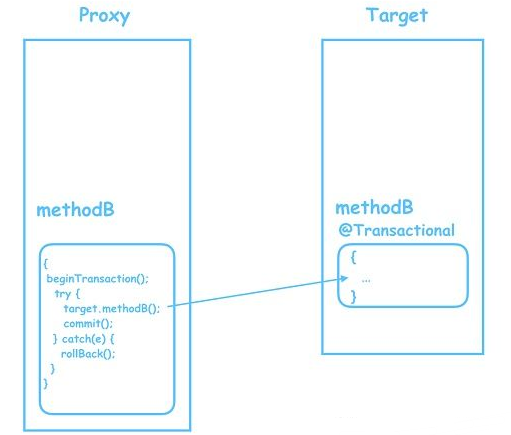
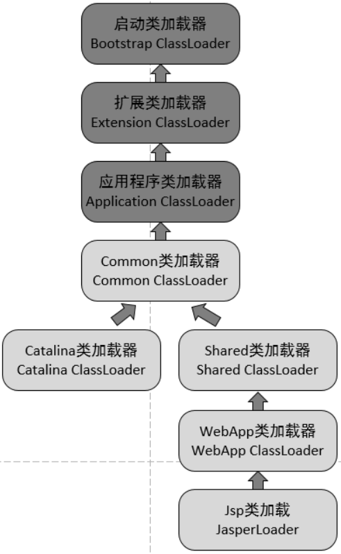
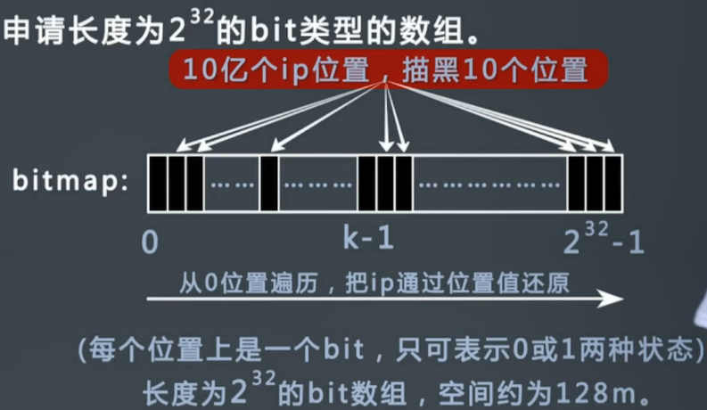
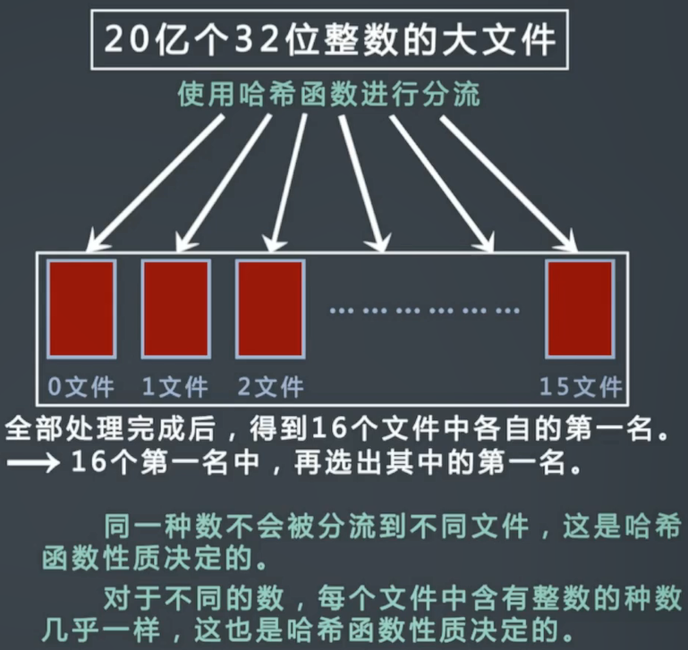

## 多线程及并发相关问题

#### 1.进程和线程的区别

就是这样的背景出来的，两个名词不过是对应的CPU时间段的描述，名词就是这样的功能。*

- **进程就是包换上下文切换的程序执行时间总和** = **CPU加载上下文+CPU执行+CPU保存上下文**

**线程是什么呢？**进程的颗粒度太大，每次都要有上下的调入，保存，调出。如果我们把进程比喻为一个运行在电脑上的软件，那么一个软件的执行不可能是一条逻辑执行的，必定有多个分支和多个程序段，就好比要实现程序A，实际分成 a，b，c等多个块组合而成。那么这里具体的执行就可能变成：

程序A得到CPU =》CPU加载上下文，开始执行程序A的a小段，然后执行A的b小段，然后再执行A的c小段，最后CPU保存A的上下文。

里的a，b，c就是线程，也就是说线程是共享了进程的上下文环境，的更为细小的CPU时间段。
到此全文结束，再一个总结：

进程和线程都是一个时间段的描述，是CPU工作时间段的描述，不过是颗粒大小不同。

#### 2.什么时死锁，死锁的四个必要条件

产生死锁的原因：

（1）竞争系统资源。（不可抢占性资源、可消耗资源）

（2）进程推进顺序不当。

死锁的四个必要条件：

（1）互斥条件：进程对所分配到的资源不允许其他进程进行访问，若其他进程访问该资源，只能等待，直至占有该资源的进程使用完成后释放该资源

（2）请求和保持条件：进程获得一定的资源之后，又对其他资源发出请求，但是该资源可能被其他进程占有，此事请求阻塞，但又对自己获得的资源保持不放

（3）不可剥夺条件：是指进程已获得的资源，在未完成使用之前，不可被剥夺，只能在使用完后自己释放

（4）环路等待条件：是指进程发生死锁后，必然存在一个进程--资源之间的环形链

处理死锁的基本方法

1.预防死锁：通过设置一些限制条件，去破坏产生死锁的必要条件

2.避免死锁：在资源分配过程中，使用某种方法避免系统进入不安全的状态，从而避免发生死锁

3.检测死锁：允许死锁的发生，但是通过系统的检测之后，采取一些措施，将死锁清除掉

4.解除死锁：该方法与检测死锁配合使用

#### 3.线程状态转换

[Java多线程总结](https://blog.csdn.net/u012156116/article/details/79390864)

#### 4.创建线程：

继承Thread类，实现Runnable，Callable接口

#### 5.synchronized(this) 与synchronized(class) 之间的区别

> **synchronized(this)是对象锁，如果有多个对象就有相对应的多个锁** 
>
> **synchronized(类的名.class)是全局锁，不管有几个对象就公用一把锁 ** 

[sychronized](https://blog.csdn.net/javazejian/article/details/72828483?locationNum=5&fps=1) 

#### 6.ReEntrantLock和synchronized

>1.开发人员可以手动指定什么时候加锁，什么时候释放锁，灵活性大大优于synchronized
>
>2.synchronized只能在等待锁，或者是保持等待。但是Lock可以响应中断，lock.lockInterruptibly()
>
>3.Lock可以锁等待限时，使用tryLock() 或者 tryLock(xx,s)
>
>4.公平锁，按照时间顺序，不会产生饥饿现象。 ReentrantLock(true)
>
>5.Condition的使用。 (使用condition时，需要持有锁
>
>6.synchronized是java的一个关键字，在jvm层面上，lock是一个类

#### 7.locksupport.park() 和 locksupport.unpark() 

线程阻塞， 使用的是一个许可。跟Thread.sleep(), Object.wait(), Thread.join()一样，是可以相应Interrupted中断的， 但是它不会抛出InterruptedException异常。

#### 8.Thread和Runnable，Callable

>Thread 是继承，然后重写run()方法，使用时只能调用一次start()方法。（常见的卖票的例子
>
>Runnable 是接口，重写run()方法，可以实现资源的共享，即 new Thread(new Runnable())。
>
>Callable 也是接口，重写call()方法，可以有返回值，可以抛出异常。

#### 9.优化线程池数量

n_cpu  = cpu 数量； u_cpu = 目标cpu的使用率， 0<=u_cpu<=1;  w/c = 等待时间/计算时间的比率；

最优的池的大小等于：


n_Threads = n_cpu * u_cpu * (1+w/c);


#### 10.线程之间的通信方式

同步，wait/notify,  exchanger, 


#### 11.多线程在项目中的应用

>* 1.ThreadLocal: (标注当前请求的客户是谁，客户的信息)  /  (解决Java Bean的中单例的线程安全问题）。
>* 2.Exchanger：提供一个同步点，在这个同步点，两个线程可以交换彼此的数据，这两个线程通过exchange()方法交换数据，如果第一个先执行exchange()方法，它会等待第二个线程也只需exchange()方法，当它们都到达同步点时，交换数据，将本线程的数据交换给对方。
>* 3.使用多线程去处理异步的消息，让线程不停地去任务队列里面取任务完成。while(true)

#### 12.BlockingQueue的两种

**ArrayBlockingQueue：**维护了一个定长数组，一个可重入锁，一个notEmpty Condition变量，一个notFull Condition变量，当使用put()的时候，如果队列满了，notFull.wait()，没put一个元素，notEmpty.notify()；

当使用take()的时候，如果队列空了，notEmpty.wait,没取一个元素，notFull.notify()。

**LinkedBlockingQueue：** 锁分离，两个可重入锁，一个负责notEmpty；一个负责notFull。每次取完元素通知下一个线程来继续取，一个添加完通知线程来添加。 但是每次take取空了，c=0，notEmpty.wait()；然后put那边放了第一个元素时，调用signalNotEmpty()方法，通知线程可以取了。

#### 13.ForkJoin框架

先把大任务分成子任务RecursiveTask，然后一个一个地提交子任务subTask.fork(); 

然后使用join()方法收集所有的结果，join()方法就是返回一个子任务的结果。

#### 14.Java实现线程安全的几种方法

>1. 互斥同步
>
>   临界区：syncronized，重入锁
>
>   信号量：semaphore
>
>   互斥量：mutex
>
>2. 非阻塞同步：
>
>   CAS（unsafe类提供的基于CPU硬件的技术支持的一种技术）
>
>3. 无同步方案：使用Threadlocal类来包装共享变量，做到每个线程都有自己的copy。

---

## 数据库及相关问题

#### 1.索引的作用、优缺点，索引是否一定提升性能（有序状态，最大小值）


#### 2.事务使用场景

​	Mysql事务主要用来处理数据量大、数据复杂度高的数据操作，最经典的使用场景是银行的转账：需要先从银行账户A中取出钱，然后再存入银行账户B中，如果中间出现问题，而没有事务的保证，那么就会出现B收不到钱，而A支出钱又回不到自己的账户的严重问题，那么有了事务机制，这个问题就解决了。

#### 3.什么是外键、主键（外主是否可以重复）、索引的区别

[https://blog.csdn.net/bingqingsuimeng/article/details/51595560](https://blog.csdn.net/bingqingsuimeng/article/details/51595560)

主键是能确定一条记录的唯一标识;外键用于与另一张表的关联。是能确定另一张表记录的字段，用于保持数据的一致性。比如，A表中的一个字段，是B表的主键，那他就可以是A表的外键。

|      | 主键                    | 外键                           | 索引                |
| ---- | --------------------- | ---------------------------- | ----------------- |
| 定义：  | 唯一标识一条记录，不能有重复的，不允许为空 | 表的外键是另一表的主键, 外键可以有重复的, 可以是空值 | 该字段没有重复值，但可以有一个空值 |
| 作用：  | 用来保证数据完整性             | 用来和其他表建立联系用的                 | 是提高查询排序的速度        |
| 个数：  | 主键只能有一个               | 一个表可以有多个外键                   | 一个表可以有多个惟一索引      |

**聚集索引和非聚集索引的区别？**

​	聚集索引一定是唯一索引。但唯一索引不一定是聚集索引。  

​	聚集索引，在索引页里直接存放数据，而非聚集索引在索引页里存放的是索引，这些索引指向专门的数据页的数据。

#### 4.第一、二、三范式的概念

一范式就是属性不可分割。

二范式就是要有主键，表中的字段必须完全依赖于全部主键而非部分主键。为什么要有主键？没有主键就没有唯一性，没有唯一性在集合中就定位不到这行记录，所以要主键。

三范式就是要消除传递函数依赖，方便理解，可以看做是“消除冗余”。

3NF说的是：非键属性不能依赖于非键属性。

[https://www.zhihu.com/question/24696366](https://www.zhihu.com/question/24696366)

BCNF说：所有属性（包括非键属性与键属性）不能依赖于非键属性。

#### 5.关系型数据库


#### 6.redis的持久化方式，

##### RDB：

* 将Redis在内存中的数据状态存到磁盘，保存为RDB文件，一个经过压缩的二进制文件。（命令：SAVE，BGSAVE）
* 可以在conf文件中配置多久自动保存一次（如900s内进行了1次修改）

##### AOF：

* 保存Redis服务器所执行的写命令来记录数据库状态。
* 实现原理：每次将写命令加入aof_buf缓冲区的末尾。每次到设置的时间了，将aof_buf中的内容写入到AOF文件中。
* **选项：** appendfsync： 默认值为  everysec（每隔一秒）    everysec/always/no    此配置对性能，安全性有影响

#### 7.redis事务

MULTI 开始事务； 事务入队； EXEC 执行事务； WATCH 监视一个key DISCARD 取消事务

redis事务不支持回滚，因为作者认为与redis追求的高效率的主旨不符合。

#### 8.redis分布式锁


#### 9.redis3.0原生集群和redis读写分离+哨兵机制区别

[集群相关](https://www.cnblogs.com/taosim/articles/4238674.html) 

一致性hash：跟hash不同的是，每次添加节点不会影响当前的数据库状态，即很多数据不应该存在当前节点了。

#### 10.redis缓存（Redis与MySQL）

[缓存出现问题总结](https://www.cnblogs.com/zhangweizhong/p/6258797.html) 

数据库和缓存之间一般不需要强一致性。

**一般缓存是这样的：**

- 读的顺序是先读缓存，后读数据库
- 写的顺序是先写数据库，然后写缓存
- 每次更新了相关的数据，都要把该缓存清理掉
- 为了避免极端条件下造成的缓存与数据库之间的数据不一致，缓存需要设置一个失效时间。时间到了，缓存自动被清理，达到缓存和数据库数据的“最终一致性”

#### 11.redis单进程单线程

利用队列技术将并发访问变为串行访问，，消除了传统数据库串行控制的开销

#### 12.使用数据库的JDBC如何操作

>1. 加载JDBC驱动
>2. 创建连接（账号，密码）
>3. 创建 Statements 对象 （相当于sql语句）
>4. 设置 SQL 语句的传入参数
>5. 执行SQL语句并获得查询结果（数据库运行sql语句）
>6. 处理查询结果返回
>7. 释放资源

#### 13.数据库的连接方式 （？）  以及如何查看连接数

>`processlist` :查看所有连接的详细资料，
>
>`status` : 查看当前连接数，Threads就是连接数。   

#### 14.级联操作

**级联的概念：**级联是用来设计一对多的关系的。在相互匹配的外键值的前提下更改一个主键值，系统会相应地更新所有匹配的外键值。 [参考](https://zhidao.baidu.com/question/81943047.html) 

**Mybatis的级联操作：** association和collection元素

#### 15.数据库为什么使用B+树，B+树比B树好在哪里

* B+树的节点只存储索引key值，具体信息的地址存于叶子节点的地址中，这就使得以页为单位的索引中可以存放更多的节点。减少更多的I/O支出。
* B树在提高IO性能的同时并没有解决元素遍历效率低下的问题，正是为了解决这个问题，B+树应用而生。B+树只需要遍历叶子节点就可以实现整棵树的遍历。而且在数据库中基于范围的查询是非常频繁的，B树不支持所以说效率很低。

#### 16.事务的一致性！！！

[一致性的解释](https://www.zhihu.com/question/31346392/answer/362597203) 

undo：将用户上一步做的操作对程序造成的改动恢复到改动之前。

redo：重新实现这种改动。

undo/redo的实现方式为两类：记录数据和记录操作。

事务的产生，是为了当应用程序访问数据库的时候，简化我们的编程模型，不需要去考虑各种潜在错误和并发问题。**事务的本质是为了应用层服务的，而不是伴随着数据库系统天生就有的。**

ACID中的C与CAP中的一致性的含义不是一回事。

ACID里的AID都是数据库的特征，但是C一致性，它是依赖于应用层的，依赖于开发者的。

这里的**一致性**指的是：系统从一个正确的状态迁移到另一个正确的状态。

**正确的状态**：满足预定的约束的状态就叫正确的状态。

**事务具备ACID里C的特性是说通过事务的AID来保证我们的一致性.**

例子：

>A要向B支付100元,而A的账户中只有90元,并且我们给定账户余额这一列的约束是,不能小于0.那么很明显这条事务执行会失败,因为90-100=-10,小于我们给定的约束了.

付之前我们数据库里的数据都是符合约束的,但是如果事务执行成功了,我们的数据库数据就破坏约束了,因此事务不能成功,再看：

>A要向B支付100元,而A的账户中只有90元,我们的账户余额列没有任何约束.但是我们业务上不允许账户余额小于0.因此支付完成后我们会检查A的账户余额,发现余额小于0了,于是我们进行了事务的回滚.

应用层利用事务回滚保证了我们的约束不被破坏.

#### 17.分布式系统的一致性！！！

指在分布式系统中的所有数据备份，在同一时刻是否同样的值。（等同于所有节点访问同一份最新的数据副本），主要是由于分布式系统写入和读取都可能不在同一台机器上，而这必然会有一段时间导致不同机器上所存的数据不一致的情况。

强一致性：系统中某个数据被更新后，后续任何对该数据的读取操作都将得到更新后的值。

弱一致性：相对于强一致性，不能保证都能得到最新的值。

最终一致性：弱一致性的特殊情况，指经过一段时间后，最终所有的访问都是更新的值。

#### 18.innodb中的幻读与mvcc和间隙锁

读分为：快照读，当前读

快照读，也就是读取的数据虽然是一致的，但是数据是历史数据。

当前读：保证数据是一致的，且读取的是最新的数据。

快照读：

select * from table where ?；   此时解决幻读是依赖mvcc解决的。

当前读：

select * from table where ? lock in share mode; 
select * from table where ? for update; 
insert into table values (…); 
update table set ? where ?; 
delete from table where ?;	        此时解决幻读是依赖gap-lock解决的。


---

## 网络及相关问题

#### 1.电路交换、分组交换的区别

电路交换，报文交换，分组交换
利弊上阐述了电路交换的独占性质，需要先在底层建立链接，传送信息期间独占电路，
报文交换就是一次性传送，不建立连接，中间路由器利用报文的首部地址传送到下一个路由器，直到终点，
分组交换就是把报文分组，多次传送。

目前计算机网络上的TCP,UDP用的都是分组交换。只不过分组传送路径上不同，不同在于TCP先建立链接，这个不是底层的电路链接，你可以理解为确定一条路径，所有分组都沿着这条路径传送，路径上的路由器是可以传送其它消息的，不像电路交换被独占。UDP没有建立链接分组传送期间达到目的地的路径会有不同。

#### 2.7层模型使用的硬件设备

见work_relation开端

#### 3.TCP、UDP区别，保存格式，字段意义

TCP提供面向连接的、可靠的数据流传输，而UDP提供的是非面向连接的、不可靠的数据流传输。
TCP传输单位称为TCP报文段，UDP传输单位称为用户数据报。
TCP注重数据安全性，UDP数据传输快，因为不需要连接等待，少了许多操作，但是其安全性却一般。

TCP对应的协议：

（1） FTP：定义了文件传输协议，使用21端口。
（2） Telnet：一种用于远程登陆的端口，使用23端口，用户可以以自己的身份远程连接到计算机上，可提供基于		   DOS模式下的通信服务。
（3） SMTP：邮件传送协议，用于发送邮件。服务器开放的是25号端口。
（4） POP3：它是和SMTP对应，POP3用于接收邮件。POP3协议所用的是110端口。
（5）HTTP：是从Web服务器传输超文本到本地浏览器的传送协议。

UDP对应的协议：
（1） DNS：用于域名解析服务，将域名地址转换为IP地址。DNS用的是53号端口。
（2） SNMP：简单网络管理协议，使用161号端口，是用来管理网络设备的。由于网络设备很多，无连接的服务就体现出其优势。
（3） TFTP(Trival File Transfer Protocal)，简单文件传输协议，该协议在熟知端口69上使用UDP服务。

#### 4.http协议是有状态还是无状态的，为什么？

> 无状态是指协议对于事务处理没有记忆功能。缺少状态意味着，假如**后面的处理需要前面的信息**，则**前面**的信息必须**重传**，这样可能导致每次连接传送的数据量增大。另一方面，在服务器**不需要前面信息**时，**应答就较快**。直观地说，就是**每个请求都是独立**的，与前面的请求和后面的请求都是没有直接联系的。

实际使用中，我们需要web是有状态的，因此加入了cookie，session等机制实现了有状态的web。

* **web=http协议+状态机制+其他机制**

>在两个页面之间维持状态，代价是很高的。

通过在客户端的cookie和服务端的session，我们可以实现有状态。[具体可以看此处](https://www.cnblogs.com/Jadie/p/6877392.html)

#### 5.http1.0和http1.1的区别 

* HTTP 1.0需要使用keep-alive参数来告知服务器端要建立一个长连接，而HTTP1.1默认支持长连接。（创建一个TCP连接是需要经过三次握手的，有一定的开销，如果每次通讯都要重新建立连接的话，对性能有影响）
* HTTP1.1支持只发送header信息（不带body信息），如果认为客户端有权限，则返回100，否则返回401。客户端如果接收到了100，才开始发送请求body。这样的话，如果是401的话，就不用发送请求body了，这样节约带宽。
* 增加Host域。在HTTP1.0中，每一台服务器绑定唯一的一个IP地址，因此，请求消息中的URL并没有传递主机名（hostname）。但随着虚拟主机技术的发展，一台主机上可以存在多个虚拟主机（或者多个站点），并且它们共享一个IP地址。HTTP1.1支持host域，如果没有会报400错误。HTTP不支持host。[host参考](https://blog.csdn.net/netdxy/article/details/51195560)  

补充（请求头中host：客户端指定自己想访问的http服务器的域名/IP 地址和端口号。）

#### 6.http2.0和http1.1的区别

* 多路复用：http2.0 复用TCP连接，在同一个连接并发处理多个请求或回应，不用按照顺序一一对应。
* 数据流：数据流发送到一半的时候，客户端和服务器可以取消这个流，1.1中只能关闭这个连接
* 服务器推送：在请求资源的时候，服务器会顺便将客户端需要的资源一起推送到客户端，免得再次创建连接发送请求来获取。


* 数据压缩: 对消息头压缩了，节省流量
* 流优先级

#### 7.输入URL发生了什么

* **事件顺序**    

  (1) 根据URL查找对应IP：

   	 a. 浏览器检查缓存中有没有这个域名对应的IP，如没有，继续；

  ​	  b. 检查操作系统缓存中是否有这个域名对应的DNS解析结果，如没有，继续：（/etc/hosts
  ​	  c. 先去本地区的域名服务器 LDNS 请求解析，如没有，继续；
  ​	  d. 去根域名服务器请求解析，根域名服务器返回一个 gTLD Server地址（国际顶级域名服务器，如.com，.cn
  ​	  e. 本地域名服务器再向上一步返回的 国际顶级域名服务器 发送请求， 
  ​	  f. gTLD返回此域名对应的 注册的 域名服务器 Name server，
  ​	  g. Name server 会 返回对应的 IP，TTL值 给 LDNS，
  ​	  h. LDNS 缓存 域名，IP，TTL
  ​	  i. 用户根据 TTL值 缓存到本地系统的缓存中。

  (2) 浏览器发出HTTP请求，HTTP请求通过TCP协议进行可靠性的传输，在三次握手后建立连接

  (3) 请求在传输层包装成TCP报文，在网络层加入IP首部封装成IP报文，

  (4) 利用ARP协议将找到对应IP的MAC地址，将IP报文封装成帧发送，

  (5) 依次转发直到服务端接收到了数据，再层层向上直到应用层。此过程中包括了传输层通过TCP协议将
  分段的数据包重新组成原来的HTTP请求报文。

  (6) 服务端处理请求，返回响应报文。（响应报文中包括状态码：200 OK 请求成功，301 永久重定向， 404 客户请求的资源不存在

  (7) 客户端接收到响应报文后，浏览器解析渲染 html文件。

* **涉及到的协议**    

  (1) 应用层：HTTP(WWW访问协议)，DNS(域名解析服务) 

  (2) 传输层：TCP(为HTTP提供可靠的数据传输)，UDP(DNS使用UDP传输) 

  (3) 网络层：IP(IP数据数据包传输和路由选择)，ICMP(提供网络传输过程中的差错检测)，ARP(将本机的默认网关IP地址映射成物理MAC地址)

#### 8.get和post的区别

>1.get用于获取资源，post用于传输实体
>
>2.get，post请求都能使用额外的参数，get参数是在URL中，post是存储在请求体中。两种都不安全，post可以通过抓包工具查看。
>
>3.get方法是安全的，post不是。（安全的http请求不改变服务器状态，post里可能有用户表单，服务器可能保存。
>
>4.get是幂等的，post不是。（幂等，同样的请求执行多次效果一样。

#### 9.Cookie,Session怎么配合使用，Cookie里面存的是什么

Cookie是服务器发送到浏览器保存在本地的一个小小的文本文件（Set-cookie:12345678），它会在浏览器下一次向同一服务器发起请求时被携带并发送到服务器上(首部行中 Cookie:12345678)。它用于告知服务端两个请求是否来自同一浏览器，并保持用户的登录状态。（两种Cookie：会话期，有效期（有一个过期时间

Session保存在服务器上，用户登录时，服务端验证用户名，密码，验证通过了将用户的信息保存到Redis种，ID称为SessionID，服务器可以将这个SessionID以setCookie的方式保存到浏览器上，客户端再次请求时会包含改cookie值，服务器会取出SessionID，取出用户的信息，继续之后的业务操作。

#### 10.Tcp的可靠传输有以下机制

1，校验和（校验数据是否损坏）；
2，定时器（分组丢失则重传）；
3，序号（用于检测丢失的分组和冗余的分组）；
4，确认（接收方告知发送方正确接收分组以及期望的下一个分组）；
5，否定确认（接收方通知发送方未被正确接收的分组）；
6，窗口和流水线（用于增加信道的吞吐量）。

#### 11.Http请求报文，响应报文

[HTTP请求报文](https://blog.csdn.net/heyue_99/article/details/74689057)

请求行：请求方法 url 协议版本

请求头：若干个属性，属性名：属性值

​	Host: xxxxx.com 主机的域名

​	Accept：text 告诉服务端我能接收什么类型的数据

​	Cookie：$Version=1; Skin=new;jsessionid=5F4771183629C9834F8382E23 

​	Referer：。。。 从哪个请求过来的

​	Cache-Control：请求过来的数据是否在客户端缓存

请求体：name=fsdfs&password=sdfsdfsd

响应行：协议版本 响应状态码 及描述

响应头：由多个属性组成

响应体：我们真正需要的数据

#### 12.两个主机间的通信方式

> c/s 		P2P 	b/s

#### 13.网络里面的通信协议

> TCP/IP

#### 14.哪些web服务器

> Tomcat, Jetty, Nginx, Apache

#### 15.OSPF（开放式最短路径优先）

是一个内部网关协议，是一个路由选择协议。

>1. 把与本路由器相连的所有路径状态通知全网
>2. 每台路由器必须产生一个全网的路径图，即ospf的database，实际上这个database在该区域上的每台路由器都是相同的
>3. 每台路由器能够根据此database自动产生一个到达目的地的最佳路径
>4. 当路径发生变化时，例如中断，datasbase能够自动调整，并且所有路由器能据此自动产生新的最佳路径

[参考](https://zhidao.baidu.com/question/500350868.html) 

---

## 数据结构及相关问题

#### 1.链表和哈希表的区别

####2.栈和队列的区别与联系

####3.数组和链表实现栈和队列的优缺点

####4.创建一棵二叉数的过程

####5.链表是否有环，有几个环，环的长度

####6.常见排序算法，时间复杂度，平均、最坏什么情况

* 快排，归并排序原理

####7.如何权衡使用无序数组和有序数组

#### 8.简述冒泡排序和快排，并且分析其稳定性、与初始顺序相关性，适用的场景

>快排的时间复杂度： 一次partition的时间复杂度是O（n），但是如果初始有序的话，我们划分的次数就是n，那么时间复杂度就是O（N^2）。
>
>冒泡排序的最好情况就是升序，这样的话就不需要交换了，而最坏的情况是按照降序排列，这样每次都要跟所有未确定顺序的元素进行交换。

#### 9.二叉树的建立

> 节点的结构体， val，left，right
>
> 输入序列ABDH##I##E##CF#J##G##（#表示空）

```java
BTree CreateBTree()
{
    BTree bt = NULL;
    char ch;
    scanf("%c", &ch);
    if (ch != '#')
    {
        bt = new BTNode;
        bt->data = ch;
        bt->lChild = CreateBTree();
        bt->rChild = CreateBTree();
    }
    return bt;
}
```

#### 10.当数据量很大的时候，适用何种排序算法

>数据量小的时候，用归并；数据量大的时候，使用快速排序和堆排序。但是快速排序不能保证时间复杂度，推荐堆排序。

#### 11.简述哈希表，从哈希函数的优劣性和冲突处理的角度出发

- 哈希函数的优劣性：1. hash函数计算出来的地址应该能等概率、均匀地分布在整个地址空间，从而减少冲突的发生。2.  应该尽量简单，能够在较短的时间内计算出任意关键字所对应的地址。
- 冲突处理：1. 开放定址法（对于经常增删的不合适，不能随便物理删除某个元素，需要定期维护hash表）  2.拉链法（对于经常增删的很合适）


#### 12.HashMap多线程下出现环的原因 以及 Java8中hashmap不能多线程原因

​	当链表需要扩容时，需要扩容resize()。然后在resize()里面有一个transfer()方法，这个方法将原node数组中的元素使用 头插法 插入到新的链表里面。

​	在多线程的情况下，如果一个线程指向的元素已经被另外一个线程转移了，第一个线程再对这些元素进行转移操作的话，此时会形成死循环。

参考：[谈谈HashMap线程不安全的体现](http://www.importnew.com/22011.html) 

​	Java8中hashmap：1. 如果一个线程get(key)，没有同步，本次时间片用完，另一个线程remove(key),出错。

​					  2. 如果多个线程同时put()，size不是volatile变量，size会不准。

#### 13.快速排序思想，时间复杂度O(nlogn)如何推导出来的。

分治法，先写出递归推导公式：T(n) = 2T(n/2)+n，然后使用主方法计算，可得O(nlgn)。[主方法](https://zhidao.baidu.com/question/561336460.html) 

#### 14.HashMap如何在不影响读写的情况下扩容(蘑菇街)

* **org.apache.commons.collections.FastHashMap** 

  旨在多线程环境中运行，其中大多数方法调用是只读的，而不是结构更改。 在“快速”模式下操作时，读取调用是非同步的，写入调用执行以下步骤：

  1.克隆现有集合， 2.对克隆执行修改 3.用修改的克隆替换现有的集合

* **io.netty.util.collection.IntObjectHashMap** 

  与HashMap相比，整个存储结构和Hash冲突的解决方法都不一样。

  HashMap的结构是 Node[] table;Node 下面有 Hash，key，value，next四个属性。

  而IntObjectHashMap的结构是int[] keys, Object[] values.

  在插入时，同样把int先取模落桶，如果遇到冲突，采用的时开发地址法(线性探测法) index+1 找下一个桶，最后在keys[index]，values[index]中分别记录。在查找时也是先落桶，然后在key[index++]中逐个比较key。

* **ConcurrentHashMap** 

  JDK1.6中：

  ```java
  public V get(Object key) {
      int hash = hash(key); // throws NullPointerException if key null
      return segmentFor(hash).get(key, hash);
  }
  //Segment的get
  V get(Object key, int hash) {
          if (count != 0) { // read-volatile // ①
              HashEntry<K,V> e = getFirst(hash); 
              while (e != null) {
                  if (e.hash == hash && key.equals(e.key)) {
                      V v = e.value;
                      if (v != null)  // ② 注意这里
                          return v;
                      return readValueUnderLock(e); // recheck
                  }
                  e = e.next;
              }
          }
          return null;
  }
  ```

  1. 首先判断下count， count变量是一个volatile变量，根据happens-before，volatile的写先行于读，所以其他线程改变了也能体现出来。
  2. 在找到节点的时候，判断下value是否为null，这样可以在这两种情况下生效：1). 这个节点刚刚新建，value还没设置，这时使用所得方式再次get一次  2). 在**①和②**之间，修改了value，由于value是volatile，可以保证读取时获取到的修改后的值。 3). 在①和②之间删除了查找的节点，还是会返回，此时无法实时保证。

  JDK1.7中：

  * 扩容。扩容是新创建了数组，然后进行迁移数据，最后面将 newTable 设置给属性 table。所以，**如果 get 操作此时也在进行，那么也没关系，如果 get 先行，那么就是在旧的 table 上做查询操作；而 put 先行，那么 put 操作的可见性保证就是 table 使用了 volatile 关键字。**


  JDK1.8中：

  * sizeCtl 属性

    - 负数代表正在进行初始化或扩容操作
      - -1代表正在初始化
      - -N 表示有N-1个线程正在进行扩容操作
      - 正数或0代表hash表还没有被初始化，这个数值表示初始化或下一次进行扩容的大小


  * Node节点数据结构

    * 它对**value和next**属性设置了volatile同步锁

    * 它不允许调用setValue方法直接改变Node的value域

    * 它增加了find方法辅助map.get()方法

      ```java
       Node<K,V> find(int h, Object k) {
                  Node<K,V> e = this;
                  if (k != null) {
                      do {
                          K ek;
                          if (e.hash == h &&
                              ((ek = e.key) == k || (ek != null && k.equals(ek))))
                              return e;
                      } while ((e = e.next) != null);
                  }
                  return null;
              }
      ```

#### 15.B树和B+树

##### B树：

* 定义：B树，又称为多路平衡查找树，一颗m阶的B树或为空树，或为满足如下特性的m叉树：

  1. 树中每个节点至多拥有m棵子树。（m代表一个树节点至多有多少个查找路径）
  2. 若根节点不是终端节点，则至少有两棵子树
  3. 除根节点外的所有非叶节点至少有ceil(m/2)棵子树。
  4. 所有叶子节点都出现在同一层次上，并且不带信息。

  B树的所有节点的平衡因子均等于0，每个关键字Ki左边指针Pi-1所指子树中所有节点的关键字均小于ki，右边指针Pi+1所指子树中所有节点的关键字均大于Ki。

* B树的查找流程：

  两个基本操作：1.在B树中找节点， 2.在节点内找关键字

  第一个操作是在磁盘中找的，将节点中的信息读取到内存中，然后第二个操作是在内存中，查找是否有相等的关键字。

* 优点：相比于平衡二叉树，每个节点存储的数据多了，层级就少了，磁盘的IO就少了。

##### B+树：

与B树的区别：

* B+树的非叶子节点不保存关键字记录的指针，这样使得B+树每个节点所能保存的关键字大大增加。
* B+树叶子节点保存了父节点的所有关键字和关键字记录的指针，每个叶子节点的关键字从小到大连接。
* B+树的根节点关键字数量和其子节点个数相等。
* B+树的非叶子节点只进行数据索引，不会存实际的关键字记录的指针，所有数据地址要到叶子节点才能取到，所以每次数据查询的次数都一样。

特点：每个节点存储的关键字个数更多，树的层级更少，所以查询快。每次查询的次数都一样，所以查询速度更稳定。

B+树是B树的变种树，有n棵子树的节点中含有n个关键字，每个关键字不保存数据，只用来索引，数据都保存在叶子节点。是为文件系统而生的。

## 设计模式（主要看笔记work_relation中）

#### 1.观察者模式：推（观察者消费能力） 拉（实时性不足）区别

观察者模式又叫发布-订阅模式，定义了**一种一对多的依赖关系**，让多个观察者对象同时监听某一个主题对象。这个主题对象在状态发生变化时，会**通知所有观察者对象**，使他们能够自动更新自己。

#### 2.枚举实现单例模式

[7种不同的单例实现方式](https://blog.csdn.net/u012156116/article/details/81153899) 

#### 3.工厂模式和抽象工厂模式区别

简单工厂：实例化对象不使用new Object()形式，可以根据用户的选择来实例化相关的类。

对于客户端，去除了具体类的依赖。只需要将具体实例的描述给工厂，工厂就会自动返回具体的实例对象。

工厂模式：增加产品类时也需要相应地增加工厂类。本来是改改工厂的，现在是改客户端。各个不同功能的实例对象的创建代码，也没有耦合在工厂类里，这是对简单工厂解耦的体现。

抽象工厂模式：抽象工厂可以生产多个产品，例如 MysqlFactory 里可以生产 MysqlUser 以及 MysqlLogin 两个产品，而这两个产品又是属于一个系列的，因为它们都是属于MySQL数据库的表。而工厂方法模式则只能生产一个产品，例如之前的 MysqlFactory 里就只可以生产一个 MysqlUser 产品。

#### 4.适配器模式，装饰者模式，外观模式的区别

适配器模式：使用者访问的接口A中没有想要的方法，该方法却在接口B中存在，使用适配器将二者匹配，适配器继承接口A，关联B中的方法，这样此适配器既是A类型，又可以使用B中的方法。如InputStreamReader

装饰者模式：为已有的类添加一些功能。装饰者保持同一个接口，增强原有对象的功能。如BufferedInputStream

外观模式：定义了一个高层接口，使得这一子系统更加容易使用。是一种“简化行为。

#### 5.迭代器模式

提供一种方法顺序的访问一个聚合对象中各个元素，而又不暴露该对象的内部表示。

---

## Java基础及相关问题

#### 1.序列化   为什么Collection类没有实现该接口

* 克隆(cloning)或者是序列化(serialization)的语义和含义是跟具体的实现相关的。因此，应该由集合类的具体实现来决定如何被克隆或者是序列化。

#### 2.什么是迭代器

​	见work_relation中迭代器模式。

#### 3.值传递和引用传递区别

基本类型： 值就直接保存在变量中

引用类型：变量中保存的是实际对象的地址，一般这种变量称为引用

然后再看“ = ”，对于基本类型 num ，赋值运算符会直接改变变量的值，原来的值被覆盖掉。
对于引用类型 str，赋值运算符会改变引用中所保存的地址，原来的地址被覆盖掉。**但是原来的对象不会被改变（重要）。**

https://www.zhihu.com/question/31203609

#### 4.HashCode（）和equeals（）重要性体现在哪些方面

>重写equals()的同时要重写hashcode(): 两对象equals()相等，hashcode()肯定相等；如果equals()不相等，hashcode不一定不相等；只要equals()比较用到的信息没改，调用多次hashcode()，必须返回同一整数。

#### 5.hashtable和hashset的区别

>先说hashmap跟hashtable，
>
>- ```java
>  public class Hashtable extends Dictionary<> implements Map<>
>  public class HashMap  extends AbstractMap<> implements Map<>
>  ```
>
>- hashtable是线程安全的，hashmap不是
>
>- hashtable中，key、value都不允许出现null，hashmap中，key可以有一个为null，value可以有很多个null
>
>- 遍历方式内部实现不同
>
>- hash值的使用不同，hashtable直接使用对象的hashcode，而hashmap是重新计算了hashcode，而且hashmap用与运算代替了求模操作。
>
>- hashtable初始大小默认为11， old**2+1； hashmap中hash数组的默认大小是16，每次 old**2
>
>再来看看hashset：
>
>- 底层就是一个hashmap，放入hashset中的集合元素实际由hashmap的key来保存的，而value值则存在的一个名叫`PRESENT`的静态Object对象。
>- 注：由于hashset的add()方法添加集合元素实际上转变为调用hashmap的put()方法来添加key-value对，所以在hashset中新添加进来的一个元素并不会覆盖原有的元素，因为haset存的是key。

#### 6.Object有哪些方法

>hashcode(),equals(),wait(),wait(long),notify,notifyAll(),getClass(),clone(),toString(),finalize()

#### 7.接口和抽象类有什么区别

* 抽象类：抽象类是用来捕捉子类的通用特性的 。它不能被实例化，只能被用作子类的超类。抽象类是被用来创建继承层级里子类的模板。只需要实现里面的抽象方法。
* 接口：接口是抽象方法的集合。如果一个类实现了某个接口，那么它就继承了这个接口的抽象方法。这就像契约模式，如果实现了这个接口，那么就必须确保使用这些方法。如下：

```java
public interface Externalizable extends Serializable {
    void writeExternal(ObjectOutput out) throws IOException;
    void readExternal(ObjectInput in) throws IOException, ClassNotFoundException;
}
```

接口中的方法默认就是public abstract， 变量默认就是public static final，可以不加。实现时需要实现里面所有的方法。

* 区别： [Java抽象类与接口的区别](http://www.importnew.com/12399.html) 具体的看见这个链接，其中一个我想提一提，就是在抽象类中添加一个方法，可以添加它的默认实现，不需要修改继承它的代码；但是在接口中你添加了一个方法，那么就必须修改所有实现这个接口的类。

* 抽象类中的抽象方法可以是：protected，default，public；接口中必须都是public。下面关于**抽象方法**有几个重点可见以下：

  > 1.抽象方法需要子类重写，而静态的方法是无法被重写的，因此二者是矛盾的。
  >
  > 2.本地方法是由本地代码（如C代码）实现的方法，而抽象方法是没有实现的，也是矛盾的。
  >
  > 3.synchronized和方法的实现细节有关，抽象方法不涉及实现细节，因此也是相互矛盾的。
  >
  > 4.抽象方法需要子类重写，如果用private子类是无法访问的，因此二者是矛盾的。

#### 8.Java中有哪些Map

线程不安全HashMap，线程安全ConcurrentHashMap，有序TreeMap，实现ThreadLoacl用的WeakHashMap （键值为“弱键”：为WeakReference 类型，可以自动回收）

HashMap：支持键，值为 null  HashTable：不支持 key=null 

TreeMap：

1. 当未实现 Comparator 接口时，key 不可以为null，否则抛 NullPointerException 异常； 
2. 当实现 Comparator 接口时，若未对 null 情况进行判断，则可能抛 NullPointerException 异常。如果针对null情况实现了，可以存入，但是却不能正常使用get()访问，只能通过遍历去访问。 

#### 9.反射能得到方法的参数名吗

[参考](https://blog.csdn.net/revitalizing/article/details/71036970) 默认是取不到的，取到的是arg0，arg1这些，在JDK1.8以后，通过编译开关`javac -parameters`打开，idea设置保留参数名：

`在 preferences-》Java Compiler->设置模块字节码版本1.8，Javac Options中的 Additional command line parameters: -parameters` 

#### 10.HashMap与HashTable

1. HashMap继承自抽象类AbstractMap,HashTable继承自抽象类Dictionary
2. HashMap支持 null key/value， HashTable中键值都不能为 null （ HashMap做了处理，使null为0
3. HashTable默认大小为11，扩容为2n+1，HashMap默认16，扩容为2n。
4. HashTable是线程安全的，HashMap不是。
5. HashMap的Iterator是 **fail-fast 迭代器**， 遍历的时候其他线程改变了HashMap的结构时，将会抛出ConcurrentModificationException，而JDK1.8以前的版本中，HashTable 是没有使用 fail-fast的， 1.8后，也使用了。

#### 11.@override 与 @overload 的区别

> @override：重写，重写父类的方法，但是抛出的异常不能比父类还广。属于动态分派，虚方法表改变了。
>
> ​			super.xxx() super关键字用来调用父类被重写的方法。访问不能做更严格的限制。
>
> @overload：重载，方法名相同，而参数不同，返回类型也可以不同。属于静态分派。
>
> ```java
> List<String> list = new ArrayList<>();
> System.out.println(list.getClass().getName());
> ```
>
> ArrayList. 原因：父类的引用指向子类的对象。

#### 12.Collections.sort() 实现原理

>调用list.sort()--->调用Arrays.sort()---> 调用TimSort()	一个改进版本的归并排序。

#### 13.Java基本类型位数和类型强制转换

>| 简单类型  | boolean | byte | char      | short | int     | long | float | double | void |
>| ----- | ------- | ---- | --------- | ----- | ------- | ---- | ----- | ------ | ---- |
>| 二进制位数 | 1(bit)  | 8    | 16        | 16    | 32      | 64   | 32    | 64     | --   |
>| 封装器类  | Boolean | Byte | Character | Short | Integer | Long | Float | Double | Void |

> * byte->short->int->long->float->double
> * char->int->long->float->double
>
> 1. 当后者换成前者的时候需要强制转换，如：long a = 100L,int b = (int) a;
> 2. 当前者转换成后者，则可以直接赋值，JVM会完成自动转换。

#### 14.LinkedHashMap

>LinkedHashMap是有序的，可以认为是HashMap+LinkedList
>
>即它既使用HashMap操作数据结构，又使用LinkedList维护插入元素的先后顺序。

* 每个Entry实体中，除了从HashMap中继承下来的key,value,next,hash，还多了两个指针：before，after
* before,after用来维护Entry插入的先后顺序
* 默认是采用插入的顺序来维护这个循环双向链表的，但是也可以使用最近最少使用次序

[参考](https://www.cnblogs.com/xiaoxi/p/6170590.html) 

#### 15.final 和static 关键字

**final：**  含义总体为：“这是不可变的”

* 修饰数据：包括成员变量和局部变量，只能赋值一次且它的值无法改变。（1.对于成员变量，我们必须在声明或者构造方法中对它进行赋值。2.如果变量是一个引用变量，那么引用的对象无法改变，但是对象的值还是可以改变的。）
* 修饰方法参数：表示在变量的生存期中它的值不能被改变。
* 修饰方法：方法无法被重写。
* 修饰类：类无法被继承 

**static：** 

* 修饰成员变量，将变量变为类的成员，所有对象共享。
* 修饰成员方法，将其变成类方法，可以直接使用“类名.方法名”来调用。
* 静态块，将多个类成员放在一起初始化，使得程序更加规整。
* 静态导包，将类的方法直接导入到当前类中，从而直接使用**“方法名”**即可调用类方法。

#### 16.CopyOnWriteArrayList

> 1. Java中的List有 ArrayList， Vector， CopyOnWriteArrayList
> 2. CopyOnWrite容器： 写时复制，包含CopyOnWriteArrayList和CopyOnWriteArraySet

* 思路：一开始大家共享一个内容，当向容器中添加元素的时候，先将容器copy一份，复制出一个新的容器，然后在新的容器中添加元素，添加元素后，再将原容器的引用指向新的容器。这样做的好处是可以并发读。因为当前容器不会添加任何元素。**CopyOnWrite容器也是一种读写分离的思想，读和写是不同的容器。**

* 底层源码：

  1. 在添加的时候是需要加锁的，否则多线程写的时候会copy出N个副本出来。
  2. 读的时候不需要加锁，如果读的时候有多个线程正在向CopyOnWriteArrayList添加数据，读还是会读到旧的数据，因为写的时候不会锁住旧的CopyOnWriteArrayList。


  ```java
  public boolean add(E e) {
      final ReentrantLock lock = this.lock;
      lock.lock();
      try {
          Object[] elements = getArray();
          int len = elements.length;
          Object[] newElements = Arrays.copyOf(elements, len + 1);
          newElements[len] = e;
          setArray(newElements);
          return true;
      } finally {
          lock.unlock();
      }
  }

  public E get(int index) {
      return get(getArray(), index);
  }

  ```

* CopyAndWrite的优点：线程安全，多个线程同时读，适用于读多写少的场景。

* CopyAndWrite的缺点：

  1. 内存占用问题：list中旧的对象在复制的时候只是复制引用。复制一个新的数组太占用空间了。
  2. 数据一致性的问题：CopyOnWrite容器只能保证数据的最终一致性，不能保证数据的实时一致性。所以如果你希望写入的的数据，马上能读到，请不要使用CopyOnWrite容器。

[参考](https://www.cnblogs.com/dolphin0520/p/3938914.html) 


---

## Spring及相关框架问题

#### 1.什么是Spring框架

​	**Spring框架倡导基于POJO的轻量级开发，以Core模块为核心，以AOP模块增强POJO的能力，弥补OOP的缺憾。Spring框架在IOC模块、AOP模块的基础上，为我们提供了众多的开源项目如SpringMVC等。**  

#### 2.怎么样理解IOC、AOP

IOC：**译为控制反转，又称依赖注入。**通常，被注入对象直接依赖于被依赖对象，但是，在IOC场景中，二者通过IOC容器来交互，二者都由IOC容器统一管理。被注入对象需要什么，直接向IOC容器取，IOC容器就会将相应的被依赖对象注入到对象中。

AOP：**译为面向切面编程，采取横向抽取机制，在不改动原有方法时对原有类进行增强，降低模块间的耦合度。** 

#### 3.bean的生命周期、作用范围

1. 容器启动阶段：容器启动后，首先会加载配置文件，然后使用BeanDefinitionReader对这些配置文件进行解析，将它们映射到BeanDefinition中，最后将这些BeanDefinition注册到BeanDefinitionRegistry。（其中DefaultListableBeanFactory实现了BeanFactory和BeanDefinitionRegistry）。
2. Bean实例化阶段：通过BeanFactory.getBean()方法触发Bean的实例化阶段。
   1. 实例化bean
   2. 设置对象属性
   3. 检查Aware相关接口，并设置相关依赖。（如BeanFactoryAware接口，将当前容器对象传入）
   4. 检查是否实现 BeanPostProcessor接口，如果实现，调用前置处理。(postProcessBeforeInitialization(bean,name))
   5. 检查是否实现了InitializingBean接口，调用afterPropertiesSet()方法，进行一些初始化操作。
   6. 后置处理，postProcessAfterInitialization(bean,name)
   7. 可以使用了，此时一直驻留在容器中
   8. 检查是否实现了DisposableBean接口或者使用destory_method方法声明了销毁方法，如实现了，在在对象实例销毁之前，执行操作。
3. 作用范围：

通过`scope="XXX"` 来指定Bean的作用域

- singleton：单例模式，使用singleton定义的Bean在整个IoC容器中将只有一个实例
- prototype：原型模式，每次通过容器的getBean获取prototype定义的Bean都将产生一个新的实例
- request：每次HTTP请求产生一个新的实例
- session： 每次Http session产生一个新的实例
- global session：每次全局的HTTP session对应一个Bean实例

4.注入方式

设值注入(setter)和构造注入；**设值注入** 需要一个setter方法和属性，在配置文件中用标签`<property>` 指定要注入的类。构造注入指在类的构造器中注入属性，需要在配置文件中使用`<constructor-arg ref="XXXClass">` 来进行注入。

#### 4.Spring bean 单例是否线程安全

大部分spring bean并没有可变的状态（如service和DAO），所以在某种程度上是线程安全的。如果由可变的变量时，需要用户自己处理，处理方式：1.将多态bean的作用域由“singleton”变更为“prototype”。2.将可变的变量设为ThreadLocal类型。

#### 5.Spring用了哪些设计模式

[参考1](https://www.cnblogs.com/yuefan/p/3763898.html)  [参考2](https://blog.csdn.net/caoxiaohong1005/article/details/80039656) 

1. 简单工厂：Spring中的BeanFactory就是简单工厂的体现，根据传入一个唯一的标识来获取bean对象。
2. 工厂模式：FactoryBean，工厂bean， Spring使用getBean()时，会自动调用该类的getObject()方法，所以返回的不是factory这个bean， 而是bean.getObject()方法的返回值，加`&` 可以得到工厂bean本身。
3. 单例模式：默认注入的bean是单例的。
4. 原型模式：使用原型注入bean。
5. 适配器模式：SpringMVC中的HandlerAdapter()。拦截器？
6. 装饰器模式：Spring用到装饰器模式的类：一种含有Wrapper，一种含有Decorator。动态地给对象增加功能。
7. 代理模式：AOP
8. 观察者模式：事件机制：事件源，事件，事件监听器
9. 策略模式：定义算法家族，把它们封装起来，让它们之间可以互相替换，此模式让算法的变化，不会影响到使用算法的客户。Spring中的使用动态代理还是CGLIB代理就使用了策略模式，如果类没有实现接口的话，就使用CGLIB代理。
10. 模板方法：父类定义骨架，某些特定的方法由子类实现。

#### 6.对SpringMVC的理解

[见博客](https://blog.csdn.net/u012156116/article/details/80795424) 

#### 7.AOP的原理， AspectJ和SpringAOP的区别

##### JDK动态代理：

实现同一个接口，通过java反射技术实现动态代理

##### Cglib代理：

使用Cglib动态字节码增强技术，在程序运行期间，创建目标类的子类，将横切逻辑添加到子类中。（不需要实现接口，但是遇到final类不可以使用）

**织入**：把切面应用到目标对象来创建新的代理对象的过程。

##### AOP两个流行的框架：SpringAOP ，Spring+AspectJ

* 织入时间不同：SpringAOP采用动态织入，AspectJ采用静态织入（编译期间就织入）。
* 使用对象不同：SpringAOP必须使用在bean上才行，AspectJ可以在任何Java对象上应用通知。

#### 8.Spring事务

**声明式事务：@Transactional：**

利用了动态代理，Spring在检查到了@Transactional注解后，就给这个对象生成了一个代理对象proxy：



代理对象的methodB，会先开启事务，然后执行原先对象的methodB，如果异常，则回滚（rollback），如果一切顺利，则提交（commit）。

[深入理解事务--Spring事务的传播机制](https://blog.csdn.net/yuanlaishini2010/article/details/45792069)  

事务的嵌套：两个事务方法之间的调用。

**事务的传播属性：**

1. REQUIRED，支持当前事务，如果当前没有事务，就新建一个事务。 （常见）
2. REQUIRES_NEW： 新建事务，如果当前存在事务，把当前事务挂起。 
3. SUPPORTS ：支持当前事务，如果当前没有事务，就以非事务方式执行。
4. NOT_SUPPORTED ：  以非事务方式执行操作，如果当前存在事务，就把当前事务挂起。 
5. MANDATORY ：支持当前事务，如果当前没有事务，就抛出异常。 
6. NEVER ： 以非事务方式执行，如果当前存在事务，则抛出异常。 
7. NESTED （嵌套）：如果当前存在事务，则在嵌套事务内执行。如果当前没有事务，则进行与REQUIRED类似的操作。 

#### 9.@Resource 与 @Autowired 的区别

* **@Autowired**：

```java
public class TestServiceImpl {
    // 下面两种@Autowired只要使用一种即可
    @Autowired
    private UserDao userDao; // 用于字段上
    
    @Autowired
    public void setUserDao(UserDao userDao) { // 用于属性的方法上
        this.userDao = userDao;
    }
}
```

@Autowired为Spring提供的注解，默认按照类型（**byType**）来注入对象，默认情况下它要求依赖对象必须存在，如果允许null值，可以设置它的required属性为false。如果希望按照名称（byName）注入，可以结合使用

@Qualifier注解一起使用，如下：

```java
public class TestServiceImpl {
    @Autowired
    @Qualifier("userDao")
    private UserDao userDao; 
}
```

* @Resource**默认按照ByName**自动注入，由J2EE提供，需要导入包javax.annotation.Resource。

@Resource有两个重要的属性：**name和type**，而Spring将@Resource注解的name属性解析为bean的名字，而type属性则解析为bean的类型。所以，如果使用name属性，则使用byName的自动注入策略，而使用type属性时则使用byType自动注入策略。如果既不制定name也不制定type属性，这时将通过反射机制使用byName自动注入策略。

```java
public class TestServiceImpl {
    // 下面两种@Resource只要使用一种即可
    @Resource(name="userDao")
    private UserDao userDao; // 用于字段上
    
    @Resource(name="userDao")
    public void setUserDao(UserDao userDao) { // 用于属性的setter方法上
        this.userDao = userDao;
    }
}
```

* **@Resource的作用相当于@Autowired，只不过@Autowired按照byType自动注入。** 

#### 10.Spring 支持哪几种切片

#### AspectJ支持的5种类型的通知：

- **@Before**: 前置通知, 在方法执行之前执行
- **@After**: 后置通知, 在方法执行之后执行
- **@AfterReturning**: 返回通知, 在方法返回结果之后执行
- **@AfterThrowing**: 异常通知,在方法抛出异常之后
- **@Around**: 环绕通知,围绕着方法执行

#### 11.Spring解决循环依赖：[参考](https://blog.csdn.net/qq924862077/article/details/73926268)

- 原型（prototype）bean循环依赖：

  对于原型bean的初始化过程中，不论是通过构造器参数循环依赖还是通过setXxx方法产生的循环依赖，Spring都会直接报错。

  **原因：**原型bean在创建之前会进行标记这个beanName正在被创建，等创建结束后会删除标记。在获取bean之前如果这个原型bean正在被创建则直接抛出异常。

- 单例bean构造器参数循环依赖：

  **原因：**Spring在创建构造器循环依赖时其实就是循环初始化操作 A-> B -> A  当A要被初始化第二次时就直接抛出异常。

- **单例bean通过setXxx或者@Autowired进行循环依赖**

  解决循环依赖的办法：通过**提前暴露一个ObjectFactory对象来完成的**，简单来说ClassA在调用构造器完成对象实例化之后，在调用ClassA的setClassB方法之前就把ClassA实例化的对象通过ObjectFactory提前暴露到Spring容器中。

  1. Spring容器实例化ClassA后，通过一个ObjectFactory对象提前暴露到Spring容器。

  ```java
  boolean earlySingletonExposure = (mbd.isSingleton() && this.allowCircularReferences &&
  				isSingletonCurrentlyInCreation(beanName));
  		if (earlySingletonExposure) {
  			if (logger.isDebugEnabled()) {
  				logger.debug("Eagerly caching bean '" + beanName +
  						"' to allow for resolving potential circular references");
  			}
  			//将初始化后的对象提前已ObjectFactory对象注入到容器中
  			addSingletonFactory(beanName, new ObjectFactory<Object>() {
  				@Override
  				public Object getObject() throws BeansException {
  					return getEarlyBeanReference(beanName, mbd, bean);
  				}
  			});
  		}
  ```

  1. ClassA调用setClassB方法，Spring首先尝试从容器中获取ClassB，此时ClassB不存在Spring容器中。
  2. Spring容器初始化ClassB，同时也会将ClassB提前暴露到Spring容器中
  3. ClassB调用setClassA方法，Spring从容器中获取ClassA ，因为第一步中已经提前暴露了ClassA，因此可以获取到ClassA实例
  4. ClassA通过spring容器获取到ClassB，完成了对象初始化操作。
  5. 这样ClassA和ClassB都完成了对象初始化操作，解决了循环依赖问题。

  **总结：A -> B -> C -> A** 初始化bean是先实例化，后设置属性。在bean实例化之后就提前暴露到容器中，这样就不存在循环初始化的情况了。

---


## JVM及相关问题

#### 1.类加载的过程

#### 2.为什么有垃圾回收、什么时间进行、目的

​	**为什么：**在Java中，当没有对象引用指向原先分配给某个对象 的内存时，该内存便成为垃圾。 垃圾回收能自动释放内存空间，减轻编程的负担，JVM的一个系统级线程会自动释放该内存块。垃圾回收意味着程序不再需要的对象是"无用信息"，这些信息将被丢弃。当一个对 象不再被引用的时候，内存回收它占领的空间，以便空间被后来的新对象使用。事实上，除了释放没用的对象，垃圾回收也可以清除内存记录碎片。由于创建对象和垃圾回收器释放丢弃对象所占的内存空间，内存会出现碎片。碎片是分配给对象的内存块之间的空闲内存洞。碎片整理将所占用的堆内存移到堆的一端，JVM将整理出的内存分配给新的对象。

​	**什么时间进行：**JVM进行次GC的频率很高,但因为这种GC占用时间极短,所以对系统产生的影响不大。更值得关注的是主GC的触发条件,因为它对系统影响很明显。总的来说,有两个条件会触发主GC:

　　1)**当应用程序空闲时,即没有应用线程在运行时,GC会被调用。**因为GC在优先级最低的线程中进行,所以当应用忙时,GC线程就不会被调用,但以下条件除外。

　　2)**Java堆内存不足时,GC会被调用。** 当应用线程在运行,并在运行过程中创建新对象,若这时内存空间不足,JVM就会强制地调用GC线程,以便回收内存用于新的分配。若GC一次之后仍不能满足 内存分配的要求,JVM会再进行两次GC作进一步的尝试,若仍无法满足要求,则 JVM将报“out of memory”的错误,Java应用将停止。

​	**如何回收：**（1）发现无用信息对象；（2）回收被无用对象占用的内存空间，使该空间可被程序再次使用。

[https://www.cnblogs.com/zedosu/p/6514457.html](https://www.cnblogs.com/zedosu/p/6514457.html)

#### 3.finalize什么时候被调用

参见笔记。

#### 4.对象置为null，是否会回收该对象。

​	不会立即释放对象占用的内存。 如果对象的引用被置为null，只是断开了当前线程栈帧中对该对象的引用关系，而 垃圾收集器是运行在后台的线程，只有当用户线程运行到安全点(safe point)或者安全区域才会扫描对象引用关系，扫描到对象没有被引用则会标记对象，这时候仍然不会立即释放该对象内存，因为有些对象是可恢复的（在 finalize方法中恢复引用 ）。只有确定了对象无法恢复引用的时候才会清除对象内存。

#### 5.虚拟机栈何时发生异常，为什么发生异常

> 1.线程请求的栈深度大于虚拟机允许的栈深度，将抛出StackOverflowError。2.虚拟机栈空间可以动态扩展，当动态扩展是无法申请到足够的空间时，抛出OutOfMemory异常。

#### 6.java的四种引用

> 强，软，弱，虚

#### 7.对象进入老年代的几种方式

>1. 当对象的年龄（GC的次数）达到一定的大小，就会离开年轻代，进入老年代。
>2. 如果对象的体积太大，会直接分配在老年代。
>3. 如果Survive空间中的相同年龄的对象大小的总和大于survive空间的一半，年龄大于等于这个年龄的对象都可以进入老年代。

#### 8.jvm垃圾回收算法和原理

>标记清除，标记整理，复制算法。

#### 9.对象实例在堆中的组成

对象头，实例数据（真正的有效信息），对齐填充（只是为了对齐，没什么用）

对象头：hashcode，分代年龄，锁标志位，类型指针（是哪个类的类型）

#### 10.栈和方法区中内容-详细

栈，局部变量表，操作数栈，常量池指针，returnAddress。

方法区，被虚拟机记载的类信息，常量，静态变量，即时编译器编译后的字节码；还有及时运行时常量池。[Java常量池](https://www.jianshu.com/p/c7f47de2ee80) 

#### 11.JDK1.6到JDK1.8 GC上面最大做了什么变化

G1收集器：

方法区的实现：永久代---->元空间：

#### 12.哪些情况下会产生Full GC / 频繁应用Full GC分析

1. [Full GC](https://zhidao.baidu.com/question/1111800566588999699.html) 
2. [Java应用频繁FullGC分析](https://yq.aliyun.com/articles/94557?t=t1) 


#### 13.类与类加载器

* 比较两个类是否相等，即两个Class对象是否相等，不止要这两个类来自与同一个Class文件，**重要的是** 两个类是由同一个类加载器加载的才有意义。 比如说 一个是由 是我们自定义类加载器加载的 ，一个是 由系统的应用程序加载器加载的，虽然是来自于同一个Class文件， 它们依然是两个不同的类。

* 1. 启动类加载器 2.扩展类加载器 3.应用程序加载器 4.自定义类加载器

* 如何破坏双亲委派模型：

  1. JDK1.2之前，双亲委派模型，重写loadClass()方法，而现在不建议这样，现在应该将自己的加载逻辑写道findClass()中，这样保证新写出来的类加载器是符合双亲委派规则的。

  2. **线程上下文类加载器（Thread Context ClassLoader）**: 此类加载器可以通过 Thread.setContextClassLoader 方法进行设置。如果创建线程时还未设置，它将会从父线程中继承一个，如果在全局范围内都没有的话，这个类加载器默认就是应用程序加载器。

     有了线程上下文加载器，JNDI服务使用这个线程上下文加载器去加载所需要的SPI代码，也就是父类加载器请求子类加载器去完成类加载的动作。

  3. 为了实现热插拔，热部署，模块化，意思是添加一个功能或减去一个功能不用重启，只需要把这模块连同类加载器一起换掉就实现了代码的热替换。如 OSGI。

#### 14.JVM的调优

##### GC日志分析：

- Linux上 `top` ，`vmstat` 分析各进程占用cpu，内存的情况。
- GC日志的分析：`-XX:+PrintGC ` 打印GC日志 `-verbose:gc` 输出虚拟机中GC的详细情况.

```java
[Full GC 168K->97K(1984K)， 0.0253873 secs]
```

168K和97K分别表示GC前后所有存活对象使用的内存容量,1984K为堆内存的总容量,GC时间为0.02....s

- 应用GC日志分析：

$$
2017-06-02T15:10:29.874+0800: 68770.091: （时间）[GC（Young GC）2017-06-02T15:10:29.874+0800: 68770.091: [ParNew（）使用ParNew作为年轻代的垃圾回收）: 1679928K（年轻代垃圾回收前的大小）->1646K年轻代垃圾回收以后的大小）(1887488K)（年轻代的总大小）, 0.0174360 secs（回收时间）]] 2204620K（堆区垃圾回收前的大小）->526439K（堆区垃圾回收后的大小）(6753536K（堆区总大小), 0.0176530 secs（回收时间）] [Times: user=0.06Young GC用户耗时） sys=0.00（Young GC系统耗时）, real=0.02 secsYoung GC实际耗时）
$$

对比数据简单分析：

```java
从最后一条GC记录中我们可以看到 Young GC回收了 1679928-1646=1678282K的内存
Heap区通过这次回收总共减少了 2204620-526439=1678181K的内存。
1678282-1678181=101K说明通过该次Young GC有101K的内存被移动到了Old Gen
```

--------  --------- / --------- ------------

##### 内存溢出OOM分析：

> JVM中的内存空间：堆，永久区，线程栈，直接内存

**1.堆溢出：**

```java
        ArrayList<byte[]> list = new ArrayList<>();
        for (int i=0;i<1024;i++){
            list.add(new byte[1024*1024]);
        }
```

在IDEA中设置：最小：`-Xms20m` 最大: `-Xmx`1024m


解决办法：增大堆空间  ,或者及时释放内存

**2.永久区溢出：**

​	大量增加类，由于类的元信息存在这里，所以溢出。

​	解决办法：增大永久区大小，Java8以后是增大元空间的大小 `-xx:MetaSpaceSize` 

**3.Java栈溢出：**

​	创建线程时，要为线程分配栈空间。

​	溢出情况：堆+栈<操作系统总空间。

​	`-Xss` 设置栈容量，把栈容量设小一点

**4.直接内存溢出：**

​	ByteBuffer.allocateDirect() 无法从操作系统获得足够的空间

--------  --------- / --------- ------------

##### Java自带分析工具简介：

* JVM性能监控工具

1. jps:列出java进程，-p：主输出进程ID

2. jmap:生成java应用程序的堆快照

   jmap -dump:fomat=b.file=heap:hprof 2972   ：  Dump 堆

3. JConsole：图形化监控：堆，永久区，类加载信息

- 使用Visual VM分析堆的dump文件

  1. 类的信息，实例的信息
  2. Visual VM中数组类型，对象类型，基本类型，静态字段，GC Root 都标出来了

  ​

#### 15.回收方法区

>主要回收，废弃常量和无用的类。
>
>废弃常量，没有地方引用这个常量。
>
>无用的类，1.无该类的实例，2.加载该类的ClassLoader以及被回收， 3. 加载该类的Java.lang.Class对象没有在任何地方被引用，无法在任何对象通过反射访问该类的方法。

#### 16.< cinit>与< init>

>< cinit> 是类构造器，不需要显示的调用父类构造器，虚拟机会保证在子类的< cinit>之前，父类的< cinit>已经执行完毕。
>
>< init>是实例构造器，需要显示调用父类构造器。

#### 17.ClassLoader相关

唯一定位一个类：（类加载器，类本身）

以前可以改写loadClass()方法，更改类加载逻辑。如：Object obj = myLoader.loadClass(".....").newInstance();

现在不支持这样了，推荐改写findClass(),但是findClass()还是保持了双亲委派模型的，并没有打破。

#### 18.内存泄漏

内存溢出：程序在申请内存时，没有足够的空间供其使用。

内存泄漏：分配出去的内存不再使用，但无法回收。[Segmentation Fault错误原因](https://www.cnblogs.com/silence-hust/p/4487026.html) 

* 内存泄漏是怎么回事？有什么影响？

  在Java中，内存泄漏就是存在一些分配的对象，这些对象有以下特点：1）对象是可达的，即在有向图中，存在通路可以与其相连；2）对象是无用的，即程序以后不会再使用这些对象。这些对象不会被GC回收，但是它们却占用着内存。

  内存泄漏第一个迹象就是：在应用程序中出现OOM。

* 内存泄漏产生的原因：

  对象可达，但是不会再使用了。

* 如何避免：

  1. 尽早释放无用对象的引用，在变量退出活动区域后设为null
  2. 进行字符串处理时，尽量使用StringBuffer，避免使用String（String为不可变类，每一个String都独占一块内存区域
  3. 尽量避免使用静态变量，static变量是全局的，存在方法区，GC不会回收。
  4. 不要在经常调用的方法中创建对象，尤其是在循环中。

#### 19.美团GC调优学习

[从实际案例聊聊Java应用的GC优化](https://tech.meituan.com/jvm_optimize.html) 

* 各分区大小设置策略

  首先找到活跃数据大小，就是程序稳定后存活于长期存活于堆中占用的空间大小，就是Full GC后老年代的大小。然后按照下表设置。

  | 空间   | 倍数                            |
  | ---- | ----------------------------- |
  | 总大小  | **3-4** 倍活跃数据的大小              |
  | 新生代  | **1-1.5** 活跃数据的大小             |
  | 老年代  | **2-3** 倍活跃数据的大小              |
  | 永久代  | **1.2-1.5** 倍Full GC后的永久代空间占用 |

* 优化步骤：确定目标、优化参数、验收结果


#### 20.CMS和G1的选择

[CMS和G1](https://blog.csdn.net/zhou2s_101216/article/details/79219953) 

如果追求低停顿，那么CMS和G1都可以是你的选择，现在G1你可以去尝试了，特别是想指定回收时间的。（如果追求的是吞吐量，CMS和G1都不怎么行，因为在并发阶段，占用了一部分线程而导致应用程序变慢，总吞吐量会降低。）

#### 21.栈上分配和TLAB

在Java中，除了堆空间，其他还有两个地方是可以存放对象的，分别是栈和TLAB(Thread Local Allocation Buffer)

**栈上分配：** 如果确定一个对象的作用域不会逃逸出方法之外，那可以将这个对象分配在栈上，这样，对象所占用的空间就可以随栈帧出栈而销毁。这样就可以减小垃圾收集器的压力。（通俗地说，就是对象可以在函数调用结束后自行销毁，而不需要垃圾收集器的介入，从而提高系统性能）

* 逃逸分析：目的是判断对象是否可能逃逸出函数体。（如static就逃逸不出）
* 标量替换：允许将对象打散分配在栈上。（如一个对象有两个字段，将它们视作局部变量进行分配）

**TLBA：** 线程本地分配缓存区，一个线程专用的内存分配区域。（避免线程同步时多线程冲突，提高对象分配效率，这块区域其实在Eden区，很小）

#### 22.对象分配内存的过程

1. 对象优先在Eden分配：大多数情况下，对象优先在Eden区中分配。当Eden区没有足够空间进行分配时，虚拟机将发起一次Minor GC。
2. 大对象直接进入老年代：虚拟机提供了一个-XX：PretenureSizeThreshold参数，令大于这个设置值的对象直接在老年代分配。 目的：避免在Eden区和两个Survivor区之间发生大量的内存复制。
3. 长期存活的对象将进入老年代：每经历一次Minor GC，年龄就+1，当年龄增加到一定程度(默认15)，就会晋升到老年代。
4. 动态对象年龄判定：如果Survive空间中相同年龄所有对象大小总和大于Survive空间的一半，年龄大于或等于该年龄的对象就可以直接进入老年代。
5. 空间分配担保：在发生Minor GC之前，虚拟机会先检查老年代最大可用连续空间是否大于新生代所有对象总和，如果这个条件成立，那么Minor GC可以确保时安全的。如果不成立，查看是否允许担保失败，如果允许，检查老年代最大可用的来内需空间是否大于历次晋升到老年代对象的平均大小，如果大于，将尝试着进行一次Minor GC；如果小于，或者不允许担保失败，那么这时也要改为进行一次Full GC。


#### 23.对象与引用之间通过什么来连接？句柄池

首先谈谈栈中的局部变量表：

##### 局部变量表：

一组变量值存储空间，用于**存放方法参数和方法内部定义的局部变量**。（Java在编译Class文件时，就在方法的Code属性的max_locals数据项中确定了该方法所需要分配的局部变量表的最大容量。）

局部变量表的容量**以变量槽（slot）为最小单位**，32位的基本类型可以存放在一个slot中，除了boolean，byte，char，short，int，float，有一个**reference类型**，此类型表示**一个对象实例的引用**，虚拟机通过这个引用可以做到两点：1.从此引用直接或者间接地查找到对象在Java堆中的数据，2.此引用直接或者间接地查找到对象所属数据类型在方法区中存储的类型信息。

##### int a =128;

a相当于一个reference类型，然后128是在堆空间中（-128-127在方法区中），然后看下句柄池的介绍：

##### 句柄池：

对象访问方式有两种：1.使用句柄间接访问实例数据，2.指针直接访问实例数据。

1. 直接访问

   局部变量表中存储的引用地址就是实例数据的地址。

2. 间接访问

   JVM会在堆中划分一块内存来作为句柄池，JVM栈帧中的局部变量表中所存储的引用地址就是指向这个对象对应的句柄池，句柄池中的一个对象的地址分为两部分，一个指向堆内存中实例的地址，一个是对象实例信息在方法区中的地址。

3. 两种方式的对比：直接的方式寻址速度快，但是引用在gc后需要改变。间接的方式易管理，如gc后实例对象在堆空间中的地址变了，只需要改变句柄池中实例对象的地址即可，无需改变引用和句柄池的关系。

[参考](https://blog.csdn.net/ShareUs/article/details/50980438) 

#### 24.Tomcat的类加载结构：



- /common:CommonClassLoader    类库可悲Tomcat和所有Web应用程序共同使用。
- /server:Catalina ClassLoader    类库只能被Tomcat使用，对Web应用程序不可见。
- /shared: Shared ClassLoader    类库可被所有Web应用程序共同使用，但对Tomcat自己不可见。
- /WebApp/WEB-INF: WebApp ClassLoader    类库只能被此应用程序使用。

----

## 附加题

### 海量数据

解题关键：1. 分而治之，通过hash函数将大任务分流到机器，或者分流成小机器。 2. 常见的hashmap或bitmap

#### 1.0

**海量数据排序** 


#### 2.0

**海量日志数据，提取出某日访问百度次数最多的那个IP**


#### 3.0

**给40亿个不重复的unsigned int的整数，没排过序的，然后再给一个数，如何快速判断这个数是否在那40亿个数当中？**


#### 4.0

**10亿条数据取中位数**


#### 5.1

**对10亿个IPV4的ip地址进行排序，每个ip地址只会出现一次。**

​	ip 转化为 无符号整数

​	10亿个ip 转化为 10亿个整数（每个整数4字节，空间约为4G）

​	申请长度为 2^32的bit类型的数组。 bitmap （每一个ip地址都不一样，且长度为32位，可以唯一映射到那个位置上）



#### 6.0

**10亿个年龄，直接采用计数排序**


#### 7.1

**有一个包含20亿个全是32位整数的大文件，在其中找到出现次数最多的数，内存只有2G**



如果直接使用hashmap，空间不够，利用hash函数分流为16个文件，然后在每个文件中使用hashmap统计出现次数最多的那个数，最后统计下16个文件中出现次数最多的数。

#### 8.1

**32位 无符号整数的范围是0-4294967295。现在有一个正好包含40亿个无符号整数的文件，所以必然有没出现过的整数。最多使用10M的内存，只用找到一个没出现过的数即可，该如何找？**

* 如果直接使用hashmap，一条记录4字节，大概需要16g内存
* 如果使用bitmap，2^32次方的数组，大约500m
* 所以将 0-2^32-1范围分成64个区间，每个区间应该装下2^32/64个数，8MB。
* 某个区间不是满的，所以这个区间上一定少了某个数，然后再对40亿个数只针对这个区间进行词频统计，就可以了。

总结：

1. 根据内存限制决定区间大小，根据区间大小，得到有多少个变量，来记录每个区间的数出现的次数。
2. 统计区间上的数出现的次数，找到没满的那个空间。
3. 利用bitmap对不满的空间，进行这个区间上的词频统计。

#### 9.1

**某搜索公司一天的用户搜索词汇是海量的，假设有百亿的数据量，请设计一种求出最热100词的可行方法**

首先，还是使用hash分流到不同的机器，处理每一个文件，使用hashmap来做词频统计，利用小根堆选出TOP100，然后将每个机器上的合并，还是利用TOP100，这样最后可以得到总共的TOP100。

#### 10.1

**服务器集群来设计和实现数据缓存，常见的操作就是将数据的id转换成一个hash值。这样可以出现的问题及改进策略。**

使用一致性hash算法，解决。


---

## 项目相关问题

#### 单点登录怎么实现

[单点登录SSO的原理和简单实现](https://blog.csdn.net/u011277123/article/details/53404269) 

#### 对分布式的理解：

首先我们看看分布式与集群的区别：

> 单机：项目部署在一台服务器上，所有的服务由这一台服务器来提供

> 集群：同一个业务，部署在多个	服务器上。

​	【*性能到达瓶颈了，多个节点提供相同的服务，由负载均衡服务器来调度*】

> 分布式：一个业务拆分成多个子业务，部署在不同的服务器上。

​	【 *将一个完整的系统，按照业务功能，拆封成一个个独立的子系统，在分布式结构中，每个子系统称为“服务”。这些子系统能够独立的运行在web容器中，它们之间通过RPC来通信*】

- 分布式的例子：比如在线商城，按照微服务的思想，我们需要按照功能模块拆分成多个独立的服务。如用户服务，产品服务，订单服务等等，这些服务都是独立的项目，可独立运行。如果服务之间有依赖关系，使用RPC方式调用。
- 分布式的好处：系统之间的耦合度降低。可以针对性地扩展某些服务。服务的复用性提高，比如说用户系统无需重新开发。
- [参考](https://www.zhihu.com/question/20004877) 

#### RPC

> 远程过程调用

##### 本地过程调用

```java
1 int Multiply(int l, int r) {
2    int y = l * r;
3    return y;
4 }
5 
6 int lvalue = 10;
7 int rvalue = 20;
8 int l_times_r = Multiply(lvalue, rvalue);
```

在第8行时，实际执行了：

> 1. 将lvalue, rvalue的值压栈
> 2. 进入Multiply函数，取出栈中的值10，20，将其赋值l，r
> 3. 执行l * r，将结果存于y
> 4. 将y的值压栈，然后从Multiply返回
> 5. 第8行，从栈中取出返回值200，并赋值给l_times_r

##### 远程过程调用（RPC）

此时需要执行的函数体是在远程的机器上，也就是说，Multiply是在另一个进程中执行的。

> 1. Call ID映射：在本地，函数体直接通过函数指针来指定，但远程调用中两个进程的地址空间不同，所以每个函数都必须要有自己的一个ID，此ID在所有进程中唯一。远程调用中，必须附上这个ID，在客户端，服务端都要唯一这个（函数----Call ID）对应表，当客户端需要远程调用时，就查一下这个表，找出这个Call ID，然后把它传给服务端，服务端也通过查表，来确定调用的是哪个函数。
> 2. 序列化和反序列化：通过序列化将客户端的参数转化为字节流传给服务端，服务端再将字节流转成自己能够读取的格式。同理，从服务端返回的值也需要序列化和反序列化。
> 3. 网络传输：远程调用往往用在网络上，客户端与服务端通过网络连接。所有数据通过网络层传输，因此需要网络传输层。网络传输层把 Call ID和序列化后的参数字节流传给服务端，然后再把序列化后的结果传给客户端。只要能完成这个的，都可以当作传输层用，协议不限，大部分RPC框架使用TCP，UDP，Netty等都可以。

Call ID函数映射可以直接使用函数字符串，这可以使用整数ID，映射表使用HashMap。

序列化，反序列化可以自己写，或使用JSON等。

网络传输库可以 自己写socket，或者 Netty。

[参考](https://www.zhihu.com/question/25536695) 

#### 分布式系统的CAP理论（针对数据库） [参考](https://zhuanlan.zhihu.com/p/33999708)

**CAP理论：一个分布式系统最多只能同时满足一致性，可用性，分区容忍性中的两个。**

- Consistency：一致性

  这里的一致性指的是所有节点在同一时间的数据完全一致。【一致性是因为多个数据拷贝下并发读写才有的问题，因此理解时一定要注意结合考虑多个数据拷贝下并发读写的场景。】

  1. 强一致性：对于关系型数据库，要求更新后的数据库必须被后续的访问看到
  2. 弱一致性：如果能容忍后续的部分或者全部访问不到，则是弱一致性。
  3. 最终一致性：如果经过一段时间后要求能访问到更新后的数据，则是最终一致性。

- Avaliability：可用性

  服务在正常响应时间内一直可用。

- Patition tolerance：分区容错性

#### 分布式系统在遇到某节点或网络分区故障的时候，仍然能够对外提供满足一致性或可用性的服务。

##### CAP的证明：


##### CAP权衡：

CA without P：如果不要求P（不允许分区），则C（强一致性）和A（可用性）是可以保证的。

CP without A：如果不要求A（可用），要求各服务器之间强一致，会导致同步无限延长。

AP without C：保证高可用并允许分区，需要放弃一致性。【Nosql多属于此类】

##### 应用场景：

1. 大型互联网应用场景：主机众多、部署分散，而且现在的集群规模越来越大，所以节点故障、网络故障是常态。保证 A，P， 舍弃C或者保证最终一致性。虽然某些地方会影响客户体验，但没达到造成用户流程的严重程度。
2. 银行类等涉及到钱财的场景：C必须保证。

#### Base理论：（待补充）


#### 分布式理论基础：一致性，2PC，3PC

2PC，3PC是解决一致性问题的两种方法。[参考未整理](https://zhuanlan.zhihu.com/p/21994882) 

#### 从技术角度分析秒杀系统

[参考1：还没有好好分析](https://zhuanlan.zhihu.com/p/20681944) 

[参考2](https://www.zhihu.com/question/54895548/answer/305137506)  

[实际项目](https://gitee.com/1028125449/miaosha) 


#### 利用Netty自定义协议的通信：

[利用Netty构建自定义协议的通信](https://www.cnblogs.com/whthomas/p/netty-custom-protocol.html) 

[Netty之解决TCP粘包拆包(自定义协议)](https://www.cnblogs.com/sidesky/p/6913109.html) 


---

## 科研相关

### 1.自我介绍


### 2.论文组织概述


### 3.项目中的难点


### 

